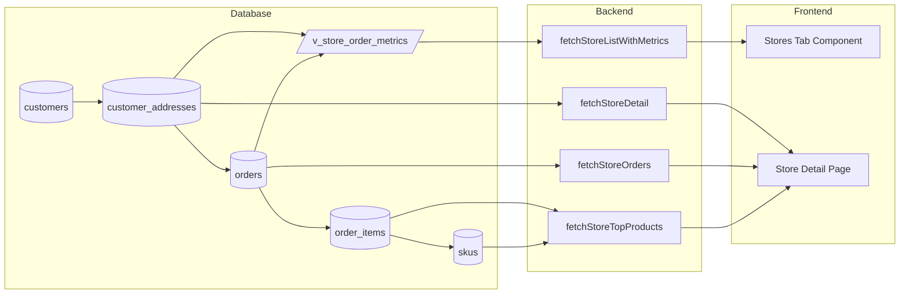
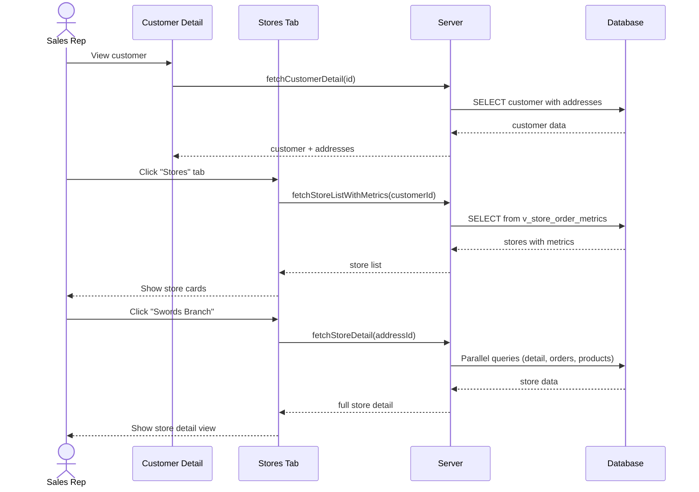

# Implementation Plan: Customer Store-Level Filtering & Drill-Down

**Status**: Ready
**Created**: 2026-02-04
**Author**: Planner
**Complexity**: L
**Estimated Sessions**: 3-4

---

## Pre-Flight Check
- Existing PLAN.md: Separate file created (other plans exist for document-designer)
- ROADMAP.md alignment: N/A - no roadmap conflict
- Related plans: None affecting customers module
- Backlog cross-ref: Store-level B2B access migration already exists (partial foundation)

---

## 1. Overview

### Problem Statement
Customers in HortiTrack represent companies (e.g., "Woodie's", "Garden Centre Group") that have multiple physical stores/locations. Currently:
- Customer data is viewed only at the company level
- Orders are linked to a shipping address (`ship_to_address_id`) but there's no easy way to view store-level order history, preferences, or patterns
- Sales reps cannot quickly see "What does the Swords branch of Woodie's typically order?"
- Store preferences and order frequency are not tracked per-location

### Proposed Solution
Enhance the customer management system with store-level drill-down capabilities:
1. **Customer list** - Shows company-level view with store count badge
2. **Customer detail** - Adds a "Stores" tab showing all locations with key metrics
3. **Store drill-down** - Each store shows its own orders, favorite products, order frequency, and preferences
4. **Store-specific analytics** - Track product preferences and order patterns per address

### Scope
**In Scope**:
- Store-level filtering on customer detail page
- Store-specific order history and metrics
- Store preferences tracking (preferred products, delivery preferences)
- Store-level analytics (order frequency, average order value)
- UI to navigate between company view and store view

**Out of Scope**:
- B2B portal store-level access (already exists via `customer_address_id` on profiles)
- Multi-company hierarchies (parent/child company relationships)
- Store-level pricing (price lists remain at customer level)
- Store manager user accounts (covered by existing B2B store-level access)

---

## 2. Requirements

### Functional Requirements
| ID | Requirement | Priority | Size |
|----|-------------|----------|------|
| FR-1 | Customer list shows store count for each customer | P1 | S |
| FR-2 | Customer detail page has "Stores/Locations" tab | P0 | M |
| FR-3 | Store list shows key metrics (order count, revenue, last order) | P0 | M |
| FR-4 | Clicking a store shows store-specific view with orders/preferences | P0 | L |
| FR-5 | Store view shows order history filtered to that address | P0 | M |
| FR-6 | Store view shows favorite/most-ordered products for that store | P1 | M |
| FR-7 | Store view shows order frequency chart for that store | P2 | M |
| FR-8 | Store preferences can be edited (delivery notes, preferred products) | P1 | M |

### Non-Functional Requirements
| ID | Requirement | Target |
|----|-------------|--------|
| NFR-1 | Store list loads within 500ms for customers with <50 stores | <500ms |
| NFR-2 | Store detail view loads within 1s | <1s |
| NFR-3 | No N+1 queries - batch load store data | Batch queries |

### Assumptions
- Orders already have `ship_to_address_id` linking to `customer_addresses`
- Most customers have 1-20 stores (some may have 50+)
- Store-level B2B access migration provides foundation (`customer_address_id` on profiles)
- Product aliases (`product_aliases` table) are at customer level, not store level

### Open Questions
- [x] Should store preferences be stored in a new table or extend `customer_addresses`?
  - **Decision**: Extend `customer_addresses` with a JSONB `preferences` column for flexibility
- [ ] Should we support store-level product aliases (different names per store)?
  - **Recommendation**: Defer to P2/backlog - most use cases are customer-level

---

## 3. Technical Design

### Architecture Overview

The feature builds on existing data model. Orders already link to `customer_addresses` via `ship_to_address_id`. The key changes are:

1. **Database**: Add `preferences` JSONB column to `customer_addresses`, create materialized view for store-level metrics
2. **Backend**: New data fetching functions for store-level aggregations
3. **Frontend**: New "Stores" tab on customer detail, store drill-down view

### System Diagram

```mermaid
flowchart TB
    subgraph CustomerPage[Customer Detail Page]
        direction TB
        Header[Customer Header]
        Tabs[Tabs: Overview | Orders | Favourites | Activity | Stores]

        subgraph StoresTab[Stores Tab]
            StoreList[Store List with Metrics]
            StoreCard[Store Card: Orders, Revenue, Last Order]
        end
    end

    subgraph StoreView[Store Detail View]
        StoreHeader[Store Header + Back to Customer]
        StoreTabs[Tabs: Overview | Orders | Products | Preferences]

        subgraph StoreOverview[Store Overview]
            StoreStats[Order Count, Revenue, AOV]
            StoreTopProducts[Top Products for Store]
            StoreRecentOrders[Recent Orders]
        end

        subgraph StoreOrders[Store Orders Tab]
            FilteredOrders[Orders filtered by ship_to_address_id]
        end

        subgraph StoreProducts[Store Products Tab]
            MostOrderedProducts[Products aggregated from orders]
        end
    end

    CustomerPage -->|Click Store| StoreView
    StoreView -->|Back| CustomerPage
```

### Data Flow Diagram



### Database Changes
**Assessment**: Minor additions (review only) - No new tables, just column additions and views
**data-engineer Required**: Yes (for review)

| Change | Type | Size | Notes |
|--------|------|------|-------|
| `customer_addresses.preferences` | Add column | S | JSONB for flexible store preferences |
| `v_store_order_metrics` | Add view | M | Aggregate order metrics per address |
| Index on `orders.ship_to_address_id` | Add index | S | Performance for store-level queries |

**Handoff to data-engineer**:
- Add `preferences JSONB` column to `customer_addresses` with default `{}`
- Create view `v_store_order_metrics` aggregating order counts, revenue, last order date per address
- Verify index exists on `orders.ship_to_address_id` (may already exist)
- No RLS changes needed - addresses already inherit customer-level RLS

### Proposed Schema Changes

```sql
-- Add preferences column to customer_addresses
ALTER TABLE public.customer_addresses
  ADD COLUMN IF NOT EXISTS preferences jsonb NOT NULL DEFAULT '{}';

COMMENT ON COLUMN public.customer_addresses.preferences IS
  'Store-level preferences: delivery_notes, preferred_products, order_frequency_target, etc.';

-- Create view for store-level order metrics
CREATE OR REPLACE VIEW public.v_store_order_metrics AS
SELECT
  ca.id as address_id,
  ca.customer_id,
  ca.label,
  ca.store_name,
  ca.city,
  ca.county,
  COUNT(DISTINCT o.id) as order_count,
  COALESCE(SUM(o.total_inc_vat), 0) as total_revenue,
  COALESCE(AVG(o.total_inc_vat), 0) as avg_order_value,
  MAX(o.created_at) as last_order_at
FROM public.customer_addresses ca
LEFT JOIN public.orders o ON o.ship_to_address_id = ca.id
  AND o.status::text NOT IN ('cancelled', 'draft')
GROUP BY ca.id, ca.customer_id, ca.label, ca.store_name, ca.city, ca.county;
```

### API Changes
| Endpoint | Method | Purpose | Size |
|----------|--------|---------|------|
| N/A - Server actions | - | Using existing patterns | - |

New server-side data functions:
- `fetchStoreListWithMetrics(customerId)` - List all stores with order metrics
- `fetchStoreDetail(addressId)` - Store info + extended metrics
- `fetchStoreOrders(addressId, limit?)` - Orders filtered by address
- `fetchStoreTopProducts(addressId, limit?)` - Top products for store

### Frontend Changes
| Component | Change | Size | Notes |
|-----------|--------|------|-------|
| `CustomerDetailClient.tsx` | Add "Stores" tab | M | New tab in existing tabs |
| `StoresTab.tsx` | New component | M | List stores with metrics cards |
| `StoreDetailView.tsx` | New component | L | Full store drill-down UI |
| `StoreOrdersTable.tsx` | New component | S | Reuse existing OrdersTab pattern |
| `StoreTopProducts.tsx` | New component | S | Products aggregated from orders |
| `StorePreferencesForm.tsx` | New component | M | Edit store preferences |
| `CustomerManagementClient.tsx` | Show store count | S | Badge on customer row |

### Sequence Diagram - Store Drill-Down Flow



---

## 4. Alternatives Considered

| Approach | Pros | Cons | Decision |
|----------|------|------|----------|
| **A: Stores as tab on Customer Detail (Recommended)** | No new routes, stays in customer context, simple navigation | Deep nesting (customer -> store -> orders) | Selected |
| **B: Stores as separate route `/sales/customers/[id]/stores/[addressId]`** | Clean URLs, bookmarkable | Context switching, more routing complexity | Rejected: Over-engineered for current need |
| **C: Inline expansion on Stores tab (accordion)** | No additional views, quick access | Limited space for store details, cluttered UI | Rejected: Not enough room for order history |

**Decision Rationale**: Option A keeps the user in the customer context while providing full store drill-down. The store view appears as an overlay/sheet or inline expansion within the Stores tab. This matches the existing pattern of using sheets for editing (CustomerSheet). If needed, we can later add dedicated routes.

---

## 5. Implementation Plan

### Phase 1: Database & Backend Foundation (P0)
| # | Task | Agent | Size | Depends On | Acceptance Criteria |
|---|------|-------|------|------------|---------------------|
| 1.1 | Add `preferences` column to `customer_addresses` | `data-engineer` | S | - | Column exists, migrations run cleanly |
| 1.2 | Create `v_store_order_metrics` view | `data-engineer` | M | 1.1 | View returns accurate aggregations |
| 1.3 | Add index on `orders.ship_to_address_id` if missing | `data-engineer` | S | - | Index exists for performance |
| 1.4 | Create `fetchStoreListWithMetrics` function | `feature-builder` | M | 1.2 | Returns stores with order counts, revenue, last order |
| 1.5 | Create `fetchStoreOrders` function | `feature-builder` | S | - | Returns orders filtered by address |
| 1.6 | Create `fetchStoreTopProducts` function | `feature-builder` | M | - | Returns top products aggregated from order items |

**Phase 1 Complete When**:
- [ ] Migration runs without errors
- [ ] `v_store_order_metrics` returns correct data for test customers
- [ ] Backend functions return expected data shapes
- [ ] TypeScript types defined for store data

### Phase 2: Core UI - Stores Tab (P0)
| # | Task | Agent | Size | Depends On | Acceptance Criteria |
|---|------|-------|------|------------|---------------------|
| 2.1 | Add "Stores" tab to CustomerDetailClient | `feature-builder` | S | Phase 1 | Tab appears, count shown |
| 2.2 | Create `StoresTab.tsx` component | `feature-builder` | M | 2.1 | Lists stores with metrics cards |
| 2.3 | Create store metric cards UI | `feature-builder` | M | 2.2 | Shows order count, revenue, last order per store |
| 2.4 | Add store count badge to customer list | `feature-builder` | S | 2.2 | Badge shows "X locations" on customer row |

**Phase 2 Complete When**:
- [ ] Stores tab visible on customer detail page
- [ ] Stores display with correct metrics
- [ ] Customer list shows location counts
- [ ] UI handles customers with 0 stores gracefully

### Phase 3: Store Drill-Down View (P0-P1)
| # | Task | Agent | Size | Depends On | Acceptance Criteria |
|---|------|-------|------|------------|---------------------|
| 3.1 | Create `StoreDetailSheet.tsx` component | `feature-builder` | L | Phase 2 | Sheet opens with store header + tabs |
| 3.2 | Implement store overview section | `feature-builder` | M | 3.1 | Stats cards, recent orders, top products |
| 3.3 | Implement store orders tab | `feature-builder` | M | 3.1 | Orders table filtered by address |
| 3.4 | Implement store top products section | `feature-builder` | M | 3.1 | Products list with quantities |

**Phase 3 Complete When**:
- [ ] Clicking store opens detail view
- [ ] Store view shows correct filtered orders
- [ ] Store view shows correct product aggregations
- [ ] Back navigation returns to stores tab

### Phase 4: Store Preferences & Analytics (P1-P2)
| # | Task | Agent | Size | Depends On | Acceptance Criteria |
|---|------|-------|------|------------|---------------------|
| 4.1 | Create `StorePreferencesForm.tsx` | `feature-builder` | M | Phase 3 | Form for editing store preferences |
| 4.2 | Implement save store preferences action | `feature-builder` | S | 4.1 | Preferences saved to JSONB column |
| 4.3 | Add order frequency chart for store | `feature-builder` | M | Phase 3 | Reuse OrderFrequencyChart with store filter |
| 4.4 | Display delivery preferences on store card | `feature-builder` | S | 4.2 | Shows preferred trolley type, special instructions |

**Phase 4 Complete When**:
- [ ] Store preferences can be edited and saved
- [ ] Order frequency chart shows store-specific data
- [ ] Preferences display on store cards
- [ ] All existing tests pass

---

## 6. Risks & Mitigations

| Risk | Likelihood | Impact | Mitigation |
|------|------------|--------|------------|
| Performance with large store counts (50+) | Low | Med | Paginate store list, lazy load metrics |
| Confusion between company vs store view | Med | Low | Clear visual hierarchy, breadcrumbs |
| Store-level product aggregation slow | Low | Med | Consider materialized view if needed |
| Breaking existing order flows | Low | High | No changes to order creation, read-only views |

---

## 7. Definition of Done

Feature is complete when:
- [ ] All P0 tasks complete
- [ ] All P1 tasks complete
- [ ] P2 tasks: deferred to backlog if time constrained
- [ ] Tests passing (`verifier`)
- [ ] Code reviewed (`reviewer`)
- [ ] Security checked (`security-auditor`) - RLS verification
- [ ] Customer detail page loads with new Stores tab
- [ ] Stores display with accurate metrics
- [ ] Store drill-down shows filtered orders
- [ ] Store preferences can be edited

---

## 8. Handoff Notes

### Jimmy Command String
```
jimmy execute .claude/plans/PLAN-customer-store-level-filtering.md --mode standard
```

### For Jimmy (Routing)
- **Start with**: `data-engineer` for schema changes (Phase 1.1-1.3)
- **DB Work Required**: Yes - minor (column addition, view creation)
- **Recommended Mode**: standard
- **Critical Dependencies**: None - builds on existing structure
- **Estimated Sessions**: 3-4

### For data-engineer
- Add `preferences JSONB NOT NULL DEFAULT '{}'` to `customer_addresses`
- Create `v_store_order_metrics` view as specified in schema changes section
- Verify/add index on `orders.ship_to_address_id`
- No RLS changes needed - existing RLS on addresses/orders is sufficient

### For feature-builder
**Key patterns to follow**:
- Data fetching: See `customer-detail-data.ts` for existing pattern
- Tabs: Follow existing `CustomerDetailClient.tsx` TabsList pattern
- Sheet pattern: See `CustomerSheet.tsx` for slide-out panel pattern
- Types: Extend existing types in `types.ts`

**Files to reference**:
- `/src/app/sales/customers/[customerId]/CustomerDetailClient.tsx` - Tab structure
- `/src/app/sales/customers/[customerId]/customer-detail-data.ts` - Data fetching
- `/src/app/sales/customers/CustomerSheet.tsx` - Sheet pattern
- `/src/components/customers/OrderFrequencyChart.tsx` - Chart reuse

**Gotchas to avoid**:
- Orders with NULL `ship_to_address_id` exist - handle in aggregations
- `customer_addresses.store_name` is optional - use `label` as fallback
- Existing migration `20260120100001_store_level_b2b_access.sql` adds `customer_address_id` to profiles - don't conflict

### For verifier
**What to test**:
- Customer with 0 stores (addresses) displays gracefully
- Customer with 1 store shows metrics correctly
- Customer with many stores (create test data with 10+)
- Store with 0 orders shows empty state
- Store with orders shows correct aggregations
- Order count and revenue match manual verification

**Edge cases**:
- Orders with cancelled status should not count
- Orders with draft status should not count
- Orders with NULL ship_to_address_id should be excluded from store metrics

### For security-auditor (if applicable)
- Verify store data respects org-level RLS
- Verify users can only see stores for customers in their org
- Check that preferences JSONB cannot be used for injection
