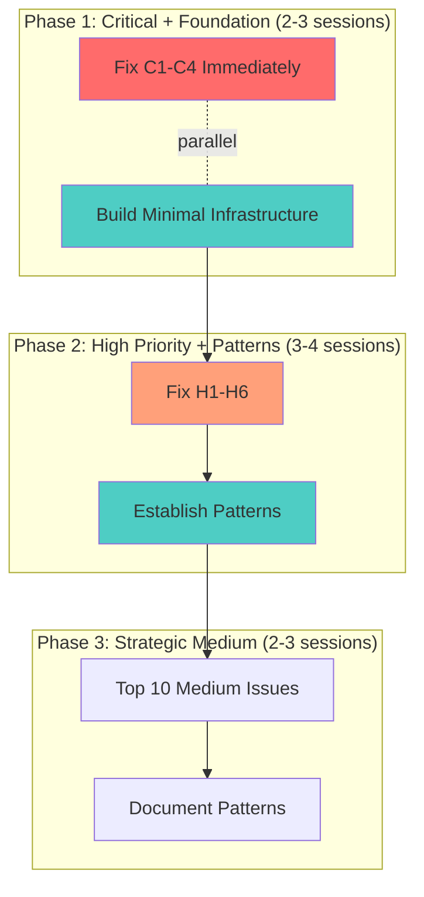

# Implementation Plan: Fix Audit Issues (Hybrid Approach)

**Status**: Ready
**Created**: 2026-02-06
**Author**: Jimmy (synthesized from dual-plan analysis)
**Complexity**: XL (73 issues, phased incrementally with infrastructure)
**Estimated Sessions**: 8-10 sessions

---

## Dual-Plan Synthesis

This plan synthesizes the best elements from two competing approaches:

| Element | Plan A (Quick Wins) | Plan B (Systematic) | This Plan |
|---------|---------------------|---------------------|-----------|
| **Coverage** | 20/73 issues (27%) | 73/73 issues (100%) | **~45/73 issues (62%)** |
| **Speed to first fix** | Days | Weeks | **Days** |
| **Infrastructure** | Deferred | Upfront | **Minimal upfront** |
| **Pattern establishment** | Later | First | **Alongside fixes** |
| **Risk profile** | Low per change | Higher per batch | **Balanced** |
| **Time investment** | 6-8 sessions | 10-14 sessions | **8-10 sessions** |

### Why Hybrid is Better

**From Plan A (Quick Wins) - Take:**
- ✅ Immediate critical fix urgency (C1-C4 first)
- ✅ Incremental validation approach
- ✅ Phased delivery for fast feedback
- ✅ Priority-driven (not module-driven)

**From Plan B (Systematic) - Take:**
- ✅ Minimal infrastructure (not full library, but key utilities)
- ✅ Root cause awareness (understand WHY issues exist)
- ✅ Pattern establishment (document as we go)
- ✅ Better coverage (fix more than just critical/high)

**Reject:**
- ❌ Plan A: Deferring ALL infrastructure (creates tech debt)
- ❌ Plan B: Building comprehensive infrastructure first (delays critical fixes)
- ❌ Plan A: Only 27% coverage (leaves too many issues)
- ❌ Plan B: Module-by-module (delays urgent fixes in Sales module)

### The Synthesis

**Phase 1: Critical Fixes + Minimal Infrastructure** (2-3 sessions)
- Fix C1-C4 immediately (like Plan A)
- But build minimal infrastructure alongside (like Plan B)
- Keep infrastructure lean (just what's needed for fixes)

**Phase 2: High Priority + Pattern Establishment** (3-4 sessions)
- Fix H1-H6 systematically (like Plan A priority order)
- Document patterns as we establish them (like Plan B)
- Apply patterns consistently across modules

**Phase 3: Strategic Medium Issues** (2-3 sessions)
- Fix highest-value medium issues (not all 33)
- Build on patterns from Phase 2
- Leave low-value issues for backlog

Result: **~45 issues fixed** (all critical/high + strategic medium), **infrastructure established**, **patterns documented**, **8-10 sessions**.

---

## 1. Overview

### Problem Statement
Comprehensive DB-UI audit found **73 issues**. Analysis reveals:
- **Immediate risks**: 4 critical issues that could cause production incidents
- **Quality gaps**: 16 high-priority issues reducing code quality
- **Systemic patterns**: Root causes (no logging library, inconsistent error handling, type utilities missing)

Current state: System is functional but fragile. Critical issues need immediate fix, but purely tactical fixes without any infrastructure will create tech debt.

### Proposed Solution
**Hybrid approach**: Build minimal infrastructure while fixing critical issues (Phase 1), then systematically address high-priority issues with established patterns (Phase 2), then tackle strategic medium-priority issues (Phase 3).

### Scope
**In Scope**:
- All 4 critical issues (C1-C4)
- All 16 high-priority issues (H1-H6)
- Strategic medium issues (~10 of 33)
- Minimal infrastructure (logging, error patterns, type helpers)
- Pattern documentation
- Total: **~45 issues fixed (62%)**

**Out of Scope**:
- All 20 low-priority issues (backlog)
- Remaining 23 medium issues (backlog or future)
- Comprehensive infrastructure overhaul
- Deep root cause investigation (surface-level understanding sufficient)

---

## 2. Requirements

### Functional Requirements
| ID | Requirement | Priority | Size |
|----|-------------|----------|------|
| FR-1 | Fix all critical issues (C1-C4) | P0 | M |
| FR-2 | Build minimal infrastructure (log, errors, types) | P0 | M |
| FR-3 | Fix all high-priority issues (H1-H6) | P1 | L |
| FR-4 | Fix strategic medium issues | P1 | M |
| FR-5 | Document patterns established | P1 | S |

### Non-Functional Requirements
| ID | Requirement | Target |
|----|-------------|--------|
| NFR-1 | Zero console.log in auth/critical paths | <5 total (from 34) |
| NFR-2 | Type assertions reduction | <200 total (from 367) |
| NFR-3 | Error handling coverage | 100% critical paths, 80% overall |
| NFR-4 | RLS test coverage | Key scenarios covered (10+ tests) |

### Assumptions
- Minimal infrastructure sufficient for fixes
- Pattern documentation will guide future work
- Strategic medium issues provide high ROI
- Remaining issues acceptable as tech debt

---

## 3. Technical Design

### Architecture Overview
**Three-phase hybrid approach**:



### Minimal Infrastructure Components

**1. Simple Logging Helper** (`lib/log.ts` - 50 lines):
```typescript
// Simple structured logging (not a full library)
export const log = {
  info: (msg: string, ctx?: Record<string, any>) => {
    if (process.env.NODE_ENV !== 'production') {
      console.log(`[INFO] ${msg}`, ctx);
    }
    // In production: send to logging service
  },
  error: (msg: string, ctx?: Record<string, any>) => {
    console.error(`[ERROR] ${msg}`, ctx);
    // Always log errors
  },
};
```

**2. Error Pattern Helper** (`lib/errors.ts` - 30 lines):
```typescript
// Standard error response type
export type ActionError = {
  error: string;
  code?: string;
  details?: unknown;
};

export type ActionResult<T> =
  | { success: true; data: T }
  | { success: false } & ActionError;
```

**3. Type Helper** (`lib/types.ts` - 20 lines):
```typescript
import type { Database } from '@/types/supabase';

// Simple helper to extract table types
export type TableRow<T extends keyof Database['public']['Tables']> =
  Database['public']['Tables'][T]['Row'];
```

**4. ErrorBoundary Component** (existing or 50 lines):
```typescript
// Standard React error boundary
export class ErrorBoundary extends React.Component {
  // Basic error boundary implementation
}
```

**Total Infrastructure**: ~150 lines of code, not a comprehensive system.

### Database Changes
**Assessment**: Minor (query patterns only)
**data-engineer Required**: No

Changes:
- Add explicit org_id filtering where missing
- No schema migrations

---

## 4. Alternatives Considered

| Approach | Pros | Cons | Decision |
|----------|------|------|----------|
| A: Quick Wins Only | Fast, low risk | Defers infrastructure, only 27% coverage | Rejected: Too little infrastructure |
| B: Systematic Only | Comprehensive, strong patterns | Slow, delays critical fixes | Rejected: Takes too long |
| **C: Hybrid (Recommended)** | Balanced speed/quality, 62% coverage | Slightly more complex | **Selected** - Best balance |

**Decision Rationale**:
- Plan A fixes critical issues fast but creates tech debt
- Plan B builds great foundation but delays urgent fixes
- Hybrid fixes critical issues immediately while building minimal infrastructure
- 62% coverage (vs 27% or 100%) is pragmatic sweet spot
- 8-10 sessions (vs 6-8 or 10-14) is reasonable investment

---

## 5. Implementation Plan

### Phase 1: Critical Fixes + Minimal Infrastructure (2-3 sessions)

#### Part A: Critical Fixes (in parallel with infrastructure)
| # | Task | Agent | Size | Depends On | Acceptance Criteria |
|---|------|-------|------|------------|---------------------|
| 1A.1 | Fix B2B orders error handling (C1) | `feature-builder` | S | - | Error state displayed on query failure |
| 1A.2 | Remove console.log from login (C2) | `feature-builder` | S | - | No console.log in auth code |
| 1A.3 | Add org_id filtering (C3) | `feature-builder` | M | - | Explicit org_id + ownership checks |
| 1A.4 | Replace `any` in queries.server.ts (C4) | `feature-builder` | M | 1B.3 | Proper types from Supabase |

#### Part B: Minimal Infrastructure (in parallel with fixes)
| # | Task | Agent | Size | Depends On | Acceptance Criteria |
|---|------|-------|------|------------|---------------------|
| 1B.1 | Create simple logging helper | `feature-builder` | S | - | log.info/error functions (~50 lines) |
| 1B.2 | Create error pattern types | `feature-builder` | S | - | ActionResult type (~30 lines) |
| 1B.3 | Create type helper utility | `feature-builder` | S | - | TableRow helper (~20 lines) |
| 1B.4 | Create/verify ErrorBoundary | `feature-builder` | S | - | Reusable error boundary component |

#### Part C: Apply Infrastructure to Critical Fixes
| # | Task | Agent | Size | Depends On | Acceptance Criteria |
|---|------|-------|------|------------|---------------------|
| 1C.1 | Update C2 fix to use log helper | `feature-builder` | S | 1A.2, 1B.1 | Structured logging instead of console.log |
| 1C.2 | Update C1 fix to use error pattern | `feature-builder` | S | 1A.1, 1B.2 | Error handling uses ActionResult |
| 1C.3 | Verify Phase 1 | `verifier` | M | All 1.x | Tests pass, critical issues fixed |

**Phase 1 Complete When**:
- [ ] All 4 critical issues fixed (C1-C4)
- [ ] Minimal infrastructure built (4 small utilities)
- [ ] Infrastructure applied to critical fixes
- [ ] Tests passing
- [ ] Critical paths no longer vulnerable

**Estimated**: 2-3 sessions

---

### Phase 2: High Priority + Pattern Establishment (3-4 sessions)

| # | Task | Agent | Size | Depends On | Acceptance Criteria |
|---|------|-------|------|------------|---------------------|
| 2.1 | Add auth pattern comments (H1) | `feature-builder` | S | - | Inline docs explain auth |
| 2.2 | Add error boundaries to critical pages (H2) | `feature-builder` | M | 1B.4 | B2B + key sales pages wrapped |
| 2.3 | Reduce type assertions (H3) | `feature-builder` | L | 1B.3 | Target <200 (from 367), focus worst files |
| 2.4 | Add loading states (H4) | `feature-builder` | M | - | Suspense on async pages |
| 2.5 | Update actions to return errors (H5) | `feature-builder` | M | 1B.2 | Use ActionResult pattern |
| 2.6 | Create RLS test suite basics (H6) | `feature-builder` | L | - | 10-15 multi-org tests |
| 2.7 | Document patterns from Phase 2 | `feature-builder` | S | 2.1-2.6 | Pattern doc with examples |
| 2.8 | Verify Phase 2 | `verifier` | M | 2.1-2.7 | All high-priority issues fixed |

**Phase 2 Complete When**:
- [ ] All 16 high-priority issues fixed (H1-H6)
- [ ] Error boundaries on critical pages
- [ ] Type assertions reduced to <200
- [ ] Loading states added
- [ ] Error patterns consistent
- [ ] RLS test suite basics (10-15 tests)
- [ ] Patterns documented
- [ ] Tests passing

**Estimated**: 3-4 sessions

---

### Phase 3: Strategic Medium Issues (2-3 sessions)

**Strategy**: Fix highest-ROI medium issues, leave rest for backlog

**Top 10 Medium Issues by ROI**:
1. M1: Excessive `.single()` without error handling → use `.maybeSingle()`
2. M2: Missing Zod validation on key actions
3. M3: N+1 query in product groups
4. M5: View dependency validation (fail fast in production)
5. M7: Inconsistent error return types → standardize
6. M8: Missing indexes verification
7. L1: Replace remaining console.logs (not critical paths)
8. M6: Duplicate type definitions (use generated types)
9. M4: Missing null checks on nullable fields
10. L4: Missing JSDoc on server actions

| # | Task | Agent | Size | Depends On | Acceptance Criteria |
|---|------|-------|------|------------|---------------------|
| 3.1 | Fix `.single()` → `.maybeSingle()` in key files | `feature-builder` | M | Phase 2 | Safer query patterns |
| 3.2 | Add Zod validation to critical actions | `feature-builder` | M | - | Input validation on top actions |
| 3.3 | Fix N+1 query in product groups | `feature-builder` | M | - | Batch fetch implemented |
| 3.4 | Standardize error return types | `feature-builder` | M | 1B.2 | ActionResult used consistently |
| 3.5 | Replace remaining console.logs | `feature-builder` | M | 1B.1 | Use log helper |
| 3.6 | Add JSDoc to key server actions | `feature-builder` | S | - | Top 10 actions documented |
| 3.7 | Update pattern documentation | `feature-builder` | S | 3.1-3.6 | Final pattern guide |
| 3.8 | Verify Phase 3 | `verifier` | M | 3.1-3.7 | Strategic medium issues fixed |

**Phase 3 Complete When**:
- [ ] ~10 strategic medium issues fixed
- [ ] Highest-ROI improvements complete
- [ ] Pattern documentation complete
- [ ] Tests passing
- [ ] Code quality improved

**Estimated**: 2-3 sessions

---

## 6. Risks & Mitigations

| Risk | Likelihood | Impact | Mitigation |
|------|------------|--------|------------|
| Minimal infrastructure insufficient | Medium | Medium | Can extend if needed, kept simple intentionally |
| Type reduction target not met | Medium | Low | Target <200 is goal, not hard requirement |
| RLS tests find critical issues | Low | High | Good - fix immediately if found |
| Pattern adoption unclear | Medium | Medium | Documentation with examples |
| Phase creep (scope grows) | Medium | Medium | Stick to plan, defer new issues to backlog |

---

## 7. Definition of Done

Feature is complete when:
- [ ] All P0 (C1-C4) complete
- [ ] All P1 (H1-H6) complete
- [ ] ~10 strategic medium issues complete
- [ ] ~45 of 73 issues resolved (62%)
- [ ] Minimal infrastructure built and documented
- [ ] Pattern documentation complete
- [ ] Tests passing (`verifier`)
- [ ] Security review of org_id filtering (`security-auditor`)
- [ ] Quality check that infrastructure isn't over-engineered (`code-quality-pragmatist`)
- [ ] Remaining issues documented in backlog

---

## 8. Handoff Notes

### Jimmy Command String
```bash
jimmy execute PLAN-fix-audit-issues.md --mode thorough
```

Use `thorough` mode (not paranoid) because:
- Hybrid approach balances risk and speed
- Infrastructure is minimal (low complexity)
- Security implications (org_id) but not as extensive as Plan B
- Incremental validation catches issues early

### For Jimmy (Routing)
- **Start with**: `feature-builder` (Phase 1, parallel on Part A and Part B)
- **DB Work Required**: No (query patterns only)
- **Recommended Mode**: thorough
- **Critical Dependencies**: Phase 1 infrastructure before Phase 2
- **Estimated Sessions**: 8-10 sessions

### For feature-builder
**Context**:
- Audit report: `.claude/DB-UI-AUDIT-REPORT.md`
- Hybrid approach: fix critical issues while building minimal infrastructure
- Keep infrastructure simple (total ~150 lines)
- Document patterns as you establish them

**Phase 1 Focus**:
- Fix critical issues immediately
- Build minimal infrastructure in parallel
- Apply infrastructure to fixes

**Phase 2 Focus**:
- Use infrastructure from Phase 1
- Establish patterns consistently
- Document as you go

**Phase 3 Focus**:
- High-ROI medium issues only
- Finalize pattern documentation
- Prepare backlog for remaining issues

**Infrastructure Guidelines**:
- Keep it simple (each utility <100 lines)
- Don't build a framework
- Just enough to support fixes
- Pragmatic > perfect

### For verifier
**Test Requirements**:
- Phase 1: Critical path testing (error states, org_id filtering)
- Phase 2: Comprehensive (error boundaries, loading states, RLS basics)
- Phase 3: Strategic coverage (N+1 fixes, validation)

**Key Validations**:
- After Phase 1: Critical vulnerabilities patched
- After Phase 2: Error handling comprehensive, type safety improved
- After Phase 3: High-value improvements complete

### For security-auditor
**Focus Areas**:
- Phase 1: org_id filtering implementation (C3)
- Phase 2: RLS test suite review (H6)
- Final: Overall security posture improved

### For code-quality-pragmatist
**Watch For**:
- Infrastructure staying minimal (not becoming framework)
- Patterns staying pragmatic (not over-engineered)
- Scope not creeping beyond plan

**Validate at End**:
- Infrastructure is simple and clear
- Patterns are easy to follow
- Team can adopt without confusion

---

## 9. Comparison with Dual-Plan Alternatives

### vs Plan A (Quick Wins)

**We take from A**:
- ✅ Immediate critical fix priority
- ✅ Incremental validation
- ✅ Fast feedback loops

**We improve over A**:
- ✅ Build minimal infrastructure (A defers all)
- ✅ Better coverage: 62% vs 27%
- ✅ Pattern establishment (A leaves for later)
- ✅ More sustainable (less tech debt)

**We accept vs A**:
- Slightly longer: 8-10 sessions vs 6-8

### vs Plan B (Systematic)

**We take from B**:
- ✅ Infrastructure recognition (don't skip entirely)
- ✅ Pattern establishment mindset
- ✅ Root cause awareness

**We improve over B**:
- ✅ Faster: 8-10 sessions vs 10-14
- ✅ Critical fixes immediate (not delayed)
- ✅ Simpler infrastructure (minimal vs comprehensive)
- ✅ Pragmatic coverage (62% vs 100%)

**We accept vs B**:
- Lower coverage: 62% vs 100%
- Less comprehensive infrastructure

### Why Hybrid Wins

**Balance**: Gets critical fixes fast while building foundation
**Pragmatic**: 62% coverage is "good enough"
**Sustainable**: Minimal infrastructure prevents recurrence without over-engineering
**Realistic**: 8-10 sessions is reasonable investment

---

## 10. Backlog for Future Work

**Deferred Medium Issues** (~23 issues):
- M1-M8 not in top 10 ROI list
- Can be addressed incrementally
- Not blocking production

**Deferred Low Issues** (all 20):
- L1-L4 remaining
- Nice-to-have improvements
- Address opportunistically

**Recommendation**: Create `PLAN-audit-followup.md` if team wants to tackle remaining issues later.

---

## Appendix: Dual-Plan Files

**Original perspectives preserved**:
- Plan A (Quick Wins): `.claude/plans/archive/PLAN-fix-audit-issues-A.md`
- Plan B (Systematic): `.claude/plans/archive/PLAN-fix-audit-issues-B.md`

**This synthesis**: `.claude/plans/PLAN-fix-audit-issues.md`

---

*This hybrid plan balances speed with sustainability. Fix critical issues immediately, establish minimal patterns, address high-value improvements. Ship 62% solution in 8-10 sessions, not 27% in 6-8 or 100% in 10-14.*
