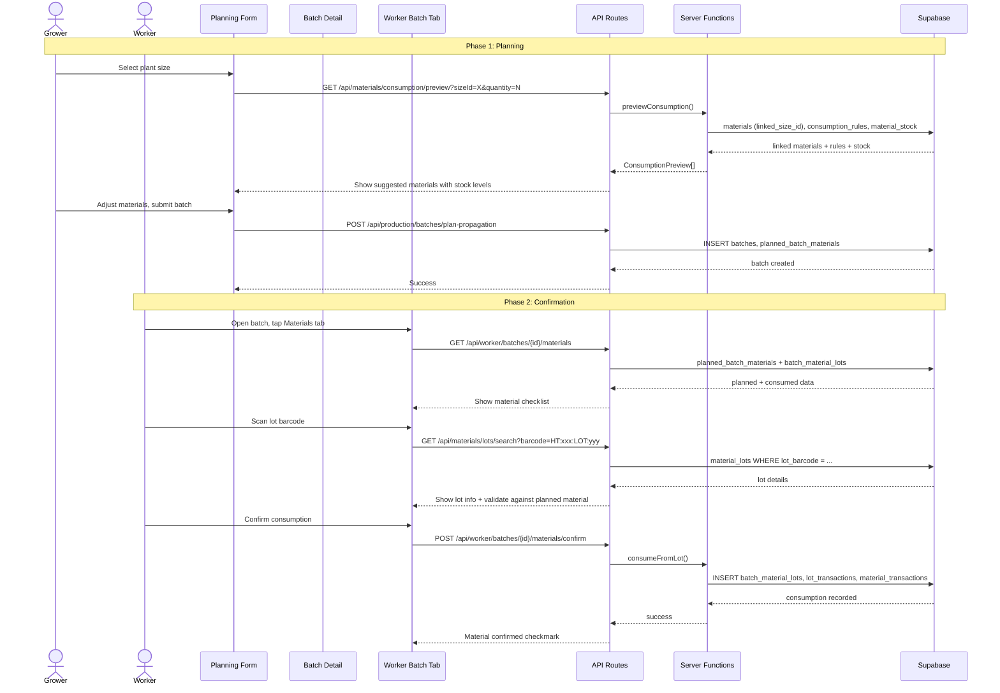
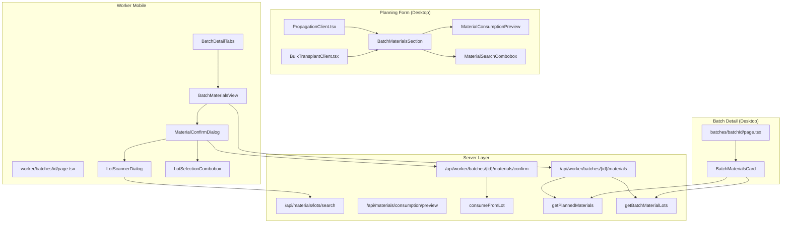
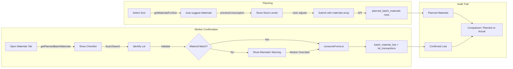

# Implementation Plan: Materials-Production Integration (Proper Architecture)

**Status**: Draft
**Created**: 2026-02-06
**Author**: Planner (Perspective B -- Proper Architecture)
**Complexity**: L
**Estimated Sessions**: 3-4

---

## Perspective: Proper Architecture

### Optimization Goals
This plan prioritizes:
1. Clean data flow with full audit trail: plan -> assign -> confirm -> consume -> trace
2. Excellent worker UX on mobile (large touch targets, scanner-first, FIFO guidance)
3. Extensibility for future material types beyond pots and compost
4. Mismatch detection between planned and actual materials used

### Trade-offs Accepted
- **More files created**: Proper separation of concerns means more components, but each is focused and testable
- **Slightly more work than MVP**: The validation layer (planned vs actual comparison) adds a phase, but it is the key differentiator for a production-grade nursery system
- **New API endpoints**: Rather than overloading existing endpoints, we create purpose-built ones for clarity

### What This Plan Does Well
- Full traceability from batch -> planned materials -> confirmed lots -> consumption records
- Worker-optimized mobile UI with barcode scanning and FIFO suggestions
- Mismatch alerts when workers use different materials than planned
- Extensible architecture that handles any material category (not just pots/compost)

### What This Plan Sacrifices
- Speed to ship (3-4 sessions vs a simpler 2-session approach)
- Some existing UI changes that could be deferred

---

## Pre-Flight Check
- Existing PLAN.md: Other plans exist but none cover materials-production integration
- ROADMAP.md alignment: N/A (no ROADMAP.md found)
- Related plans: PLAN-stock-allocation.md (tangential -- allocation is for sales, not production materials)
- Backlog cross-ref: None found

---

## 1. Overview

### Problem Statement
When planning batches (propagation or transplant), growers need to specify which materials (pots, compost, trays, labels) are required. Currently, the API supports an optional `materials` array on plan-propagation/plan-transplant, and the `planned_batch_materials` table exists, but there is **no UI** to assign materials during planning.

Once a batch is planned, potting teams need to **confirm** which materials they actually used -- ideally by scanning lot barcodes or selecting from FIFO-ordered lists. Currently, workers viewing a batch cannot see what materials were planned for it, and there is no mechanism to record consumption tied to specific lots.

### Proposed Solution
Build the complete materials-production pipeline across three surfaces:

1. **Planning UI** (desktop, `/production/batches/new/*`): Add a collapsible "Materials" section to propagation and transplant forms. Auto-suggest materials linked to the selected size via `linked_size_id`. Show consumption preview with stock availability.

2. **Batch Detail** (desktop + worker): Add a "Materials" tab/card showing planned materials, confirmed materials, and consumption status. Show planned-vs-actual comparison.

3. **Worker Material Confirmation** (mobile, `/worker/batches/[id]`): Add a "Materials" tab to `BatchDetailTabs`. Workers scan lot barcodes or search/select lots. FIFO suggestions guide correct lot usage. Confirmation creates `batch_material_lots` records and decrements lot stock.

### Scope
**In Scope**:
- Material assignment UI on propagation and transplant planning forms
- Material visibility on batch detail pages (desktop + worker)
- Worker material confirmation flow with barcode scanning + manual search
- FIFO-guided lot selection
- Planned vs actual mismatch detection
- Consumption recording via existing `consumeFromLot` function

**Out of Scope**:
- Bulk material confirmation across multiple batches at once (future)
- Offline/PWA caching of material data (future)
- Material purchase order integration from production planning (exists separately)
- Changing the `planned_batch_materials` or `batch_material_lots` schema (already correct)

---

## 2. Requirements

### Functional Requirements
| ID | Requirement | Priority | Size |
|----|-------------|----------|------|
| FR-1 | Planner can add/remove materials with quantities when planning a propagation batch | P0 | M |
| FR-2 | Materials auto-suggest based on selected plant size (via `linked_size_id` and consumption rules) | P0 | S |
| FR-3 | Show stock availability preview inline during planning | P0 | S |
| FR-4 | Planned materials are saved to `planned_batch_materials` table | P0 | S |
| FR-5 | Batch detail page shows planned materials with status (pending/confirmed/mismatched) | P0 | M |
| FR-6 | Workers can see planned materials on batch detail (mobile) | P0 | M |
| FR-7 | Workers can confirm a material by scanning lot barcode | P0 | M |
| FR-8 | Workers can confirm a material by searching/selecting a lot (fallback to scan) | P0 | M |
| FR-9 | FIFO-ordered lot suggestions shown during confirmation | P1 | S |
| FR-10 | Confirmation creates `batch_material_lots` record and decrements lot stock | P0 | S |
| FR-11 | Alert when confirmed material differs from planned material | P1 | S |
| FR-12 | Alert when lot has insufficient stock for planned quantity | P1 | S |
| FR-13 | Transplant planning form also supports material assignment (same UI as propagation) | P1 | M |
| FR-14 | Desktop batch detail shows material consumption audit trail | P1 | S |

### Non-Functional Requirements
| ID | Requirement | Target |
|----|-------------|--------|
| NFR-1 | Worker material confirmation completes in < 2s | Response time |
| NFR-2 | Scanner works on mobile Chrome/Safari | Browser compatibility |
| NFR-3 | Touch targets >= 44px for worker UI | Accessibility |
| NFR-4 | All material operations respect org_id RLS | Security |

### Assumptions
- `planned_batch_materials` table and `batch_material_lots` table already exist with correct schema
- `consumeFromLot` in `src/server/materials/lots.ts` handles the full consumption flow (lot transaction + batch_material_lots + aggregate stock)
- `getMaterialsForSize` in `src/server/materials/consumption.ts` returns linked materials
- The `MaterialScannerDialog`, `MaterialSearchCombobox`, and `LotSelectionCombobox` components already exist and work
- Lot barcodes follow the format `HT:{ORG_PREFIX}:LOT:{LOT_NUMBER}`
- `parseLotScanCode` in `src/lib/scan/parse.ts` handles lot barcode parsing

### Open Questions
- [ ] Should material confirmation be mandatory before a batch can transition from "Planned" to "Growing"? (Recommended: No, keep optional for flexibility but show warning badge)
- [ ] Maximum number of materials per batch? (Recommend: No hard limit, but UI optimized for 2-5)

---

## 3. Technical Design

### Architecture Overview

The system follows a three-tier data flow:

```
PLANNING PHASE                  CONFIRMATION PHASE              AUDIT PHASE
(Desktop UI)                    (Worker Mobile UI)              (Both UIs)

Grower selects size        -->  Worker opens batch         -->  Batch detail shows:
  |                               |                              - Planned materials
  v                               v                              - Confirmed lots
Auto-suggest materials          See planned materials            - Consumption records
  |                               |                              - Planned vs actual delta
  v                               v
Grower adjusts quantities       Scan lot barcode / search
  |                               |
  v                               v
Save to planned_batch_materials  Validate lot (material match,
                                  stock check)
                                    |
                                    v
                                  consumeFromLot() ->
                                  batch_material_lots +
                                  lot_transactions +
                                  material_transactions
```

### System Diagram



### Component Diagram



### Database Changes
**Assessment**: Minor (no schema changes needed)
**data-engineer Required**: No

The existing tables are sufficient:
- `planned_batch_materials` (batch_id, material_id, quantity_planned, notes) -- already exists
- `batch_material_lots` (batch_id, lot_id, material_id, quantity_consumed, consumed_by, job_id) -- already exists
- `material_lots` with lot_barcode, current_quantity, FIFO ordering -- already exists

**One new server query function needed**: `getPlannedBatchMaterials(batchId)` to read from `planned_batch_materials` with joined material info.

### API Changes
| Endpoint | Method | Purpose | Size | Status |
|----------|--------|---------|------|--------|
| `/api/worker/batches/[id]/materials` | GET | Get planned + consumed materials for a batch | M | New |
| `/api/worker/batches/[id]/materials/confirm` | POST | Confirm material lot consumption | M | New |
| `/api/materials/lots/search` | GET | Search lots by barcode/number | S | Exists |
| `/api/materials/consumption/preview` | GET | Preview consumption for a size | S | Exists |
| `/api/production/batches/plan-propagation` | POST | Already accepts `materials` array | S | Exists (no change) |

### Frontend Changes
| Component | Change | Size | Notes |
|-----------|--------|------|-------|
| `src/components/batches/BatchMaterialsSection.tsx` | **NEW** | M | Reusable material assignment UI for planning forms |
| `src/components/batches/BatchMaterialsCard.tsx` | **NEW** | M | Desktop batch detail card showing planned + consumed |
| `src/components/worker/batch/BatchMaterialsView.tsx` | **NEW** | L | Worker mobile materials tab with confirmation flow |
| `src/components/worker/batch/MaterialConfirmDialog.tsx` | **NEW** | M | Dialog for scanning/selecting lot and confirming |
| `src/components/worker/batch/LotScannerDialog.tsx` | **NEW** | S | Lot-specific scanner dialog (adapts MaterialScannerDialog) |
| `src/app/production/batches/new/propagation/PropagationClient.tsx` | **MODIFY** | S | Add BatchMaterialsSection below form |
| `src/app/production/batches/[batchId]/page.tsx` | **MODIFY** | S | Add BatchMaterialsCard to detail page |
| `src/components/worker/batch/BatchDetailTabs.tsx` | **MODIFY** | S | Add "Materials" tab |

### Data Flow



---

## 4. Alternatives Considered

| Approach | Pros | Cons | Decision |
|----------|------|------|----------|
| **A: Full Architecture (this plan)** | Complete audit trail, mismatch detection, extensible, good UX | More files, 3-4 sessions | **Selected** |
| **B: Inline consumption only** | Fast to ship, simpler | No planned-vs-actual tracking, no audit trail, hard to extend | Rejected: Loses the key value of traceability |
| **C: Deferred confirmation** | Planning UI only, defer worker flow | Ships faster | Rejected: The worker confirmation IS the core value for potting teams |
| **D: Batch-level consumption (no lot tracking)** | Simpler, fewer components | Loses lot-level traceability, FIFO becomes meaningless | Rejected: Existing infrastructure supports lot-level and should be used |

**Decision Rationale**: Option A is selected because the database infrastructure (`planned_batch_materials`, `batch_material_lots`, FIFO functions, lot barcodes) is already built for this exact flow. Building only the UI layer on top of robust existing backend is the right investment. The worker confirmation flow is the primary user need -- potting teams need to verify they are using the correct pots and compost.

---

## 5. Implementation Plan

### Phase 1: Server Layer + Planning UI (P0)

| # | Task | Agent | Size | Depends On | Acceptance Criteria |
|---|------|-------|------|------------|---------------------|
| 1.1 | Create `getPlannedBatchMaterials()` server function | `feature-builder` | S | - | Function in `src/server/materials/consumption.ts` queries `planned_batch_materials` with material join, returns typed array |
| 1.2 | Create `BatchMaterialsSection` component | `feature-builder` | M | 1.1 | New component at `src/components/batches/BatchMaterialsSection.tsx`. Collapsible section. When sizeId changes, calls `previewConsumption` to auto-suggest materials. Shows material rows with quantity inputs, add/remove buttons, stock availability badges. Uses existing `MaterialSearchCombobox` for adding custom materials. |
| 1.3 | Integrate `BatchMaterialsSection` into PropagationClient | `feature-builder` | S | 1.2 | PropagationClient renders `BatchMaterialsSection` after the size selector. Materials array is included in form submission payload. |
| 1.4 | Verify `plan-propagation` API saves materials correctly | `feature-builder` | S | 1.3 | End-to-end test: Create batch with materials -> verify `planned_batch_materials` rows exist in DB. The API already handles the `materials` array. |

**Phase 1 UX Wireframe: BatchMaterialsSection**:
```
+--------------------------------------------------+
| Materials (Estimated)                    [Collapse]|
|                                                    |
| Auto-suggested for size "9cm Pot":                |
|                                                    |
| [POT] 9cm Premium Pot    Qty: [1200]   OK (5000) |
| [SOI] Multi-Purpose Comp  Qty: [120L]  LOW (80L) |
|                                                    |
| + Add Material                                     |
|   [MaterialSearchCombobox]  [Scan]                |
|                                                    |
| Stock Note: "Multi-Purpose Compost" may be short. |
| Available: 80L, Required: 120L.                    |
+--------------------------------------------------+
```

**Phase 1 Complete When**:
- [ ] Grower can see auto-suggested materials when selecting a size on propagation form
- [ ] Grower can adjust quantities and add/remove materials
- [ ] Submitting batch saves material assignments to `planned_batch_materials`
- [ ] Stock shortage warnings display correctly

---

### Phase 2: Worker Confirmation Flow (P0)

| # | Task | Agent | Size | Depends On | Acceptance Criteria |
|---|------|-------|------|------------|---------------------|
| 2.1 | Create `GET /api/worker/batches/[id]/materials` endpoint | `feature-builder` | M | 1.1 | Returns `{ planned: PlannedMaterial[], consumed: BatchMaterialLot[], summary: MaterialChecklistItem[] }`. Summary merges planned + consumed into a checklist with status per material. |
| 2.2 | Create `POST /api/worker/batches/[id]/materials/confirm` endpoint | `feature-builder` | M | - | Accepts `{ lotId, materialId, quantity, notes? }`. Calls `consumeFromLot()`. Returns updated material checklist. Auth check: worker must belong to same org as batch. |
| 2.3 | Create `LotScannerDialog` component | `feature-builder` | S | - | New component at `src/components/worker/batch/LotScannerDialog.tsx`. Adapts existing `MaterialScannerDialog` pattern but uses `parseLotScanCode` and looks up lots via `/api/materials/lots/search`. Shows lot details (material name, quantity, expiry) on successful scan. |
| 2.4 | Create `MaterialConfirmDialog` component | `feature-builder` | M | 2.3 | New component at `src/components/worker/batch/MaterialConfirmDialog.tsx`. Two input modes: (1) Scan button opens LotScannerDialog, (2) LotSelectionCombobox for manual selection. Shows FIFO-suggested lots. Shows mismatch warning if scanned lot material != planned material. Quantity input (defaults to planned). Confirm button calls POST endpoint. |
| 2.5 | Create `BatchMaterialsView` component | `feature-builder` | L | 2.1, 2.4 | New component at `src/components/worker/batch/BatchMaterialsView.tsx`. Renders material checklist. Each item shows: material name, planned qty, confirmed qty, status (pending/confirmed/partial/mismatch). Tapping an unconfirmed item opens `MaterialConfirmDialog`. Mobile-optimized: large touch targets, clear status indicators. |
| 2.6 | Add "Materials" tab to `BatchDetailTabs` | `feature-builder` | S | 2.5 | Add new tab entry `{ key: "materials", label: "Materials", icon: Package }` to tabs array. Render `BatchMaterialsView` when active. |

**Phase 2 UX Wireframe: Worker Materials Tab**:
```
+------------------------------------------+
| [Summary] [Stock] [Health] [Scout] [Materials] |
+------------------------------------------+
|                                          |
|  Materials Checklist                     |
|                                          |
|  +--------------------------------------+|
|  | [check] 9cm Premium Pot              ||
|  |   Planned: 1,200  Confirmed: 1,200  ||
|  |   Lot: L-M-POT-001-0042             ||
|  |   Status: CONFIRMED                  ||
|  +--------------------------------------+|
|                                          |
|  +--------------------------------------+|
|  | [!] Multi-Purpose Compost            ||
|  |   Planned: 120L  Confirmed: --       ||
|  |   Tap to confirm                     ||
|  |   Status: PENDING           [Scan]   ||
|  +--------------------------------------+|
|                                          |
|  +--------------------------------------+|
|  | [~] Plant Labels                     ||
|  |   Planned: 1,200  Confirmed: 1,200  ||
|  |   Used different lot than planned    ||
|  |   Status: MISMATCH (qty OK)          ||
|  +--------------------------------------+|
+------------------------------------------+
```

**Phase 2 UX Wireframe: MaterialConfirmDialog**:
```
+------------------------------------------+
|  Confirm Material                    [X] |
|                                          |
|  Expected: 9cm Premium Pot               |
|  Planned Qty: 1,200 each                 |
|                                          |
|  +----- Select Lot -------------------+ |
|  | [Scan Barcode]  or  [Search Lots]  | |
|  +------------------------------------+ |
|                                          |
|  Suggested (FIFO):                       |
|  +------------------------------------+ |
|  | L-M-POT-001-0042  Qty: 2,000      | |
|  | Received: 2026-01-15  [FIFO pick]  | |
|  +------------------------------------+ |
|  | L-M-POT-001-0043  Qty: 5,000      | |
|  | Received: 2026-01-28               | |
|  +------------------------------------+ |
|                                          |
|  Quantity: [1200]                        |
|                                          |
|  [Cancel]              [Confirm Usage]   |
+------------------------------------------+
```

**Phase 2 Complete When**:
- [ ] Worker can see planned materials on batch detail
- [ ] Worker can scan a lot barcode and see it matched to a planned material
- [ ] Worker can manually search/select a lot from FIFO-ordered list
- [ ] Confirming consumption creates `batch_material_lots` record
- [ ] Lot stock is decremented correctly
- [ ] Mismatch warning appears when wrong material is scanned

---

### Phase 3: Desktop Batch Detail + Polish (P1-P2)

| # | Task | Agent | Size | Depends On | Acceptance Criteria |
|---|------|-------|------|------------|---------------------|
| 3.1 | Create `BatchMaterialsCard` for desktop batch detail | `feature-builder` | M | 1.1, Phase 2 | New component at `src/components/batches/BatchMaterialsCard.tsx`. Card with table showing planned materials, confirmed lots (linked), consumption quantities, and status. Shows "No materials planned" empty state when none exist. |
| 3.2 | Add `BatchMaterialsCard` to batch detail page | `feature-builder` | S | 3.1 | Add card to `src/app/production/batches/[batchId]/page.tsx` in the detail grid. Positioned in the right column below PlantHealthCard. |
| 3.3 | Integrate `BatchMaterialsSection` into transplant form | `feature-builder` | S | 1.2 | Add same `BatchMaterialsSection` to `BulkTransplantClient.tsx` and `MultiTransplantClient.tsx`. Same pattern as propagation. |
| 3.4 | Add confirmation badge to batch list views | `feature-builder` | S | Phase 2 | In batch list pages, show a small "Materials: 2/3 confirmed" indicator for batches with planned materials. Helps growers see which batches still need material confirmation. |

**Phase 3 Complete When**:
- [ ] Desktop batch detail shows materials card with planned + consumed data
- [ ] Transplant forms support material assignment
- [ ] Batch lists indicate material confirmation status

---

## 6. File Map

### New Files
| File | Purpose | Phase |
|------|---------|-------|
| `src/components/batches/BatchMaterialsSection.tsx` | Material assignment UI for planning forms | 1 |
| `src/components/batches/BatchMaterialsCard.tsx` | Desktop batch detail materials card | 3 |
| `src/components/worker/batch/BatchMaterialsView.tsx` | Worker materials checklist tab | 2 |
| `src/components/worker/batch/MaterialConfirmDialog.tsx` | Lot confirmation dialog (scan + search) | 2 |
| `src/components/worker/batch/LotScannerDialog.tsx` | Lot-specific barcode scanner dialog | 2 |
| `src/app/api/worker/batches/[id]/materials/route.ts` | GET planned + consumed materials | 2 |
| `src/app/api/worker/batches/[id]/materials/confirm/route.ts` | POST confirm lot consumption | 2 |

### Modified Files
| File | Change | Phase |
|------|--------|-------|
| `src/server/materials/consumption.ts` | Add `getPlannedBatchMaterials()` function | 1 |
| `src/app/production/batches/new/propagation/PropagationClient.tsx` | Add `BatchMaterialsSection` below size selector | 1 |
| `src/app/production/forms/propagation-schema.ts` | Add optional `materials` array to Zod schema | 1 |
| `src/components/worker/batch/BatchDetailTabs.tsx` | Add "Materials" tab | 2 |
| `src/app/production/batches/[batchId]/page.tsx` | Add `BatchMaterialsCard` | 3 |
| `src/app/production/batches/new/bulk-transplant/BulkTransplantClient.tsx` | Add `BatchMaterialsSection` | 3 |
| `src/app/production/batches/new/multi-transplant/MultiTransplantClient.tsx` | Add `BatchMaterialsSection` | 3 |

### Existing Components Reused (No Changes Needed)
| Component | Used By | Purpose |
|-----------|---------|---------|
| `src/components/materials/MaterialSearchCombobox.tsx` | BatchMaterialsSection | Search/scan materials during planning |
| `src/components/materials/MaterialConsumptionPreview.tsx` | Reference pattern | Pattern reference for stock preview UI |
| `src/components/materials/LotSelectionCombobox.tsx` | MaterialConfirmDialog | FIFO lot selection during confirmation |
| `src/components/materials/MaterialScannerDialog.tsx` | LotScannerDialog | Pattern reference for scanner dialog |
| `src/lib/scan/parse.ts` (`parseLotScanCode`) | LotScannerDialog | Parse scanned lot barcodes |
| `src/server/materials/lots.ts` (`consumeFromLot`) | confirm API | Execute lot consumption |
| `src/server/materials/lots.ts` (`getBatchMaterialLots`) | materials API | Get consumed lots for a batch |
| `src/server/materials/lots.ts` (`getAvailableLotsFifo`) | MaterialConfirmDialog (via API) | FIFO lot suggestions |
| `src/server/materials/consumption.ts` (`previewConsumption`) | BatchMaterialsSection (via API) | Auto-suggest + stock preview |
| `src/server/materials/consumption.ts` (`getMaterialsForSize`) | Planning flow | Find linked materials for a size |

---

## 7. Risks & Mitigations

| Risk | Likelihood | Impact | Mitigation |
|------|------------|--------|------------|
| `planned_batch_materials` may not have RLS policies | Medium | High | Check and add RLS policy matching existing pattern (org_id filter) in Phase 1 |
| Scanner may not work reliably in nursery (dirty/damaged barcodes) | Medium | Medium | Always provide manual search fallback (LotSelectionCombobox). Scanner is optional, never blocking. |
| Workers may skip material confirmation | Medium | Low | Make it visible (badge on batch list) but not mandatory. Planned materials still provide planning value even without confirmation. |
| Lot stock goes negative if quantity entered exceeds available | Low | Medium | Validate on server side in `consumeFromLot` (already throws if insufficient). Show warning in UI before confirm. |
| Performance of loading materials for each batch in a list view | Low | Medium | Batch list indicator (task 3.4) uses a lightweight count query, not full material details |

---

## 8. Definition of Done

Feature is complete when:
- [ ] All P0 tasks complete (Phases 1 + 2)
- [ ] All P1 tasks complete (Phase 3) or explicitly deferred with reason
- [ ] Grower can plan a propagation batch with auto-suggested materials
- [ ] Worker can open a batch, see planned materials, and confirm using scanner or search
- [ ] Consumption records are created correctly in `batch_material_lots`
- [ ] Lot stock decrements correctly after confirmation
- [ ] Mismatch warnings display when wrong material confirmed
- [ ] Desktop batch detail shows materials card
- [ ] Tests passing (`verifier`)
- [ ] RLS policies verified for `planned_batch_materials` access
- [ ] Code reviewed (`reviewer`)

---

## 9. Handoff Notes

### Jimmy Command String
```
jimmy execute PLAN-materials-production-B.md --mode thorough
```

### For Jimmy (Routing)
- **Start with**: `feature-builder` for Phase 1 task 1.1 (server function)
- **DB Work Required**: No schema changes. May need RLS policy check (run `security-auditor` after Phase 1).
- **Recommended Mode**: thorough (multiple surfaces, needs careful testing)
- **Critical Dependencies**: All existing server functions + components exist. No blockers.
- **Estimated Sessions**: 3-4

### For feature-builder
**Key patterns to follow**:
- Forms use `react-hook-form` + `zod` (see `PropagationClient.tsx`)
- Worker UI uses haptic feedback (`vibrateTap`, `vibrateSuccess` from `@/lib/haptics`)
- Worker tabs use `BatchDetailTabs` pattern (see `src/components/worker/batch/BatchDetailTabs.tsx`)
- Material components use `Command`/`Popover` from shadcn for combobox pattern
- API routes use `getUserAndOrg()` for auth (see `plan-propagation/route.ts`)
- Worker API routes are in `src/app/api/worker/` and use the same auth pattern
- The `consumeFromLot()` function in `src/server/materials/lots.ts` handles the full consumption flow -- do NOT reimplement
- `getAvailableLotsFifo()` returns lots in FIFO order with `isSuggested` flag
- `getBatchMaterialLots()` already exists for fetching consumed lots per batch

**Gotchas to avoid**:
- Supabase joins may return arrays instead of objects -- use the `extractJoin` helper pattern seen throughout the codebase
- Always check `.error` on every Supabase query
- Worker pages are client-side only ("use client") -- no server components in worker route group
- The `MaterialScannerDialog` uses dynamic import for the scanner to avoid SSR issues -- follow same pattern for `LotScannerDialog`

### For verifier
**What to test**:
- Planning form: add materials, change size (should re-suggest), submit, verify DB records
- Worker: open batch with planned materials, scan valid lot barcode, confirm, verify consumption records
- Worker: scan lot for wrong material, verify mismatch warning
- Worker: try to consume more than lot has, verify error handling
- Desktop: batch detail shows correct planned + consumed data
- Edge case: batch with no planned materials shows empty state

### For security-auditor
**Check these**:
- RLS policies on `planned_batch_materials` (may need to be added)
- Worker API endpoints check org membership
- No cross-org data leakage in materials/lots queries (all queries filter by org_id)

---

## For Dual-Plan Comparison

### Best Suited When
- The nursery values traceability and audit trails (regulatory, quality control)
- Multiple workers need to confirm materials independently per batch
- The nursery plans to expand material tracking beyond pots/compost (labels, fertilizer, chemicals)
- There is a need to compare planned vs actual material usage for cost analysis

### Not Ideal When
- Speed to market is the only priority
- Material tracking is viewed as a "nice to have" rather than essential
- The nursery is very small with only 1-2 people doing both planning and potting

### Key Differentiators
- Full planned-vs-actual comparison with mismatch detection
- Lot-level traceability (not just material-level)
- Extensible to any material category (not hardcoded to pots/compost)
- Three-surface approach (planning, worker confirmation, desktop audit) gives each user role exactly what they need
