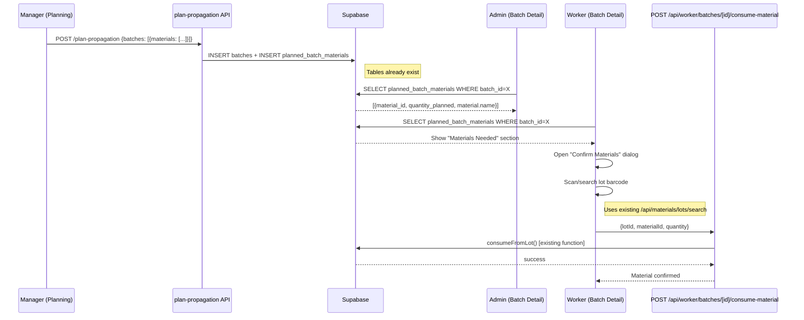
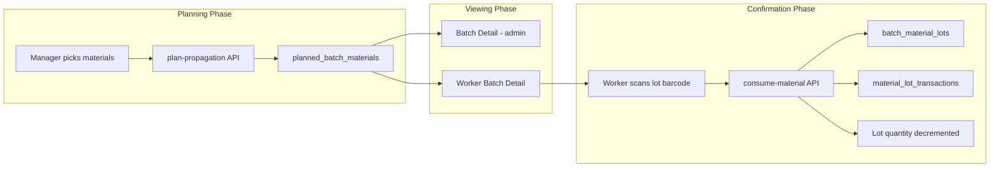

# Implementation Plan: Materials-Production Integration (MVP Speed)

**Status**: Ready
**Created**: 2026-02-06
**Author**: Planner (MVP Speed perspective)
**Complexity**: L
**Estimated Sessions**: 2-3

---

## Perspective: MVP Speed

### Optimization Goals
This plan prioritizes:
1. Minimum new files -- reuse existing components, APIs, and patterns
2. Zero database migrations -- all tables and RLS already exist
3. Fastest path to usable functionality for pots and compost

### Trade-offs Accepted
- No consumption rules UI in this MVP (rules can be set up via existing materials admin)
- No barcode printing for lots in this flow (already exists at `/api/materials/lots/[id]/print`)
- No stock shortage alerts (just visual indicators)
- Worker confirmation is "confirm + record" not full FIFO auto-pick
- Planned materials section is a simple list, not a drag-and-drop builder

### What This Plan Does Well
- Ships 3 usable features with ~8 files changed, ~3 new files
- All backend infrastructure already exists (APIs, server functions, tables)
- Follows established patterns (Dialog components, fetch-based APIs, worker batch tabs)

### What This Plan Sacrifices
- Auto-suggesting materials based on consumption rules during planning (deferred)
- Real-time stock reservation during planning (deferred)
- Multi-lot FIFO auto-selection during confirmation (deferred)

---

## Pre-Flight Check
- Existing PLAN.md: No conflicts (no materials-production plan exists)
- ROADMAP.md alignment: N/A
- Related plans: None
- Backlog cross-ref: None

---

## 1. Overview

### Problem Statement
Managers plan batches (propagation/transplant) but cannot assign material requirements (pots, compost) from the UI. Workers doing the potting cannot see what materials they should use, nor confirm what they actually used. The database tables and server functions all exist -- only UI and lightweight API glue is missing.

### Proposed Solution
Three incremental additions:
1. **Material picker** on batch planning forms (propagation + transplant)
2. **Planned materials display** on batch detail pages (production + worker)
3. **Material confirmation dialog** for workers to record what they used

### Scope
**In Scope**:
- Add material selection to propagation planning form
- Add material selection to transplant planning form
- Show planned materials on batch detail page (production admin)
- Show planned materials on worker batch detail page
- Worker dialog to confirm/record material consumption against a batch
- Worker can search/scan lot barcodes to select specific lots

**Out of Scope**:
- Consumption rules management UI (already exists in materials admin)
- Auto-suggest materials from consumption rules (enhancement for later)
- Stock shortage alerts/notifications
- Analytics/reports on material usage
- Barcode scanning hardware integration (camera scanner already works)

---

## 2. Requirements

### Functional Requirements
| ID | Requirement | Priority | Size |
|----|-------------|----------|------|
| FR-1 | Manager can add materials (pots, compost) when planning propagation batch | P0 | M |
| FR-2 | Manager can add materials when planning transplant batch | P0 | S |
| FR-3 | Planned materials visible on batch detail page (admin) | P0 | S |
| FR-4 | Planned materials visible on worker batch detail page | P0 | S |
| FR-5 | Worker can confirm/record material consumption for a batch | P0 | M |
| FR-6 | Worker can scan or search lot barcodes during confirmation | P1 | M |

### Assumptions
- `planned_batch_materials` table exists with RLS (confirmed in migration `20260106200000`)
- `batch_material_lots` table exists for recording actual consumption
- `consumeFromLot()` in `src/server/materials/lots.ts` handles all consumption logic
- `/api/materials/lots/search` and `/api/materials/lots/fifo` endpoints exist
- `/api/materials/consumption/preview` endpoint exists
- `ScannerClient` component exists and works for barcode scanning
- `parseLotScanCode()` in `src/lib/scan/parse.ts` handles lot barcode parsing

---

## 3. Technical Design

### Architecture Overview
No new architecture needed. This wires existing backend to new/modified UI:

```
Planning Forms (existing) --[add materials array]--> plan-propagation API (already accepts materials)
Batch Detail Pages (existing) --[new section]--> planned_batch_materials table (exists)
Worker Confirmation (new dialog) --[calls]--> consumeFromLot() (exists) via new thin API endpoint
```

### System Diagram



### Database Changes
**Assessment**: None required. All tables exist:
- `planned_batch_materials` -- stores what's planned (migration `20260106200000`)
- `batch_material_lots` -- stores what was consumed (lot-level traceability)
- `material_lot_transactions` -- transaction log (written by `consumeFromLot`)

**data-engineer Required**: No

### API Changes
| Endpoint | Method | Purpose | Size | Status |
|----------|--------|---------|------|--------|
| `/api/production/batches/plan-propagation` | POST | Already accepts `materials[]` | -- | EXISTS |
| `/api/production/batches/plan-transplant` | POST | Already accepts `materials[]` | -- | EXISTS |
| `/api/materials/lots/search` | GET | Search lots by barcode/number | -- | EXISTS |
| `/api/materials/lots/fifo` | GET | FIFO lot selection | -- | EXISTS |
| `/api/materials/consumption/preview` | GET | Preview consumption for size | -- | EXISTS |
| `/api/worker/batches/[id]/materials` | GET | Get planned + consumed materials for batch | S | **NEW** |
| `/api/worker/batches/[id]/consume-material` | POST | Record material consumption from lot | S | **NEW** |

### Frontend Changes
| Component | Change | Size | Notes |
|-----------|--------|------|-------|
| `PropagationClient.tsx` | **Modify**: Add collapsible materials section | M | Add material search + quantity inputs |
| `BulkTransplantClient.tsx` | **Modify**: Add materials section (same pattern) | S | Reuse pattern from propagation |
| `BatchMaterialsSection.tsx` | **New**: Shared component for batch detail | S | Shows planned vs consumed materials |
| `BatchDetailTabs.tsx` | **Modify**: Add "Materials" tab | S | New tab alongside Summary/Stock/Health/Scout |
| `ConfirmMaterialDialog.tsx` | **New**: Worker dialog for confirming material use | M | Scan/search lot, enter quantity, confirm |
| Worker batch detail page | **Modify**: Add "Confirm Materials" action button | S | In Quick Actions card |
| Production batch detail page | **Modify**: Add BatchMaterialsSection | S | In the detail grid |

### Data Flow



---

## 4. Alternatives Considered

| Approach | Pros | Cons | Decision |
|----------|------|------|----------|
| **A: Lightweight UI wiring (Recommended)** | Reuses all existing APIs/functions; 2-3 sessions; no DB changes | No auto-suggest, manual material selection | **Selected** |
| B: Full consumption rule engine | Auto-suggests correct pots/compost based on size; smarter | Requires new UI for rules, complex preview logic, 5+ sessions | Rejected: Too slow for MVP |
| C: Worksheet-based approach | Materials listed on printed worksheets; workers fill paper forms | Zero UI dev for workers | Rejected: No digital traceability, defeats purpose |

**Decision Rationale**: Option A maximizes reuse. The plan-propagation API already accepts a `materials[]` array (line 20 of route.ts). The `consumeFromLot()` function in `lots.ts` already handles all the consumption logic including `batch_material_lots` traceability and `material_lot_transactions`. We just need UI to invoke these.

---

## 5. Implementation Plan

### Phase 1: Planning Form Materials Section (P0)

| # | Task | Agent | Size | Depends On | Acceptance Criteria |
|---|------|-------|------|------------|---------------------|
| 1.1 | Add materials picker section to `PropagationClient.tsx` | `feature-builder` | M | - | Manager can search materials, set quantities, materials sent in API payload |
| 1.2 | Add same materials picker to `BulkTransplantClient.tsx` | `feature-builder` | S | 1.1 | Transplant form also sends materials |

**Details for 1.1 - PropagationClient.tsx modification**:

The propagation form schema (`propagation-schema.ts`) needs a `materials` field added:
```typescript
materials: z.array(z.object({
  material_id: z.string().uuid(),
  name: z.string(), // display only
  quantity: z.number().positive(),
  notes: z.string().optional(),
})).optional().default([]),
```

The `PropagationClient.tsx` needs a collapsible "Materials" section below the Location field. It should:
- Have an "Add Material" button that opens a searchable dropdown
- Fetch materials from `/api/materials?category=POT,SOI` (pots and compost/soil)
- Each added material shows: name, quantity input, remove button
- On submit, the `createPropagationBatchAction` payload includes `materials[]`

Note: The `createPropagationBatchAction` in `src/app/actions/production.ts` needs to pass materials through to the plan-propagation API. The API already accepts them (see `PlannedMaterialSchema` in plan-propagation route.ts).

**Files to modify**:
- `/Users/patrickdoran/Hortitrack/hortitrack/src/app/production/forms/propagation-schema.ts` -- add materials field
- `/Users/patrickdoran/Hortitrack/hortitrack/src/app/production/batches/new/propagation/PropagationClient.tsx` -- add materials section UI
- Check `src/app/actions/production.ts` for `createPropagationBatchAction` -- ensure materials passed through

**Phase 1 Complete When**:
- [ ] Manager can add pots/compost materials to a propagation batch during planning
- [ ] Materials appear in `planned_batch_materials` table after batch creation
- [ ] Transplant form also supports materials

---

### Phase 2: Material Visibility on Batch Detail Pages (P0)

| # | Task | Agent | Size | Depends On | Acceptance Criteria |
|---|------|-------|------|------------|---------------------|
| 2.1 | Create `BatchMaterialsSection` shared component | `feature-builder` | S | - | Displays planned materials and consumed materials for a batch |
| 2.2 | Add `BatchMaterialsSection` to production batch detail page | `feature-builder` | S | 2.1 | Materials visible on `/production/batches/[batchId]` |
| 2.3 | Create `GET /api/worker/batches/[id]/materials` endpoint | `feature-builder` | S | - | Returns planned + consumed materials for worker app |
| 2.4 | Add "Materials" tab to `BatchDetailTabs.tsx` (worker) | `feature-builder` | S | 2.3 | Workers see materials tab on batch detail |

**Details for 2.1 - BatchMaterialsSection component**:

New file: `src/components/batches/BatchMaterialsSection.tsx`

This is a Card component that:
- Fetches planned materials: `supabase.from('planned_batch_materials').select('*, material:materials(name, part_number, base_uom)').eq('batch_id', batchId)`
- Fetches consumed materials: `getBatchMaterialLots()` from `src/server/materials/lots.ts`
- Displays a table/list:
  - Material name | Planned qty | Consumed qty | Status (checkmark if consumed >= planned)
- For admin page, this is a server component (direct Supabase query)
- For worker page, this fetches from the new API endpoint

**Details for 2.3 - Worker materials API**:

New file: `src/app/api/worker/batches/[id]/materials/route.ts`

Simple GET endpoint that:
1. Gets planned materials from `planned_batch_materials` with material join
2. Gets consumed materials from `batch_material_lots` with lot/material join
3. Returns combined view

```typescript
// Response shape:
{
  planned: [{ materialId, materialName, partNumber, quantityPlanned, uom }],
  consumed: [{ materialId, materialName, lotNumber, quantityConsumed, consumedAt, consumedBy }],
}
```

**Details for 2.4 - Worker BatchDetailTabs modification**:

File: `src/components/worker/batch/BatchDetailTabs.tsx`

Add a 5th tab: `{ key: "materials", label: "Materials", icon: Package }`

When active, renders a new `BatchMaterialsView` component (similar pattern to `StockLedgerView` and `BatchHealthView`) that:
- Calls `GET /api/worker/batches/[id]/materials`
- Shows planned materials as a checklist
- Shows consumed materials with lot numbers
- Has a "Confirm Material" button for each unconfirmed planned material

**Phase 2 Complete When**:
- [ ] Production admin sees planned materials on batch detail page
- [ ] Workers see a "Materials" tab on batch detail
- [ ] Planned and consumed materials displayed correctly

---

### Phase 3: Worker Material Confirmation (P0)

| # | Task | Agent | Size | Depends On | Acceptance Criteria |
|---|------|-------|------|------------|---------------------|
| 3.1 | Create `POST /api/worker/batches/[id]/consume-material` endpoint | `feature-builder` | S | - | Validates input, calls `consumeFromLot()`, returns result |
| 3.2 | Create `ConfirmMaterialDialog` component | `feature-builder` | M | 3.1, 2.4 | Worker can search/scan lot, enter quantity, confirm consumption |
| 3.3 | Wire "Confirm Material" button in materials tab to dialog | `feature-builder` | S | 3.2 | Full flow works end-to-end |

**Details for 3.1 - Consume material API**:

New file: `src/app/api/worker/batches/[id]/consume-material/route.ts`

POST endpoint that:
1. Validates: `{ lotId: uuid, materialId: uuid, quantity: number, notes?: string }`
2. Calls `consumeFromLot()` from `src/server/materials/lots.ts`
3. This function already:
   - Creates lot transaction
   - Creates `batch_material_lots` record
   - Updates aggregate stock
4. Returns success/error

**Details for 3.2 - ConfirmMaterialDialog**:

New file: `src/components/worker/batch-actions/ConfirmMaterialDialog.tsx`

Pattern: Follows `LogActionDialog.tsx` pattern (Dialog + form + async submit).

Dialog flow:
1. Opens with pre-selected material (materialId, materialName, quantityNeeded)
2. Worker scans lot barcode OR searches by lot number
   - Scan: Uses `ScannerClient` component (dynamically imported)
   - Search: Text input that calls `/api/materials/lots/search?q=XXX&materialId=YYY`
3. Shows selected lot info (lot number, available quantity, location)
4. Worker enters quantity consumed (defaults to planned quantity)
5. Submit calls `POST /api/worker/batches/[id]/consume-material`
6. Success toast + refresh materials tab

The scan/search toggle follows the same pattern as the existing worker scan page (`src/app/(worker)/worker/scan/page.tsx`).

**Phase 3 Complete When**:
- [ ] Worker can open "Confirm Material" from materials tab
- [ ] Worker can scan a lot barcode to select a lot
- [ ] Worker can search by lot number to select a lot
- [ ] Consumption is recorded in `batch_material_lots` and transactions
- [ ] Materials tab updates to show confirmed status

---

### Phase 4: Polish (P2)

| # | Task | Agent | Size | Depends On | Acceptance Criteria |
|---|------|-------|------|------------|---------------------|
| 4.1 | Add stock availability indicators on planning form | `feature-builder` | S | Phase 1 | Show "X available" next to each material during planning |
| 4.2 | Add "Quick Add" for pots linked to selected size | `feature-builder` | S | Phase 1 | If materials have `linked_size_id` matching batch size, auto-suggest them |

**Phase 4 Complete When**:
- [ ] Planning form shows stock levels
- [ ] Linked materials auto-suggested

---

## 6. File Summary

### New Files (3)
| File | Purpose |
|------|---------|
| `src/components/batches/BatchMaterialsSection.tsx` | Shared component showing planned vs consumed materials |
| `src/app/api/worker/batches/[id]/materials/route.ts` | GET: planned + consumed materials for a batch |
| `src/app/api/worker/batches/[id]/consume-material/route.ts` | POST: record material consumption from a lot |
| `src/components/worker/batch-actions/ConfirmMaterialDialog.tsx` | Dialog for workers to scan/search lot and confirm material use |

### Modified Files (7)
| File | Change |
|------|--------|
| `src/app/production/forms/propagation-schema.ts` | Add optional `materials` array to schema |
| `src/app/production/batches/new/propagation/PropagationClient.tsx` | Add collapsible materials picker section |
| `src/app/production/batches/new/bulk-transplant/BulkTransplantClient.tsx` | Add materials picker (same pattern) |
| `src/app/production/batches/[batchId]/page.tsx` | Add `BatchMaterialsSection` to batch detail grid |
| `src/components/worker/batch/BatchDetailTabs.tsx` | Add "Materials" tab |
| `src/app/(worker)/worker/batches/[id]/page.tsx` | Add "Confirm Materials" quick action button |
| `src/components/worker/batch-actions/index.ts` | Export new `ConfirmMaterialDialog` |

### Existing Files Leveraged (no changes needed)
| File | How Used |
|------|----------|
| `src/server/materials/lots.ts` -- `consumeFromLot()` | Core consumption logic, called from new API |
| `src/server/materials/lots.ts` -- `getBatchMaterialLots()` | Get consumed materials for a batch |
| `src/server/materials/consumption.ts` -- `getMaterialsForSize()` | Auto-suggest linked materials (Phase 4) |
| `src/app/api/materials/lots/search/route.ts` | Lot barcode/number search for worker dialog |
| `src/app/api/materials/lots/fifo/route.ts` | FIFO lot selection |
| `src/app/api/production/batches/plan-propagation/route.ts` | Already saves materials to `planned_batch_materials` |
| `src/components/Scanner/ScannerClient.tsx` | Barcode scanner for lot scanning |
| `src/lib/scan/parse.ts` -- `parseLotScanCode()` | Parse lot barcodes |

---

## 7. Risks & Mitigations

| Risk | Likelihood | Impact | Mitigation |
|------|------------|--------|------------|
| `createPropagationBatchAction` doesn't pass materials to API | Medium | Medium | Check action file; may need modification to pass through |
| Workers unfamiliar with lot barcode scanning | Low | Low | Provide search as fallback; lot numbers are human-readable |
| Insufficient stock when confirming | Medium | Low | Show available quantity; `consumeFromLot` throws clear error |
| Multi-transplant form has different structure | Low | Low | Do propagation + bulk-transplant first; multi-transplant is P2 |

---

## 8. Definition of Done

Feature is complete when:
- [ ] All P0 tasks complete (Phases 1-3)
- [ ] Manager can plan a propagation batch with pots and compost assigned
- [ ] Manager can plan a transplant batch with materials assigned
- [ ] Admin batch detail shows planned materials
- [ ] Worker batch detail shows materials tab with planned/consumed
- [ ] Worker can confirm material usage by scanning or searching lot
- [ ] Consumption recorded with full traceability (lot, quantity, user, timestamp)
- [ ] P2 tasks deferred to backlog

---

## 9. Handoff Notes

### Jimmy Command String
```
jimmy execute PLAN-materials-production-integration-A.md --mode standard
```

### For Jimmy (Routing)
- **Start with**: `feature-builder` (Phase 1, task 1.1)
- **DB Work Required**: No (all tables exist)
- **Recommended Mode**: standard
- **Critical Dependencies**: Check that `createPropagationBatchAction` passes materials through
- **Estimated Sessions**: 2-3

### For feature-builder
**Key context**:
- Follow `LogActionDialog.tsx` pattern for the worker confirmation dialog
- Follow `BatchHealthView.tsx` / `StockLedgerView.tsx` pattern for the materials tab content
- The propagation plan-propagation API already accepts `materials[]` -- see `PlannedMaterialSchema` at line 8-12 of `src/app/api/production/batches/plan-propagation/route.ts`
- `consumeFromLot()` in `src/server/materials/lots.ts` line 553-633 does ALL the heavy lifting for consumption
- `getBatchMaterialLots()` in the same file (line 775-814) fetches consumed materials for a batch
- The `ScannerClient` component is dynamically imported to avoid SSR issues -- see pattern in `src/app/(worker)/worker/scan/page.tsx`
- The `parseLotScanCode()` function parses `HT:ORG:LOT:L-M-XXX-NNN-NNNN` format and plain lot numbers

**Gotchas**:
- Check `src/app/actions/production.ts` for `createPropagationBatchAction` -- it may call the plan-propagation API or directly insert. If direct insert, needs to also write to `planned_batch_materials`.
- The `BulkTransplantClient.tsx` and `MultiTransplantClient.tsx` are different forms -- do bulk first, defer multi.
- Worker batch detail at `src/app/(worker)/worker/batches/[id]/page.tsx` fetches batch from `/api/worker/batches/${batchId}` -- the materials tab will need its own fetch to the new `/api/worker/batches/[id]/materials` endpoint.

### For verifier
- Test planning flow: create batch with materials, verify `planned_batch_materials` rows created
- Test worker view: open batch detail, check materials tab shows planned materials
- Test confirmation: select lot, confirm consumption, verify `batch_material_lots` and `material_lot_transactions` records
- Edge case: try to consume more than available in lot
- Edge case: plan batch with no materials (should still work)

### For Dual-Plan Comparison

#### Best Suited When
- You want materials tracking working this week
- The team is already doing potting and needs digital confirmation ASAP
- You accept manual material selection (no auto-suggest)

#### Not Ideal When
- You need consumption rules to auto-calculate material needs
- You need stock reservation during planning phase
- You need complex multi-lot FIFO auto-allocation

#### Key Differentiators
- Zero database migrations
- Reuses all existing server functions (consumeFromLot, getBatchMaterialLots, etc.)
- Only 3-4 new files; ~7 modified files
- Ships in 2-3 sessions
