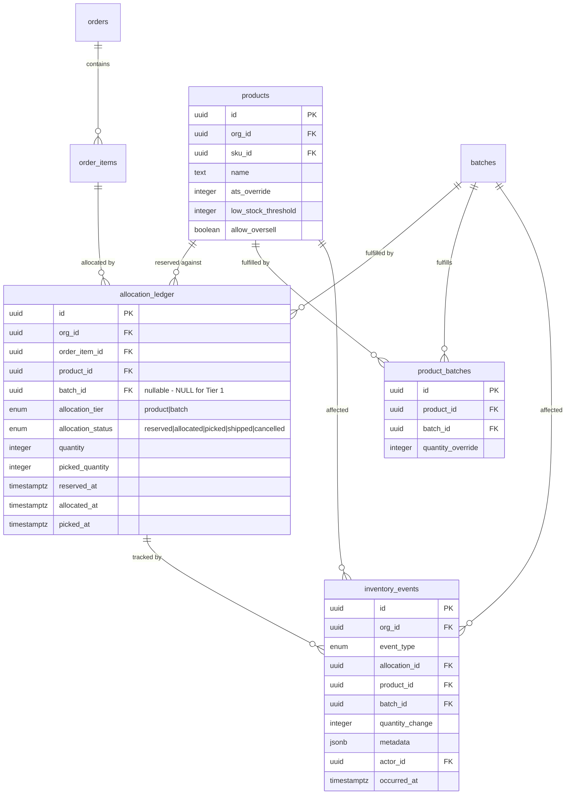
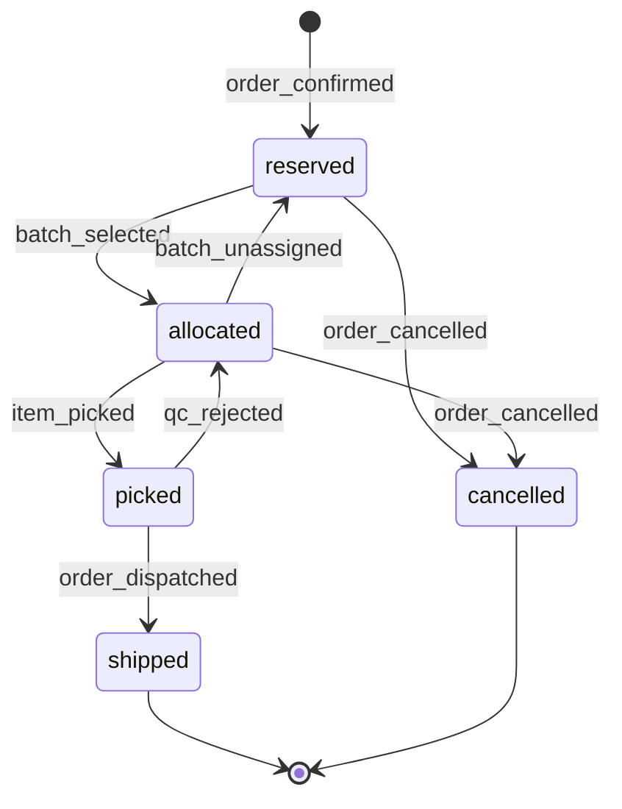
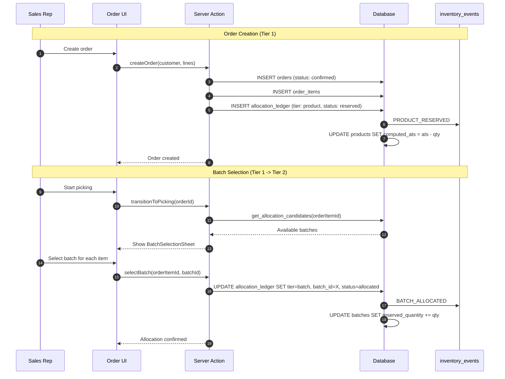

# Implementation Plan: Two-Tier Stock Allocation System

**Status**: Ready
**Created**: 2026-02-04
**Author**: Planner
**Complexity**: XL
**Estimated Sessions**: 6-8
**Perspective**: Proper Architecture - Scalable & Clean

---

## Pre-Flight Check
- Existing PLAN.md: Separate file created (PLAN-stock-allocation-architecture.md)
- ROADMAP.md alignment: Core inventory feature, aligned with sales module roadmap
- Related plans: None directly related
- Backlog cross-ref: None identified

---

## Perspective: Proper Architecture

### Optimization Goals
This plan prioritizes:
1. **Clean data model** - No ambiguity in allocation states or ownership
2. **Event sourcing** - Full audit trail for compliance and debugging
3. **Future extensibility** - Multi-warehouse, complex routing, forecasting-ready
4. **Separation of concerns** - Clear boundaries between tiers

### Trade-offs Accepted
This plan accepts:
- **Longer implementation time**: Proper abstractions take more effort upfront
- **More database objects**: Additional tables, triggers, and functions
- **Initial complexity**: Learning curve for the two-tier mental model

### What This Plan Does Well
- Clear state machine with explicit transitions
- Full audit trail via event sourcing
- Easy to extend for partial fulfillment, returns, cancellations
- Product ATS hybrid model supports both calculation and overrides
- Clean separation enables parallel development of UI and backend

### What This Plan Sacrifices
- Quick-win simplicity (could have modified existing tables)
- Minimal migration effort (requires data migration strategy)

---

## For Dual-Plan Comparison

### Best Suited When
- System will scale to multiple warehouses
- Audit/compliance requirements are important
- Long-term maintainability is prioritized
- Team prefers explicit state machines over implicit logic

### Not Ideal When
- Need to ship in 1-2 sessions
- System will remain single-warehouse forever
- Audit trail not required by business

### Key Differentiators
- Explicit `inventory_events` table for event sourcing
- `allocation_ledger` for unified allocation tracking
- Clear state machine with transition validation
- Built-in support for shortage prioritization (FIFO)

---

## 1. Overview

### Problem Statement
The current system requires batch-level allocation at order creation time. This forces sales staff to select specific batches before confirming orders, which:
1. Slows down order entry (must know exact inventory)
2. Creates conflicts when multiple orders compete for same batches
3. Doesn't match real-world workflow (batch selection happens at picking)
4. Makes "product-level" availability reporting inaccurate

### Proposed Solution
Implement a **two-tier allocation system**:

```
                    ORDER LIFECYCLE
                    ===============

[Draft] --> [Confirmed] --> [Picking] --> [Picked] --> [Dispatched]
               |                |
               v                v
         +-----------+    +-----------+
         | TIER 1    |    | TIER 2    |
         | Product   |    | Batch     |
         | Allocation|    | Allocation|
         +-----------+    +-----------+
               |                |
               v                v
         Decrements       Decrements
         Product ATS      Batch Available
```

**Tier 1: Product Allocation** (NEW)
- Created when order status changes to `confirmed`
- Decrements Product Available-to-Sell (ATS)
- `batch_id` is NULL - not yet assigned to specific batch
- Supports overselling with warning

**Tier 2: Batch Allocation** (EXISTS, modified)
- Created when order status changes to `picking` (human selects batches)
- Picker sees filterable list of available batches
- Updates allocation record with specific `batch_id`
- Transfers reservation from Product level to Batch level

### Scope
**In Scope**:
- Product-level allocation when order confirmed
- Product ATS calculation (hybrid: calculated + override)
- Batch selection UI during picking transition
- Allocation state machine with event sourcing
- Shortage prioritization (FIFO by confirmation date)
- B2B stock indicators (In Stock/Low Stock/Out of Stock)
- Partial fulfillment support
- Order cancellation with allocation release

**Out of Scope**:
- Multi-warehouse allocation routing
- Automated batch matching algorithm (Phase 2)
- Returns processing
- Inventory forecasting (foundation only)

---

## 2. Requirements

### Functional Requirements
| ID | Requirement | Priority | Size |
|----|-------------|----------|------|
| FR-1 | When order status changes to `confirmed`, system creates product-level allocations for each order item | P0 | L |
| FR-2 | Product ATS = sum of linked batch available quantities (with optional override) | P0 | M |
| FR-3 | Product ATS decrements when product allocation created | P0 | M |
| FR-4 | When order status changes to `picking`, picker UI shows batch selection interface | P0 | L |
| FR-5 | Picker can filter batches by variety name, location, grade | P1 | M |
| FR-6 | Batch selection updates allocation with batch_id (Tier 1 -> Tier 2 transition) | P0 | M |
| FR-7 | Batch reserved_quantity increments when allocation moves to Tier 2 | P0 | S |
| FR-8 | Overselling allowed with warning when Product ATS < order quantity | P1 | S |
| FR-9 | Shortage prioritization: FIFO by order confirmation date | P1 | M |
| FR-10 | Order cancellation releases allocations (both tiers) | P0 | M |
| FR-11 | B2B portal shows stock indicators (In Stock/Low Stock/Out of Stock) | P1 | M |
| FR-12 | All allocation changes logged in event table | P0 | M |
| FR-13 | Partial fulfillment supported (pick less than ordered) | P1 | M |

### Non-Functional Requirements
| ID | Requirement | Target |
|----|-------------|--------|
| NFR-1 | Allocation creation < 100ms | Performance |
| NFR-2 | Product ATS calculation < 50ms | Performance |
| NFR-3 | All allocation operations ACID compliant | Reliability |
| NFR-4 | Full audit trail for all allocation changes | Compliance |
| NFR-5 | No orphaned allocations on order/item deletion | Data Integrity |

### Assumptions
- Product-batch relationships (`product_batches` table) already exist and are maintained
- Order status transitions are controlled (no direct DB updates bypassing triggers)
- `sales_status = 'available'` is the gate for batch saleability
- Single-warehouse model (no multi-warehouse routing in this phase)

### Open Questions
- [x] What threshold defines "Low Stock"? **Answer: Configurable per product, default 10%**
- [x] Should overselling require manager approval? **Answer: No, warning only**
- [x] Auto-match batches or always manual? **Answer: Hybrid - auto-match + manual overrides**

---

## 3. Technical Design

### Architecture Overview

The system introduces:
1. **`allocation_ledger`** - Unified allocation table replacing batch_allocations for new orders
2. **`inventory_events`** - Event sourcing table for all inventory changes
3. **`product_inventory_summary`** - Materialized view for fast ATS queries
4. **State machine** - Explicit allocation states with transition validation

```
┌─────────────────────────────────────────────────────────────────────┐
│                         ALLOCATION FLOW                             │
├─────────────────────────────────────────────────────────────────────┤
│                                                                      │
│  Order Created (draft)                                               │
│       │                                                              │
│       v                                                              │
│  Order Confirmed ──────┬─────────────────────────────────────────>  │
│       │                │                                             │
│       │         allocation_ledger                                    │
│       │         ┌────────────────────┐                              │
│       │         │ status: reserved   │                              │
│       │         │ tier: product      │                              │
│       └────────>│ batch_id: NULL     │                              │
│                 │ product_id: X      │                              │
│                 │ quantity: N        │                              │
│                 └────────────────────┘                              │
│                           │                                          │
│                           │ inventory_events: PRODUCT_RESERVED       │
│                           │                                          │
│  Order Picking ───────────┼─────────────────────────────────────────>│
│       │                   │                                          │
│       │                   v                                          │
│       │         ┌────────────────────┐                              │
│       │         │ status: allocated  │                              │
│       │         │ tier: batch        │                              │
│       └────────>│ batch_id: Y        │                              │
│                 │ product_id: X      │                              │
│                 │ quantity: N        │                              │
│                 └────────────────────┘                              │
│                           │                                          │
│                           │ inventory_events: BATCH_ALLOCATED        │
│                           │                                          │
│  Item Picked ─────────────┼─────────────────────────────────────────>│
│       │                   │                                          │
│       │                   v                                          │
│       │         ┌────────────────────┐                              │
│       │         │ status: picked     │                              │
│       └────────>│ tier: batch        │                              │
│                 │ batch_id: Y        │                              │
│                 │ picked_qty: N      │                              │
│                 └────────────────────┘                              │
│                           │                                          │
│                           │ inventory_events: BATCH_PICKED           │
│                                                                      │
└─────────────────────────────────────────────────────────────────────┘
```

### System Diagram



### Database Changes
**Assessment**: Significant (design required)
**data-engineer Required**: Yes

| Change | Type | Size | Notes |
|--------|------|------|-------|
| `allocation_ledger` | New Table | L | Replaces batch_allocations for new orders |
| `inventory_events` | New Table | M | Event sourcing for all inventory changes |
| `products` columns | Add Columns | S | `ats_override`, `low_stock_threshold`, `allow_oversell` |
| `v_product_inventory` | New View | M | Real-time Product ATS calculation |
| `trg_order_confirmed_allocate` | New Trigger | M | Auto-create Tier 1 allocations |
| `fn_transition_to_batch_allocation` | New RPC | L | Tier 1 -> Tier 2 transition |
| `fn_calculate_product_ats` | New RPC | M | Product ATS with override support |
| `fn_get_allocation_candidates` | New RPC | M | Batches available for allocation |

**Handoff to data-engineer**:
- Tables needed: `allocation_ledger`, `inventory_events`
- Relationships: Both link to `order_items`, `products`, `batches`
- RLS requirements: Standard org_id isolation
- Expected RPCs/Views: Listed above

### State Machine: Allocation Status



**State Definitions**:
| State | Tier | Meaning | ATS Impact | Batch Reserved Impact |
|-------|------|---------|------------|----------------------|
| `reserved` | Product | Order confirmed, awaiting batch selection | -N | 0 |
| `allocated` | Batch | Batch selected, awaiting picking | 0 | +N |
| `picked` | Batch | Items physically picked | 0 | 0 (qty deducted) |
| `shipped` | Batch | Order dispatched | 0 | 0 |
| `cancelled` | Either | Order/item cancelled | +N or 0 | -N or 0 |

### Inventory Event Types

```sql
CREATE TYPE inventory_event_type AS ENUM (
    -- Tier 1 (Product) events
    'PRODUCT_RESERVED',      -- Order confirmed, product ATS decremented
    'PRODUCT_UNRESERVED',    -- Order cancelled before batch allocation

    -- Tier 2 (Batch) events
    'BATCH_ALLOCATED',       -- Batch assigned to order item
    'BATCH_DEALLOCATED',     -- Batch unassigned (different batch selected)
    'BATCH_PICKED',          -- Items physically picked from batch
    'BATCH_PICK_REVERSED',   -- QC rejection, items returned to batch
    'BATCH_SHIPPED',         -- Order dispatched

    -- Adjustment events
    'MANUAL_ADJUSTMENT',     -- Manual stock adjustment
    'SHORTAGE_RECORDED',     -- Could not fulfill full quantity
    'OVERSELL_RECORDED'      -- Sold more than available
);
```

### API Changes
| Endpoint/RPC | Method | Purpose | Size |
|--------------|--------|---------|------|
| `create_order_with_product_allocation` | RPC | Create order with Tier 1 allocations | L |
| `transition_to_batch_allocation` | RPC | Tier 1 -> Tier 2 for order item | M |
| `get_allocation_candidates` | RPC | Get batches available for order item | M |
| `calculate_product_ats` | RPC | Get Product ATS (with override) | S |
| `get_product_stock_status` | RPC | Returns "in_stock"/"low_stock"/"out_of_stock" | S |
| `/api/inventory/product-ats` | GET | REST endpoint for product ATS | S |
| `/api/picking/batch-select` | POST | Select batch for order item | M |

### Frontend Changes
| Component | Change | Size | Notes |
|-----------|--------|------|-------|
| `BatchSelectionSheet` | New | L | Picker batch selection UI |
| `ProductATSBadge` | New | S | Shows stock status indicator |
| `PickingTransitionDialog` | New | M | Confirm transition to picking |
| `AllocationTimeline` | New | M | Shows allocation history for order |
| `OrderItemAllocations` | Modify | M | Show allocation tier/status |
| Order creation flow | Modify | M | Remove batch selection requirement |

### Data Flow



---

## 4. Alternatives Considered

| Approach | Pros | Cons | Decision |
|----------|------|------|----------|
| **A: Unified allocation_ledger (Selected)** | Single source of truth; clean state machine; easy audit | New table to maintain; migration complexity | Selected - best long-term architecture |
| **B: Extend batch_allocations** | Less migration; fewer changes | Unclear semantics for NULL batch_id; harder to audit | Rejected - muddy data model |
| **C: Separate product_allocations table** | Clear separation of concerns | Two allocation tables to query; sync complexity | Rejected - over-normalized |
| **D: Soft allocation via order_items flags** | Minimal schema changes | No audit trail; hard to query inventory | Rejected - loses traceability |

**Decision Rationale**: Option A (unified allocation_ledger) provides the cleanest data model with explicit tier tracking. The `allocation_tier` and `allocation_status` enums make state clear. The event sourcing pattern via `inventory_events` enables full audit trail and future analytics. While it requires a new table and migration, the architectural clarity justifies the effort for a system expected to handle significant inventory complexity.

---

## 5. Implementation Plan

### Phase 1: Database Foundation (P0)
| # | Task | Agent | Size | Depends On | Acceptance Criteria |
|---|------|-------|------|------------|---------------------|
| 1.1 | Create `inventory_event_type` enum | `data-engineer` | S | - | Enum exists with all event types |
| 1.2 | Create `allocation_tier` enum | `data-engineer` | S | - | Enum exists (product, batch) |
| 1.3 | Create `allocation_status_v2` enum | `data-engineer` | S | - | Enum exists (reserved, allocated, picked, shipped, cancelled) |
| 1.4 | Create `inventory_events` table | `data-engineer` | M | 1.1 | Table with RLS, indexes, grants |
| 1.5 | Create `allocation_ledger` table | `data-engineer` | L | 1.2, 1.3 | Table with RLS, indexes, FK constraints, grants |
| 1.6 | Add columns to `products` table | `data-engineer` | S | - | `ats_override`, `low_stock_threshold`, `allow_oversell` columns exist |
| 1.7 | Create `v_product_inventory` view | `data-engineer` | M | 1.5 | View calculates ATS per product |

**Phase 1 Complete When**:
- [ ] All enums created and deployed
- [ ] `allocation_ledger` table exists with proper constraints
- [ ] `inventory_events` table exists with proper constraints
- [ ] `products` table has new columns
- [ ] `v_product_inventory` view returns correct ATS
- [ ] All RLS policies applied

### Phase 2: Core RPCs (P0)
| # | Task | Agent | Size | Depends On | Acceptance Criteria |
|---|------|-------|------|------------|---------------------|
| 2.1 | Create `fn_log_inventory_event` RPC | `data-engineer` | M | 1.4 | Function logs events atomically |
| 2.2 | Create `fn_calculate_product_ats` RPC | `data-engineer` | M | 1.6, 1.7 | Returns ATS respecting override |
| 2.3 | Create `fn_create_product_allocation` RPC | `data-engineer` | L | 1.5, 2.1 | Creates Tier 1 allocation, logs event |
| 2.4 | Create `fn_transition_to_batch_allocation` RPC | `data-engineer` | L | 2.1, 2.3 | Transitions allocation, logs event |
| 2.5 | Create `fn_get_allocation_candidates` RPC | `data-engineer` | M | - | Returns filterable batch list |
| 2.6 | Create trigger for order confirmation | `data-engineer` | M | 2.3 | Auto-creates Tier 1 allocations |
| 2.7 | Create trigger for order cancellation | `data-engineer` | M | 2.1 | Releases allocations, logs events |

**Phase 2 Complete When**:
- [ ] All RPCs execute without error
- [ ] Order confirmation creates product allocations automatically
- [ ] Product ATS decrements on confirmation
- [ ] Batch selection transitions allocation tier
- [ ] Order cancellation releases allocations
- [ ] All operations log to inventory_events

### Phase 3: Order Flow Modification (P0-P1)
| # | Task | Agent | Size | Depends On | Acceptance Criteria |
|---|------|-------|------|------------|---------------------|
| 3.1 | Create `create_order_with_product_allocation` RPC | `data-engineer` | L | 2.3 | Replaces existing RPC for new flow |
| 3.2 | Update `createOrder` server action | `feature-builder` | M | 3.1 | Uses new RPC, removes batch requirement |
| 3.3 | Update order creation UI | `feature-builder` | M | 3.2 | No longer requires batch selection |
| 3.4 | Create `BatchSelectionSheet` component | `feature-builder` | L | 2.5 | Shows filterable batch list |
| 3.5 | Create picking transition logic | `feature-builder` | M | 2.4, 3.4 | Transition order to picking with batch selection |
| 3.6 | Update pick list creation | `feature-builder` | M | 3.5 | Works with new allocation flow |

**Phase 3 Complete When**:
- [ ] Orders can be created without batch selection
- [ ] Order confirmation creates product allocations
- [ ] Picker can transition order to picking status
- [ ] Batch selection UI appears during transition
- [ ] Pick lists created from batch-allocated items
- [ ] Integration tests passing

### Phase 4: Stock Indicators & B2B (P1)
| # | Task | Agent | Size | Depends On | Acceptance Criteria |
|---|------|-------|------|------------|---------------------|
| 4.1 | Create `fn_get_product_stock_status` RPC | `data-engineer` | S | 2.2 | Returns in_stock/low_stock/out_of_stock |
| 4.2 | Create `ProductATSBadge` component | `feature-builder` | S | 4.1 | Shows stock status visually |
| 4.3 | Integrate badge in product listings | `feature-builder` | S | 4.2 | Badge visible in order creation |
| 4.4 | Add B2B portal stock indicators | `feature-builder` | M | 4.1 | B2B shows stock availability |
| 4.5 | Add oversell warning UI | `feature-builder` | S | 2.2 | Warning when quantity > ATS |

**Phase 4 Complete When**:
- [ ] Stock status indicators visible in product listings
- [ ] B2B portal shows correct stock availability
- [ ] Oversell warning appears appropriately
- [ ] Low stock threshold configurable per product

### Phase 5: Audit Trail & Timeline (P1)
| # | Task | Agent | Size | Depends On | Acceptance Criteria |
|---|------|-------|------|------------|---------------------|
| 5.1 | Create `AllocationTimeline` component | `feature-builder` | M | Phase 2 | Shows allocation event history |
| 5.2 | Add timeline to order detail page | `feature-builder` | S | 5.1 | Timeline visible on order detail |
| 5.3 | Create allocation report queries | `data-engineer` | M | 1.4 | Queries for allocation analytics |

**Phase 5 Complete When**:
- [ ] Allocation timeline visible on order detail
- [ ] All allocation events appear in timeline
- [ ] Event details show actor, timestamp, changes

### Phase 6: Migration & Compatibility (P0)
| # | Task | Agent | Size | Depends On | Acceptance Criteria |
|---|------|-------|------|------------|---------------------|
| 6.1 | Create migration script for existing allocations | `data-engineer` | L | Phase 1 | Migrates batch_allocations to allocation_ledger |
| 6.2 | Create backward compatibility layer | `data-engineer` | M | 6.1 | Old queries still work via view |
| 6.3 | Update picking functions for dual support | `data-engineer` | M | 6.2 | Pick from either allocation source |
| 6.4 | Test migration on staging | `verifier` | M | 6.1-6.3 | All existing orders work correctly |

**Phase 6 Complete When**:
- [ ] Existing allocations migrated to allocation_ledger
- [ ] Old queries work via compatibility view
- [ ] Picking works for both old and new allocations
- [ ] No data loss in migration
- [ ] Rollback script tested

---

## 6. Risks & Mitigations

| Risk | Likelihood | Impact | Mitigation |
|------|------------|--------|------------|
| Migration corrupts existing allocations | Low | High | Test on staging copy; rollback script ready |
| Performance regression on ATS calculation | Medium | Medium | Indexed view; caching layer if needed |
| UI confusion with two-tier model | Medium | Low | Clear status indicators; training documentation |
| Concurrent allocation race conditions | Medium | High | Row-level locking in RPCs; transaction isolation |
| Backward compatibility breaks existing integrations | Medium | Medium | Compatibility view; phased rollout |
| Overselling creates fulfillment issues | Low | Medium | Configurable per product; clear warnings |

---

## 7. Definition of Done

Feature is complete when:
- [ ] All P0 tasks complete
- [ ] All P1 tasks complete (or explicitly deferred with reason)
- [ ] P2 tasks: Deferred to Phase 2 (auto-matching, forecasting)
- [ ] Tests passing (`verifier`)
  - [ ] Unit tests for all RPCs
  - [ ] Integration tests for order flow
  - [ ] Migration test on staging
- [ ] Code reviewed (`reviewer`)
- [ ] Security checked (`security-auditor`)
  - [ ] RLS policies verified
  - [ ] No SQL injection vectors
- [ ] Documentation updated
  - [ ] Database schema documentation
  - [ ] API documentation for new RPCs
- [ ] User acceptance confirmed
  - [ ] Sales can create orders without batch selection
  - [ ] Pickers can select batches during picking transition
  - [ ] Stock indicators visible in UI

---

## 8. Handoff Notes

### Jimmy Command String
```bash
jimmy execute PLAN-stock-allocation-architecture.md --mode thorough
```

### For Jimmy (Routing)
- **Start with**: `data-engineer` for Phase 1 & 2 (database foundation)
- **DB Work Required**: Yes - significant new tables and RPCs
- **Recommended Mode**: thorough (XL complexity, high data integrity requirements)
- **Critical Dependencies**: Migration script must be tested before production deploy
- **Estimated Sessions**: 6-8

### For data-engineer
**Schema Design Requirements**:

1. **allocation_ledger table**:
```sql
CREATE TABLE public.allocation_ledger (
    id uuid PRIMARY KEY DEFAULT gen_random_uuid(),
    org_id uuid NOT NULL REFERENCES organizations(id),
    order_item_id uuid NOT NULL REFERENCES order_items(id) ON DELETE CASCADE,
    product_id uuid NOT NULL REFERENCES products(id),
    batch_id uuid REFERENCES batches(id),  -- NULL for Tier 1

    allocation_tier allocation_tier NOT NULL DEFAULT 'product',
    allocation_status allocation_status_v2 NOT NULL DEFAULT 'reserved',

    quantity integer NOT NULL CHECK (quantity > 0),
    picked_quantity integer NOT NULL DEFAULT 0 CHECK (picked_quantity >= 0),

    reserved_at timestamptz NOT NULL DEFAULT now(),
    allocated_at timestamptz,
    picked_at timestamptz,
    shipped_at timestamptz,
    cancelled_at timestamptz,

    created_at timestamptz NOT NULL DEFAULT now(),
    updated_at timestamptz NOT NULL DEFAULT now(),

    CONSTRAINT unique_order_item_allocation UNIQUE (order_item_id),
    CONSTRAINT tier_batch_consistency CHECK (
        (allocation_tier = 'product' AND batch_id IS NULL) OR
        (allocation_tier = 'batch' AND batch_id IS NOT NULL)
    )
);
```

2. **inventory_events table**:
```sql
CREATE TABLE public.inventory_events (
    id uuid PRIMARY KEY DEFAULT gen_random_uuid(),
    org_id uuid NOT NULL REFERENCES organizations(id),
    event_type inventory_event_type NOT NULL,

    allocation_id uuid REFERENCES allocation_ledger(id),
    product_id uuid REFERENCES products(id),
    batch_id uuid REFERENCES batches(id),
    order_id uuid REFERENCES orders(id),

    quantity_change integer NOT NULL,
    running_ats integer,  -- For product events
    running_batch_qty integer,  -- For batch events

    metadata jsonb NOT NULL DEFAULT '{}',
    actor_id uuid REFERENCES auth.users(id),
    occurred_at timestamptz NOT NULL DEFAULT now(),

    created_at timestamptz NOT NULL DEFAULT now()
);
```

3. **Key RPC signatures**:
```sql
-- Create product allocation (Tier 1)
fn_create_product_allocation(
    p_org_id uuid,
    p_order_item_id uuid,
    p_product_id uuid,
    p_quantity integer,
    p_actor_id uuid
) RETURNS uuid  -- allocation_id

-- Transition to batch allocation (Tier 1 -> Tier 2)
fn_transition_to_batch_allocation(
    p_org_id uuid,
    p_allocation_id uuid,
    p_batch_id uuid,
    p_actor_id uuid
) RETURNS jsonb

-- Get batches available for allocation
fn_get_allocation_candidates(
    p_org_id uuid,
    p_product_id uuid,
    p_variety_filter text DEFAULT NULL,
    p_location_filter uuid DEFAULT NULL,
    p_grade_filter text DEFAULT NULL
) RETURNS TABLE (
    batch_id uuid,
    batch_number text,
    variety_name text,
    available_quantity integer,
    location_name text,
    grade text,
    age_weeks integer
)
```

### For feature-builder
**Key context**:
- Existing order flow is in `/src/app/sales/actions.ts`
- Current allocation logic in `/src/server/sales/allocation.ts`
- Pick list creation in `/src/server/sales/picking.ts`
- Batch selection UI pattern: see existing `BatchSelector` components

**Patterns to follow**:
- Use server actions for mutations
- Use Zod schemas for validation
- Follow existing Sheet component patterns for `BatchSelectionSheet`
- Use existing toast patterns for warnings (oversell)

**Gotchas to avoid**:
- Don't directly update allocation_ledger - use RPCs for state transitions
- Always include org_id in queries for RLS
- Handle the transition period where both old and new allocations exist

### For verifier
**What to test**:
1. Order creation without batch selection
2. Product ATS calculation accuracy
3. Batch selection during picking transition
4. Allocation state transitions
5. Order cancellation releases allocations
6. Existing orders still work (backward compatibility)
7. Concurrent order creation doesn't cause race conditions

**Edge cases**:
- Order with multiple items, different products
- Partial batch availability (need multiple batches)
- Order cancellation mid-picking
- Product with ATS override
- Overselling scenario

### For security-auditor
**Security considerations**:
- Verify RLS on `allocation_ledger` and `inventory_events`
- Ensure RPCs use SECURITY DEFINER with proper search_path
- Validate that allocation changes are only allowed through RPCs
- Check that actor_id is properly captured for audit

---

## 9. Future Extensibility Considerations

This architecture is designed to support future enhancements:

### Multi-Warehouse Support
- `allocation_ledger.warehouse_id` can be added
- `fn_get_allocation_candidates` can filter by warehouse
- Routing logic can be added to allocation creation

### Automated Batch Matching
- `fn_auto_match_batches` can use FEFO/FIFO logic
- Can be triggered on order confirmation for "standard" products
- Manual override always available via `fn_transition_to_batch_allocation`

### Inventory Forecasting
- `inventory_events` provides event source for forecasting models
- Running totals (`running_ats`, `running_batch_qty`) enable point-in-time analysis
- Event types designed to capture all inventory movements

### Returns Processing
- Add `BATCH_RETURNED` event type
- Reverse allocation flow for returns
- Link return to original allocation via `metadata`

### Partial Fulfillment Tracking
- `allocation_ledger.picked_quantity` tracks partial picks
- `SHORTAGE_RECORDED` events capture unfulfilled demand
- Backorder logic can use remaining quantity

---

*This plan prioritizes architectural clarity and long-term maintainability over implementation speed. The event sourcing pattern and explicit state machine provide a solid foundation for a complex inventory system.*
