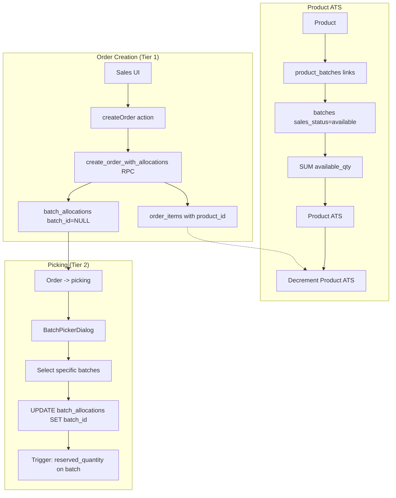

# Implementation Plan: Two-Tier Stock Allocation (MVP/Speed Perspective)

**Status**: Draft
**Created**: 2026-02-04
**Author**: Planner (MVP Speed Perspective)
**Complexity**: M
**Estimated Sessions**: 2-3

---

## Perspective: MVP Speed

### Optimization Goals
This plan prioritizes:
1. Minimal database schema changes (reuse existing tables)
2. Speed to working product - ship within 2-3 sessions
3. Leverage existing infrastructure (batch_allocations, order_items, products)
4. Accept calculated fields over new columns where possible

### Trade-offs Accepted
This plan accepts:
- **Some denormalization**: Product ATS calculated from batches on-demand rather than cached
- **Deferred optimization**: No dedicated product_reservations table; use existing order_items.quantity with batch_id NULL pattern
- **Manual override via existing fields**: Use existing `saleable_quantity` on batches for ATS override rather than new column

### What This Plan Does Well
- Ships fast with minimal migration risk
- Reuses existing `batch_allocations` table with nullable `batch_id`
- Leverages existing `products-with-batches.ts` calculation logic
- No new tables required - only 2 column additions

### What This Plan Sacrifices
- Perfect normalization (product reservations are implicit in order_items)
- Dedicated ATS override column on products (use computed/view instead)
- Separate audit trail for tier-1 vs tier-2 allocations

---

## For Dual-Plan Comparison

### Best Suited When
- Need to ship in < 1 week
- Team familiar with existing allocation patterns
- Can tolerate some calculation overhead
- B2B visibility indicators sufficient (not precise counts)

### Not Ideal When
- High-volume ordering needs optimized queries
- Strict audit requirements for allocation tiers
- Need product-level ATS override per-product (not per-batch)

### Key Differentiators
- Zero new tables (vs "proper" architecture with `product_allocations` table)
- Reuses `batch_allocations.batch_id = NULL` pattern for product-level reservations
- Product ATS calculated dynamically from linked batches

---

## Pre-Flight Check
- Existing PLAN.md: Found (creating separate plan file)
- ROADMAP.md alignment: Aligned - stock allocation is core feature
- Related plans in progress: PLAN-dispatch-review.md (no conflict)
- Backlog items: None blocking

---

## 1. Overview

### Problem Statement
Currently, orders require batch-level allocation at order time. This forces:
1. Sales to know which batches to allocate before confirming
2. Batches reserved immediately, blocking flexibility
3. No product-level "soft reservation" before picking

We need a two-tier system:
- **Tier 1 (Product Allocation)**: Reserve at product level when order confirmed
- **Tier 2 (Batch Allocation)**: Assign specific batches when picking starts

### Proposed Solution (MVP Approach)
Extend existing `batch_allocations` table to allow `batch_id = NULL` for product-level allocations. When picking begins, update the allocation record with a specific batch_id (tier-2).

**Key Insight**: The existing `order_items.product_id` + `order_items.quantity` already implicitly reserves product-level stock. We just need to:
1. Calculate Product ATS from linked batches
2. Allow `batch_allocations` with NULL batch_id (already nullable in schema!)
3. Add batch selection UI at picking stage

### Scope
**In Scope**:
- Product ATS calculation (sum of linked batch available quantities)
- Tier-1 allocation creation on order confirmation
- Tier-2 batch selection UI in picking workflow
- B2B stock indicators (In Stock / Low Stock / Out)
- Overselling warning (not blocking)

**Out of Scope**:
- ATS override at product level (use batch.saleable_quantity)
- Shortage queue/priority FIFO (defer to v2)
- Automatic batch matching (manual selection only for MVP)

---

## 2. Requirements

### Functional Requirements
| ID | Requirement | Priority | Size |
|----|-------------|----------|------|
| FR-1 | Product ATS calculated from linked batches (saleable batches) | P0 | S |
| FR-2 | Tier-1 allocation created when order status -> confirmed | P0 | M |
| FR-3 | Picker can select batches when order status -> picking | P0 | M |
| FR-4 | B2B catalog shows stock indicators | P1 | S |
| FR-5 | Overselling allowed with warning toast | P1 | S |
| FR-6 | Batch selection filtered by variety name | P1 | S |

### Non-Functional Requirements
| ID | Requirement | Target |
|----|-------------|--------|
| NFR-1 | ATS calculation | < 500ms for 100 products |
| NFR-2 | Picking UI batch list | < 300ms load |

### Assumptions
- `batch_allocations.batch_id` is already nullable in schema (confirmed)
- Existing `product_batches` linkage is sufficient for ATS calculation
- `sales_status = 'available'` on batches is the saleable gate

### Open Questions
- [ ] Should we show specific batch quantities in B2B or just indicators? (Assuming indicators for MVP)

---

## 3. Technical Design

### Architecture Overview

```
Order Creation (Tier 1)
    |
    v
[Order confirmed] --> create_order_with_allocations()
    |                    |
    |                    v
    |               order_items (product_id, quantity)
    |                    |
    |                    v
    |               batch_allocations (batch_id = NULL) <-- NEW: Tier-1 record
    |
    v
[Order -> picking] --> Picker UI
    |                    |
    |                    v
    |               BatchPickerDialog (select batches)
    |                    |
    |                    v
    |               UPDATE batch_allocations SET batch_id = X
    |                    |
    |                    v
    |               Trigger: sync reserved_quantity on batches
```

### System Diagram (Data Flow)



### Database Changes
**Assessment**: Minor (2 column additions, 1 RPC modification)
**data-engineer Required**: No (changes are additive and simple)

#### Changes to Existing Tables

| Table | Change | Type | Notes |
|-------|--------|------|-------|
| `batch_allocations` | Add `allocation_tier` column | Add Column | `'product' \| 'batch'` - default 'batch' for backward compat |
| `order_items` | Already has `product_id` | None | Used for tier-1 reservation tracking |
| `batches` | Existing `saleable_quantity` | None | Can use as ATS override if set |

#### Column Addition: `batch_allocations.allocation_tier`

```sql
-- Migration: Add allocation_tier to batch_allocations
ALTER TABLE batch_allocations
ADD COLUMN IF NOT EXISTS allocation_tier text DEFAULT 'batch'
CHECK (allocation_tier IN ('product', 'batch'));

COMMENT ON COLUMN batch_allocations.allocation_tier IS
  'Tier of allocation: product (soft reserve, batch_id NULL) or batch (hard reserve)';

-- Index for filtering by tier
CREATE INDEX IF NOT EXISTS idx_batch_allocations_tier
ON batch_allocations(allocation_tier) WHERE allocation_tier = 'product';
```

### RPC Changes

#### Modified: `create_order_with_allocations`

Current behavior: Creates batch_allocations only if allocations array provided.

New behavior: Always create batch_allocation with `allocation_tier = 'product'` and `batch_id = NULL` if no specific allocations provided.

```sql
-- In the line processing loop, AFTER inserting order_item:

-- If no allocations provided, create tier-1 (product-level) allocation
IF v_line->'allocations' IS NULL OR jsonb_array_length(v_line->'allocations') = 0 THEN
  INSERT INTO public.batch_allocations (
    org_id,
    order_item_id,
    batch_id,          -- NULL for tier-1
    quantity,
    status,
    allocation_tier
  ) VALUES (
    p_org_id,
    v_order_item_id,
    NULL,              -- No batch yet
    (v_line->>'quantity')::integer,
    'reserved',
    'product'          -- Tier-1 allocation
  );
END IF;
```

### API Changes
| Endpoint | Method | Purpose | Size |
|----------|--------|---------|------|
| `/api/picking/[pickListId]/items/[itemId]/assign-batch` | POST | Assign batch to tier-1 allocation | S |
| Existing `/api/sales/available-varieties` | GET | Already exists, may need ATS field | S |

### Frontend Changes
| Component | Change | Size | Notes |
|-----------|--------|------|-------|
| `BatchPickerDialog` | New component | M | Select batches for tier-1 allocations |
| `PickingItemCard` | Add "Assign Batch" button | S | For items with tier-1 allocations |
| `OrderItemsTable` | Show allocation tier badge | S | Visual indicator |
| B2B product card | Stock indicator | S | In Stock/Low Stock/Out |

### Product ATS Calculation

Leverage existing `getProductsWithBatches()` in `/src/server/sales/products-with-batches.ts`.

Current logic already calculates:
```typescript
const totalStock = productBatches.reduce((sum, b) => sum + b.quantity, 0);
const orderReserved = orderReservedMap.get(product.id) || 0;
const netAvailableStock = Math.max(0, totalStock - orderReserved - groupReserved);
```

**Enhancement needed**: Include tier-1 allocations in `orderReserved` calculation.

```typescript
// Current: counts order_items.quantity for active orders
// Enhanced: ALSO count batch_allocations WHERE allocation_tier = 'product' AND status = 'reserved'
```

This is already done - `orderReservedMap` counts order_items.quantity for confirmed/picking/packed orders. No change needed for ATS!

---

## 4. Alternatives Considered

| Approach | Pros | Cons | Decision |
|----------|------|------|----------|
| **A: Extend batch_allocations (Selected)** | Zero new tables, leverages existing trigger | allocation_tier column needed | Selected |
| **B: New product_allocations table** | Clean separation, better audit | More migration, new RLS, more code | Rejected: too slow for MVP |
| **C: Virtual allocations (computed only)** | Zero schema changes | No explicit tier-1 record, harder to track | Rejected: need explicit record for picking |

**Decision Rationale**: Option A gives us explicit tier-1 records with minimal schema change. The existing trigger for `sync_reserved_quantity` already handles batch-level updates; tier-1 records with NULL batch_id won't affect batch reservations (which is correct - product ATS is separate).

---

## 5. Implementation Plan

### Phase 1: Database & Backend Foundation (P0)
| # | Task | Agent | Size | Depends On | Acceptance Criteria |
|---|------|-------|------|------------|---------------------|
| 1.1 | Add `allocation_tier` column migration | `data-engineer` | S | - | Column exists, default='batch', CHECK constraint works |
| 1.2 | Modify `create_order_with_allocations` RPC | `data-engineer` | M | 1.1 | Creates tier-1 allocation when no batch allocations provided |
| 1.3 | Create `assign_batch_to_allocation` RPC | `data-engineer` | S | 1.1 | Updates allocation with batch_id, changes tier to 'batch' |

**Phase 1 Complete When**:
- [ ] Migration applies cleanly
- [ ] New orders without batch selection create tier-1 allocations
- [ ] Batch assignment RPC updates allocation correctly

### Phase 2: Picking UI Enhancement (P0)
| # | Task | Agent | Size | Depends On | Acceptance Criteria |
|---|------|-------|------|------------|---------------------|
| 2.1 | Create `BatchPickerDialog` component | `feature-builder` | M | Phase 1 | Dialog shows available batches, allows selection |
| 2.2 | Add "Assign Batch" to `PickingItemCard` | `feature-builder` | S | 2.1 | Button appears for tier-1 allocations, opens dialog |
| 2.3 | Create assign-batch API route | `feature-builder` | S | 1.3 | POST calls RPC, returns updated allocation |
| 2.4 | Add allocation tier badge to order items | `feature-builder` | S | 1.1 | Shows "Product" or "Batch" badge |

**Phase 2 Complete When**:
- [ ] Picker can select batch for tier-1 allocation
- [ ] Allocation updates to tier-2 after batch assigned
- [ ] Batch reserved_quantity updates correctly

### Phase 3: B2B Stock Indicators (P1)
| # | Task | Agent | Size | Depends On | Acceptance Criteria |
|---|------|-------|------|------------|---------------------|
| 3.1 | Add stock indicator to B2B product cards | `feature-builder` | S | Phase 1 | Shows In Stock/Low Stock/Out based on ATS |
| 3.2 | Add overselling warning in order creation | `feature-builder` | S | Phase 1 | Toast warning when qty > ATS, allows proceed |

**Phase 3 Complete When**:
- [ ] B2B shows stock status indicators
- [ ] Overselling shows warning but doesn't block

### Phase 4: Polish (P2)
| # | Task | Agent | Size | Depends On | Acceptance Criteria |
|---|------|-------|------|------------|---------------------|
| 4.1 | Batch filter by variety name in picker | `feature-builder` | S | 2.1 | Search/filter works |
| 4.2 | Auto-match suggestion (show recommended batch) | `feature-builder` | S | 2.1 | FEFO suggestion shown |

**Phase 4 Complete When**:
- [ ] Batch picker has variety filter
- [ ] Recommended batch highlighted

---

## 6. Risks & Mitigations

| Risk | Likelihood | Impact | Mitigation |
|------|------------|--------|------------|
| Existing orders affected by migration | Low | Med | Default 'batch' tier, existing allocations unchanged |
| ATS calculation performance | Med | Low | Existing query already optimized, cache if needed |
| Tier-1 allocations orphaned if order cancelled | Low | Low | Status 'cancelled' on allocation handles this |
| sync_reserved_quantity trigger with NULL batch_id | Low | High | Verify trigger handles NULL gracefully (SKIP if NULL) |

---

## 7. Definition of Done

Feature is complete when:
- [ ] All P0 tasks complete
- [ ] All P1 tasks complete
- [ ] P2 tasks: deferred to backlog
- [ ] Tests passing (`verifier`)
- [ ] Code reviewed (`reviewer`)
- [ ] Manual testing: create order without batch -> picking -> assign batch flow works
- [ ] Existing orders unaffected (regression test)

---

## 8. Handoff Notes

### Jimmy Command String
```bash
jimmy execute .claude/plans/PLAN-stock-allocation-mvp.md --mode standard
```

### For Jimmy (Routing)
- **Start with**: `data-engineer` for Phase 1 (migration + RPC)
- **DB Work Required**: Yes (1 migration, 2 RPC changes)
- **Recommended Mode**: standard
- **Critical Dependencies**: None blocking
- **Estimated Sessions**: 2-3

### For data-engineer
**Migration file**: `supabase/migrations/YYYYMMDDHHMMSS_two_tier_allocation.sql`

Key requirements:
1. Add `allocation_tier` column with CHECK constraint
2. Modify `create_order_with_allocations` - add tier-1 creation logic
3. Create `assign_batch_to_allocation(p_allocation_id, p_batch_id)` RPC
4. Verify `sync_reserved_quantity` trigger handles NULL batch_id (should skip)

### For feature-builder
Key files to reference:
- `/src/components/worker/picking/BatchSubstitutionSheet.tsx` - similar batch selection UI
- `/src/server/sales/picking.ts` - picking workflow patterns
- `/src/server/sales/products-with-batches.ts` - ATS calculation (already correct)
- `/src/components/sales/PickItemCard.tsx` - picking item UI

Pattern for BatchPickerDialog:
```typescript
// Similar to BatchSubstitutionSheet but for tier-1 -> tier-2 upgrade
interface BatchPickerDialogProps {
  allocationId: string;
  orderItemId: string;
  productId: string;
  requestedQty: number;
  onBatchAssigned: () => void;
}
```

### For verifier
Test scenarios:
1. Create order without batch allocations -> verify tier-1 allocation created
2. Transition to picking -> assign batch via picker -> verify tier-2
3. Check batch reserved_quantity updates correctly
4. Existing order with batch allocations still works (regression)
5. B2B stock indicators reflect correct ATS

---

## Appendix: Migration SQL (Draft)

```sql
-- Migration: 20260204_two_tier_allocation.sql

-- 1. Add allocation_tier column
ALTER TABLE batch_allocations
ADD COLUMN IF NOT EXISTS allocation_tier text DEFAULT 'batch'
CHECK (allocation_tier IN ('product', 'batch'));

COMMENT ON COLUMN batch_allocations.allocation_tier IS
  'Tier of allocation: product (soft reserve at product level, batch_id NULL) or batch (hard reserve on specific batch)';

-- Index for querying tier-1 allocations
CREATE INDEX IF NOT EXISTS idx_batch_allocations_tier_product
ON batch_allocations(allocation_tier, status)
WHERE allocation_tier = 'product' AND status = 'reserved';

-- 2. RPC: Assign batch to allocation (tier-1 -> tier-2 upgrade)
CREATE OR REPLACE FUNCTION public.assign_batch_to_allocation(
  p_allocation_id uuid,
  p_batch_id uuid
)
RETURNS jsonb
LANGUAGE plpgsql
SECURITY DEFINER
SET search_path = ''
AS $$
DECLARE
  v_allocation RECORD;
  v_available integer;
  v_batch_number text;
BEGIN
  -- Get allocation
  SELECT * INTO v_allocation
  FROM public.batch_allocations
  WHERE id = p_allocation_id
  FOR UPDATE;

  IF NOT FOUND THEN
    RAISE EXCEPTION 'Allocation not found';
  END IF;

  IF v_allocation.batch_id IS NOT NULL THEN
    RAISE EXCEPTION 'Allocation already has a batch assigned';
  END IF;

  -- Check batch availability
  SELECT
    (b.quantity - COALESCE(b.reserved_quantity, 0)),
    b.batch_number
  INTO v_available, v_batch_number
  FROM public.batches b
  WHERE b.id = p_batch_id
    AND b.org_id = v_allocation.org_id
  FOR UPDATE;

  IF NOT FOUND THEN
    RAISE EXCEPTION 'Batch not found';
  END IF;

  IF v_available < v_allocation.quantity THEN
    RAISE EXCEPTION 'Insufficient stock in batch %. Available: %, Requested: %',
      COALESCE(v_batch_number, p_batch_id::text), v_available, v_allocation.quantity;
  END IF;

  -- Update allocation
  UPDATE public.batch_allocations
  SET
    batch_id = p_batch_id,
    allocation_tier = 'batch',
    updated_at = now()
  WHERE id = p_allocation_id;

  -- sync_reserved_quantity trigger will update batch.reserved_quantity

  RETURN jsonb_build_object(
    'success', true,
    'allocation_id', p_allocation_id,
    'batch_id', p_batch_id,
    'batch_number', v_batch_number
  );
END;
$$;

-- 3. Modify create_order_with_allocations (add to existing function)
-- This is a replacement - see full function in implementation
```

---

*Plan created with MVP/Speed perspective. Prioritizes fast delivery over perfect architecture.*
