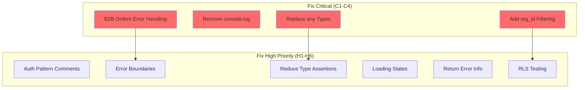
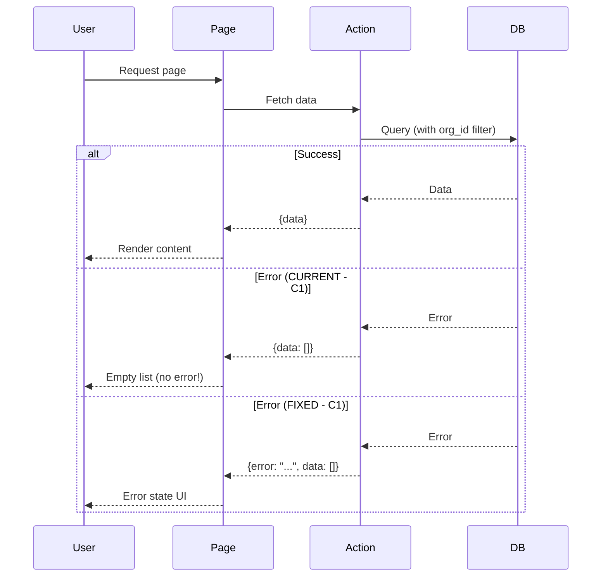

# Implementation Plan: Fix Audit Issues (Quick Wins First)

**Status**: Ready
**Created**: 2026-02-06
**Author**: Planner (Perspective A)
**Complexity**: XL (73 issues, but phased incrementally)
**Estimated Sessions**: 6-8 sessions

---

## Perspective: Quick Wins First

### Optimization Goals
This plan prioritizes:
1. **Immediate Risk Reduction** - Fix critical issues that could cause production incidents
2. **Visible Impact** - Address issues that directly affect user experience
3. **Incremental Delivery** - Ship fixes in small batches for fast feedback
4. **High Priority Focus** - Get C1-C4 and H1-H6 done, defer medium/low

### Trade-offs Accepted
This plan accepts:
- **Pattern establishment delayed**: Won't build comprehensive infrastructure first
- **Some rework**: May need to refactor later when establishing patterns
- **Medium/Low deferred**: 53 issues (P2/P3) handled later or not at all
- **Root cause analysis limited**: Fixes symptoms fast, doesn't deeply investigate why

### What This Plan Does Well
- Gets critical vulnerabilities patched immediately
- Provides fast validation that fixes work
- Builds team confidence with quick wins
- Minimal disruption to ongoing feature work
- Clear prioritization by impact

### What This Plan Sacrifices
- Comprehensive pattern establishment
- Infrastructure for preventing recurrence
- Systematic module-by-module approach
- Deep root cause analysis (e.g., why 367 type assertions?)
- Medium/low priority polish

---

## Pre-Flight Check
- Existing PLAN.md: None
- ROADMAP.md alignment: N/A (technical debt cleanup)
- Related plans: None
- Backlog cross-ref: Audit report in `.claude/DB-UI-AUDIT-REPORT.md`

---

## 1. Overview

### Problem Statement
Comprehensive DB-UI audit found **73 issues** across the codebase:
- **4 Critical (P0)**: Security/reliability issues that could cause production incidents
- **16 High Priority (P1)**: Issues that reduce code quality and user experience
- **33 Medium (P2)**: Improvements that enhance maintainability
- **20 Low (P3)**: Nice-to-have enhancements

Current state: System is functional but fragile. Critical issues must be fixed before any production deployment.

### Proposed Solution
**Quick wins approach**: Fix issues in order of priority and impact, not by module. Get critical fixes deployed immediately, then incrementally address high-priority issues. Defer medium/low issues to future work.

### Scope
**In Scope**:
- All 4 critical issues (C1-C4)
- All 16 high-priority issues (H1-H6)
- Total: 20 issues fixed (27% of total)

**Out of Scope** (for this plan):
- Medium priority issues (33 items) - separate plan if needed
- Low priority issues (20 items) - backlog
- Comprehensive infrastructure (structured logging, global error boundaries)
- Root cause deep-dive (e.g., why type assertions proliferated)

---

## 2. Requirements

### Functional Requirements
| ID | Requirement | Priority | Size |
|----|-------------|----------|------|
| FR-1 | Fix B2B orders page error handling | P0 | S |
| FR-2 | Remove console.log from production code | P0 | S |
| FR-3 | Add org_id filtering to queries | P0 | M |
| FR-4 | Replace `any` types with proper types | P0 | L |
| FR-5 | Add error boundaries to critical pages | P1 | M |
| FR-6 | Reduce type assertions in key areas | P1 | L |
| FR-7 | Add loading states to pages | P1 | M |
| FR-8 | Return errors from server functions | P1 | M |

### Non-Functional Requirements
| ID | Requirement | Target |
|----|-------------|--------|
| NFR-1 | No production console.log statements | 0 critical occurrences |
| NFR-2 | All server actions return error info | 100% coverage for new fixes |
| NFR-3 | All critical pages have error handling | 100% coverage for B2B + key sales pages |

### Assumptions
- Fixing issues incrementally won't introduce new bugs
- TypeScript type regeneration from Supabase works
- Existing tests cover basic functionality (won't break on refactor)
- Medium/low issues can be addressed later without blocking progress

### Open Questions
- [ ] Should we create RLS test suite immediately or defer to follow-up?
- [ ] What's the threshold for "acceptable" type assertions (currently 367)?

---

## 3. Technical Design

### Architecture Overview
No architecture changes - this is purely fixing existing code:
- Server actions: Add error handling and validation
- Page components: Add error states and boundaries
- Types: Replace `any` with generated Supabase types
- Queries: Add explicit org_id filtering where missing

### System Diagram


### Database Changes
**Assessment**: Minor (no schema changes, only query modifications)
**data-engineer Required**: No (but should review org_id filtering approach)

Changes:
- Add explicit `.eq('org_id', user.org_id)` to queries missing it
- Verify customer ownership before querying interactions

No migrations needed.

### API Changes
None - fixing existing actions/queries only.

### Frontend Changes
| Component | Change | Size | Notes |
|-----------|--------|------|-------|
| B2B Orders Page | Add error state | S | Wrap query result check |
| Error Boundary Components | Create/add | M | Reusable error boundary |
| Loading Skeletons | Add to pages | M | Server component Suspense |

### Data Flow


---

## 4. Alternatives Considered

| Approach | Pros | Cons | Decision |
|----------|------|------|----------|
| **A: Quick Wins (Recommended)** | Fast impact, low risk, incremental | Some rework later, patterns not established | **Selected** - Best for immediate risk reduction |
| B: Module-by-Module | Comprehensive, establishes patterns, root cause fixes | Slower, higher risk, longer feedback cycle | Rejected: Takes too long to fix critical issues |
| C: Infrastructure First | Prevents recurrence, proper foundation | Delays critical fixes, complex setup | Rejected: Critical issues need immediate fix |

**Decision Rationale**:
Critical issues (C1-C4) pose immediate risk. Waiting weeks to build infrastructure means vulnerabilities stay exposed. Quick wins approach patches critical holes immediately, then we can incrementally improve. Better to be 80% safe today than 100% safe in 2 months.

---

## 5. Implementation Plan

### Phase 1: Critical Fixes (C1-C4) - 1-2 sessions
| # | Task | Agent | Size | Depends On | Acceptance Criteria |
|---|------|-------|------|------------|---------------------|
| 1.1 | Fix B2B orders error handling (C1) | `feature-builder` | S | - | Error handling added, error state displayed |
| 1.2 | Remove console.log from login action (C2) | `feature-builder` | S | - | No console.log in auth code |
| 1.3 | Add org_id filtering to customer interactions (C3) | `feature-builder` | M | - | Explicit org_id filter + customer ownership check |
| 1.4 | Replace `any` in sales/queries.server.ts (C4) | `feature-builder` | M | - | Proper Supabase types used, no `any` |
| 1.5 | Verify critical fixes | `verifier` | S | 1.1-1.4 | All tests pass, manual smoke test |

**Phase 1 Complete When**:
- [ ] All 4 critical issues fixed
- [ ] B2B orders shows error states correctly
- [ ] No console.log in production auth code
- [ ] org_id filtering explicit in customer interactions
- [ ] Type safety restored in sales queries
- [ ] Tests passing

---

### Phase 2: High Priority - Error Handling (H1, H2, H5) - 2 sessions
| # | Task | Agent | Size | Depends On | Acceptance Criteria |
|---|------|-------|------|------------|---------------------|
| 2.1 | Add auth pattern comments (H1) | `feature-builder` | S | - | Inline comments explain auth patterns |
| 2.2 | Create reusable ErrorBoundary component | `feature-builder` | M | - | ErrorBoundary component with fallback UI |
| 2.3 | Add error boundaries to B2B pages | `feature-builder` | S | 2.2 | B2B pages wrapped in error boundaries |
| 2.4 | Add error boundaries to sales pages | `feature-builder` | M | 2.2 | Key sales pages wrapped |
| 2.5 | Update listOrders() to return error (H5) | `feature-builder` | S | - | Returns `{error?: string}` on failure |
| 2.6 | Update pages to check for errors | `feature-builder` | M | 2.5 | Pages check error field and show state |
| 2.7 | Verify error handling improvements | `verifier` | S | 2.1-2.6 | Simulate errors, verify UI response |

**Phase 2 Complete When**:
- [ ] Auth patterns documented with inline comments
- [ ] ErrorBoundary component created and tested
- [ ] Critical pages wrapped in error boundaries
- [ ] Server actions return error information
- [ ] Pages display error states appropriately
- [ ] Error simulation tests pass

---

### Phase 3: High Priority - Type Safety (H3) - 1-2 sessions
| # | Task | Agent | Size | Depends On | Acceptance Criteria |
|---|------|-------|------|------------|---------------------|
| 3.1 | Regenerate Supabase types | `feature-builder` | S | - | Latest types generated from schema |
| 3.2 | Replace `any` in sales/actions.ts | `feature-builder` | M | 3.1 | Use generated types, no `any` |
| 3.3 | Replace `any` in settings/fees/actions.ts | `feature-builder` | M | 3.1 | Proper types for org_fees |
| 3.4 | Fix type assertions in top 5 worst files | `feature-builder` | L | 3.1 | Reduce by ~50 assertions |
| 3.5 | Verify type safety improvements | `verifier` | S | 3.2-3.4 | TypeScript strict checks pass |

**Phase 3 Complete When**:
- [ ] Supabase types regenerated
- [ ] Core action files use proper types
- [ ] Type assertions reduced by ~50 in worst offenders
- [ ] No TypeScript errors
- [ ] Build succeeds

---

### Phase 4: High Priority - Loading & Polish (H4, H6) - 2 sessions
| # | Task | Agent | Size | Depends On | Acceptance Criteria |
|---|------|-------|------|------------|---------------------|
| 4.1 | Create loading skeleton components | `feature-builder` | M | - | Reusable skeleton components |
| 4.2 | Add Suspense to orders page | `feature-builder` | S | 4.1 | Loading skeleton during fetch |
| 4.3 | Add Suspense to key sales pages | `feature-builder` | M | 4.1 | Skeletons on 5-10 critical pages |
| 4.4 | Add Suspense to B2B pages | `feature-builder` | S | 4.1 | B2B portal has loading states |
| 4.5 | Create basic RLS test suite (H6) | `feature-builder` | L | - | Tests verify multi-org isolation |
| 4.6 | Verify loading states & RLS tests | `verifier` | M | 4.1-4.5 | Loading visible, RLS tests pass |

**Phase 4 Complete When**:
- [ ] Loading skeleton components created
- [ ] Critical pages show loading states
- [ ] RLS test suite created with 5-10 tests
- [ ] Multi-org isolation verified
- [ ] All tests passing

---

## 6. Risks & Mitigations

| Risk | Likelihood | Impact | Mitigation |
|------|------------|--------|------------|
| Type changes break existing code | Medium | High | Incremental approach, test after each change |
| Error boundaries catch too much | Low | Medium | Granular boundaries, not single root boundary |
| RLS tests find critical issues | Medium | High | Good - fix immediately if found |
| org_id filtering breaks queries | Low | High | Test queries in dev with multi-org data |
| New error handling changes UX | Low | Low | Use consistent error messaging patterns |

---

## 7. Definition of Done

Feature is complete when:
- [ ] All P0 (C1-C4) tasks complete
- [ ] All P1 (H1-H6) tasks complete
- [ ] 20 of 73 issues resolved (27%)
- [ ] Tests passing (`verifier`)
- [ ] Code reviewed (`module-reviewer`)
- [ ] Security checked (`security-auditor`) for org_id filtering
- [ ] Smoke tested in dev environment
- [ ] Medium/low issues documented for future work

---

## 8. Handoff Notes

### Jimmy Command String
```bash
jimmy execute PLAN-fix-audit-issues-A.md --mode thorough
```

Use `thorough` mode because:
- Touches auth and security (org_id filtering)
- Type changes could have ripple effects
- Need careful verification at each phase

### For Jimmy (Routing)
- **Start with**: `feature-builder` (Phase 1, task 1.1)
- **DB Work Required**: No (query changes only, no schema)
- **Recommended Mode**: thorough (security implications)
- **Critical Dependencies**: None (can start immediately)
- **Estimated Sessions**: 6-8 sessions (4 phases)

### For feature-builder
**Context**:
- Audit report: `/Users/patrickdoran/Hortitrack/hortitrack/.claude/DB-UI-AUDIT-REPORT.md`
- Follow existing patterns in codebase
- Don't over-engineer - quick targeted fixes
- Test each fix before moving to next

**Key Files**:
- Critical fixes: `src/app/b2b/orders/page.tsx`, `src/app/login/actions.ts`, `src/app/sales/actions.ts`, `src/server/sales/queries.server.ts`
- Type definitions: `src/types/supabase.ts` (regenerate with Supabase CLI)
- Error boundaries: Create in `src/components/errors/`

**Gotchas**:
- Don't break existing auth patterns when adding comments
- Supabase type regeneration: `npx supabase gen types typescript --project-id [id] > src/types/supabase.ts`
- Error boundaries need proper React error handling (getDerivedStateFromError)

### For verifier
**Test Coverage**:
- Phase 1: Simulate database errors, verify error states show
- Phase 2: Test error boundaries with thrown errors
- Phase 3: Run TypeScript strict checks, verify build
- Phase 4: Verify loading states appear during slow queries

**Critical Paths**:
- B2B order page error handling
- Multi-org data isolation (RLS tests)
- No console.log in production builds

### For security-auditor
**Focus Areas**:
- Review org_id filtering implementation (C3)
- Verify RLS test suite adequately covers multi-tenant scenarios (H6)
- Ensure error messages don't leak sensitive information

---

## For Dual-Plan Comparison

### Best Suited When
- Critical production issues need immediate fix
- Team wants fast, visible progress
- Lower tolerance for prolonged disruption
- Prefer incremental validation over big-bang approach
- Medium/low priority issues can wait

### Not Ideal When
- Root causes need comprehensive investigation
- Infrastructure for prevention is higher priority
- Time exists for systematic module-by-module work
- Pattern establishment is more valuable than quick fixes
- All 73 issues must be resolved (not just critical/high)

### Key Differentiators
- **Speed to first fix**: Days vs weeks
- **Validation cadence**: After each small batch vs after full module
- **Risk profile**: Lower risk per change, more total iterations
- **Pattern establishment**: Deferred vs upfront
- **Coverage**: 20/73 issues (27%) vs potentially all 73 issues

---

## Appendix: Deferred Issues (Medium/Low)

**Deferred to Future Work**:
- M1-M8: 33 medium priority issues
- L1-L4: 20 low priority issues

These should be addressed in a follow-up plan if/when:
- Critical/high issues are stable
- Team has bandwidth for systematic improvements
- Root cause analysis becomes priority

Recommendation: Create PLAN-audit-followup.md after Phase 4 complete.

---

*This plan optimizes for speed and impact. Ship critical fixes fast, build confidence, iterate.*
