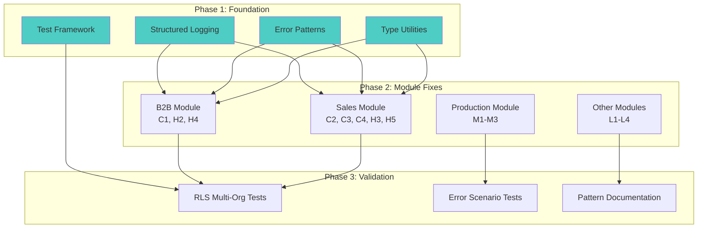
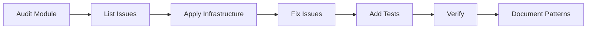

# Implementation Plan: Fix Audit Issues (Systematic Module Approach)

**Status**: Ready
**Created**: 2026-02-06
**Author**: Planner (Perspective B)
**Complexity**: XL (73 issues + infrastructure)
**Estimated Sessions**: 10-14 sessions

---

## Perspective: Systematic Module Approach

### Optimization Goals
This plan prioritizes:
1. **Root Cause Resolution** - Understand WHY issues exist, fix underlying problems
2. **Pattern Establishment** - Build infrastructure that prevents recurrence
3. **Module Coherence** - Fix all issues within a module together for consistency
4. **Comprehensive Testing** - Each module gets full test coverage before next
5. **Long-term Maintainability** - Leave codebase in better state than found

### Trade-offs Accepted
This plan accepts:
- **Slower initial progress**: Infrastructure takes time to build
- **More complex initial setup**: Logging library, error utilities, test framework
- **Delayed critical fixes**: C1-C4 not fixed until their module's turn
- **Higher coordination overhead**: More moving parts in each phase
- **Longer feedback loops**: Test full module before knowing if it works

### What This Plan Does Well
- Prevents issues from recurring (structured logging, type utilities)
- Establishes patterns for team to follow
- Addresses root causes (why 367 type assertions?)
- Comprehensive coverage (all 73 issues addressed)
- Module coherence (all B2B issues fixed together)
- Deep investigation of problems

### What This Plan Sacrifices
- Speed to first fix (weeks vs days)
- Incremental validation (big batches vs small)
- Simplicity (complex infrastructure vs targeted fixes)
- Critical issue urgency (waits for module's turn)
- Low disruption (more changes at once)

---

## Pre-Flight Check
- Existing PLAN.md: None
- ROADMAP.md alignment: N/A (technical debt cleanup)
- Related plans: None
- Backlog cross-ref: Audit report in `.claude/DB-UI-AUDIT-REPORT.md`

---

## 1. Overview

### Problem Statement
Comprehensive DB-UI audit found **73 issues** across the codebase. Beyond individual fixes, audit reveals **systemic problems**:
- **Type safety bypassed systematically**: 367 type assertions suggest generated types are inadequate or misunderstood
- **Error handling inconsistent**: No standard pattern for server actions or page components
- **Logging infrastructure missing**: 34 console.log statements show no proper logging library
- **Testing gaps**: No RLS multi-org tests, limited error scenario coverage
- **Pattern inconsistency**: Each developer solving same problems differently

Current state: Codebase grew organically without establishing foundational patterns. Fixing individual issues without addressing root causes will lead to recurrence.

### Proposed Solution
**Systematic module approach**: Build infrastructure first (logging, error handling patterns, type utilities), then fix each module comprehensively with that infrastructure. Establish patterns that prevent issues from recurring.

### Scope
**In Scope**:
- All 73 issues (C1-C4, H1-H6, M1-M8, L1-L4)
- Infrastructure: Structured logging library, error handling patterns, type utilities
- Test framework enhancements: RLS multi-org tests, error scenario tests
- Pattern documentation for team

**Out of Scope**:
- Performance optimizations not identified in audit
- Feature additions or enhancements
- Complete rewrite of any module

---

## 2. Requirements

### Functional Requirements
| ID | Requirement | Priority | Size |
|----|-------------|----------|------|
| FR-1 | Build structured logging library | P0 | M |
| FR-2 | Create error handling patterns/utilities | P0 | M |
| FR-3 | Create type safety utilities | P0 | M |
| FR-4 | Fix all B2B module issues | P0 | L |
| FR-5 | Fix all Sales module issues | P0 | XL |
| FR-6 | Fix all Production module issues | P1 | L |
| FR-7 | Create RLS test framework | P0 | L |
| FR-8 | Establish pattern documentation | P1 | M |

### Non-Functional Requirements
| ID | Requirement | Target |
|----|-------------|--------|
| NFR-1 | Zero console.log in production | 0 occurrences |
| NFR-2 | Type assertion reduction | <100 total (down from 367) |
| NFR-3 | Error handling coverage | 100% of server actions |
| NFR-4 | RLS test coverage | 100% of org-scoped tables |
| NFR-5 | Loading state coverage | 100% of async pages |

### Assumptions
- Team can dedicate 10-14 sessions to systematic cleanup
- Infrastructure building doesn't introduce new bugs
- Module boundaries are clear (B2B, Sales, Production, etc.)
- Pattern documentation will be followed by team
- Root cause fixes prevent most future issues

### Open Questions
- [ ] Should we use existing logging library or build minimal one?
- [ ] What's the standard for acceptable type assertions?
- [ ] Should error handling patterns be enforced via linting?

---

## 3. Technical Design

### Architecture Overview
**Three-layer approach**:
1. **Foundation Layer**: Build infrastructure (logging, errors, types)
2. **Module Layer**: Fix each module completely using infrastructure
3. **Validation Layer**: Comprehensive testing and documentation

Each module fix follows pattern:
```
Infrastructure → Module Audit → Fixes → Testing → Documentation
```

### System Diagram


### Database Changes
**Assessment**: Minor (no schema changes, only query patterns)
**data-engineer Required**: No (but should review org_id filtering patterns)

Changes:
- Establish standard org_id filtering pattern
- Document in pattern guide
- Apply consistently across all modules

No migrations needed.

### Infrastructure Components

**1. Structured Logging Library** (`lib/log.ts`):
```typescript
export type LogLevel = 'debug' | 'info' | 'warn' | 'error';
export type LogContext = Record<string, unknown>;

export interface Logger {
  debug(message: string, context?: LogContext): void;
  info(message: string, context?: LogContext): void;
  warn(message: string, context?: LogContext): void;
  error(message: string, context?: LogContext): void;
}

// Server-side implementation
export const log: Logger = {
  // Structured JSON logging
};

// Client-side implementation (development only)
export const clientLog: Logger = {
  // Browser console wrapper (dev only)
};
```

**2. Error Handling Patterns** (`lib/errors.ts`):
```typescript
export type ActionError = {
  error: string;           // User-facing message
  code?: string;           // Error code
  details?: unknown;       // Technical details (dev only)
  field?: string;          // Field name if validation error
};

export type ActionResult<T> =
  | { success: true; data: T }
  | { success: false } & ActionError;

export function handleDatabaseError(error: PostgrestError): ActionError {
  // Standardized database error handling
}

export function handleValidationError(zodError: ZodError): ActionError {
  // Standardized validation error handling
}
```

**3. Type Utilities** (`lib/types.ts`):
```typescript
import type { Database } from '@/types/supabase';

// Helper to extract table row types
export type TableRow<T extends keyof Database['public']['Tables']> =
  Database['public']['Tables'][T]['Row'];

// Helper for relations
export type TableRowWithRelations<
  T extends keyof Database['public']['Tables'],
  Relations extends Record<string, any>
> = TableRow<T> & Relations;

// Example usage:
type Order = TableRow<'orders'>;
type OrderWithCustomer = TableRowWithRelations<'orders', {
  customers: Pick<TableRow<'customers'>, 'name' | 'email'>;
}>;
```

**4. Error Boundary Component** (`components/ErrorBoundary.tsx`):
```typescript
export class ErrorBoundary extends React.Component {
  // Standard error boundary with fallback UI
  // Logs errors with structured logging
  // Shows user-friendly error messages
}
```

**5. RLS Test Utilities** (`__tests__/utils/rls-helpers.ts`):
```typescript
export async function createTestOrg(): Promise<string>;
export async function createTestUser(orgId: string): Promise<User>;
export async function getSupabaseForUser(user: User): SupabaseClient;
export async function assertCannotAccess(
  client: SupabaseClient,
  table: string,
  id: string
): Promise<void>;
```

### Module Fix Pattern

Each module follows this standardized approach:



---

## 4. Alternatives Considered

| Approach | Pros | Cons | Decision |
|----------|------|------|----------|
| A: Quick Wins | Fast impact, low risk, incremental | Rework later, patterns not established | Rejected: Doesn't address root causes |
| **B: Systematic (Recommended)** | Comprehensive, prevents recurrence, patterns established | Slower, complex, delayed critical fixes | **Selected** - Best for long-term health |
| C: Hybrid | Balance of speed and thoroughness | Complexity of deciding what's quick vs systematic | Rejected: Too ambiguous, hard to execute |

**Decision Rationale**:
The audit found **systemic issues** not isolated bugs. 367 type assertions, 34 console.logs, inconsistent error handling - these indicate missing infrastructure and patterns. Quick fixes will address symptoms temporarily, but issues will recur. Better to invest 2 extra weeks now building foundation that prevents future problems.

**Root Cause Examples**:
- **367 type assertions**: Generated types don't cover all query shapes → build type utilities
- **34 console.logs**: No logging library → build structured logging
- **Inconsistent errors**: No standard pattern → create error utilities

---

## 5. Implementation Plan

### Phase 1: Foundation Infrastructure - 2-3 sessions
| # | Task | Agent | Size | Depends On | Acceptance Criteria |
|---|------|-------|------|------------|---------------------|
| 1.1 | Create structured logging library | `feature-builder` | M | - | Logger with info/warn/error, server + client |
| 1.2 | Create error handling patterns/utilities | `feature-builder` | M | - | ActionResult type, error helpers |
| 1.3 | Create type utilities for Supabase types | `feature-builder` | M | - | TableRow, TableRowWithRelations helpers |
| 1.4 | Create ErrorBoundary component | `feature-builder` | M | 1.1 | Boundary with logging integration |
| 1.5 | Create RLS test utilities | `feature-builder` | M | - | Test helpers for multi-org scenarios |
| 1.6 | Document infrastructure patterns | `feature-builder` | S | 1.1-1.5 | README in lib/ explaining usage |
| 1.7 | Verify infrastructure | `verifier` | M | 1.1-1.6 | All utilities tested, docs clear |

**Phase 1 Complete When**:
- [ ] Structured logging library working (server + client)
- [ ] Error handling patterns defined and tested
- [ ] Type utilities available and documented
- [ ] ErrorBoundary component ready
- [ ] RLS test helpers ready
- [ ] Pattern documentation complete
- [ ] All infrastructure tests passing

---

### Phase 2A: B2B Module - 2-3 sessions
**Issues Fixed**: C1 (error handling), H2 (error boundaries), H4 (loading states), portions of H3/H5

| # | Task | Agent | Size | Depends On | Acceptance Criteria |
|---|------|-------|------|------------|---------------------|
| 2A.1 | Audit B2B module issues | `module-reviewer` | M | Phase 1 | List of all B2B-related issues |
| 2A.2 | Replace console.log in B2B login | `feature-builder` | S | 1.1 | Use structured logging |
| 2A.3 | Fix B2B orders error handling (C1) | `feature-builder` | M | 1.2 | Use ActionResult pattern |
| 2A.4 | Add error boundaries to B2B pages | `feature-builder` | M | 1.4 | All B2B pages wrapped |
| 2A.5 | Add loading states to B2B pages | `feature-builder` | M | - | Suspense boundaries added |
| 2A.6 | Replace type assertions in B2B | `feature-builder` | M | 1.3 | Use type utilities |
| 2A.7 | Add org_id filtering to B2B queries | `feature-builder` | M | - | Explicit filtering |
| 2A.8 | Test B2B module comprehensively | `verifier` | L | 2A.2-2A.7 | All error scenarios, loading states |
| 2A.9 | Document B2B patterns | `feature-builder` | S | 2A.8 | Module-specific patterns noted |

**Phase 2A Complete When**:
- [ ] All B2B console.logs replaced
- [ ] B2B error handling uses ActionResult
- [ ] All B2B pages have error boundaries
- [ ] All B2B pages have loading states
- [ ] B2B type assertions reduced
- [ ] B2B org_id filtering explicit
- [ ] Full B2B test coverage
- [ ] B2B patterns documented

---

### Phase 2B: Sales Module - 3-4 sessions
**Issues Fixed**: C2 (console.log in login), C3 (org_id), C4 (type assertions), H3 (type overuse), H5 (error returns), many medium issues

| # | Task | Agent | Size | Depends On | Acceptance Criteria |
|---|------|-------|------|------------|---------------------|
| 2B.1 | Audit Sales module issues | `module-reviewer` | L | Phase 1 | Comprehensive issue list |
| 2B.2 | Replace console.log in login/sales actions | `feature-builder` | M | 1.1 | Use structured logging |
| 2B.3 | Fix org_id filtering (C3) | `feature-builder` | L | - | Explicit filtering + ownership checks |
| 2B.4 | Replace `any` in queries.server.ts (C4) | `feature-builder` | L | 1.3 | Use Supabase types + utilities |
| 2B.5 | Reduce type assertions in sales (H3) | `feature-builder` | XL | 1.3 | Target <50 assertions (from ~150) |
| 2B.6 | Update sales actions to return errors (H5) | `feature-builder` | L | 1.2 | ActionResult pattern throughout |
| 2B.7 | Add error boundaries to sales pages | `feature-builder` | L | 1.4 | Key pages wrapped |
| 2B.8 | Add loading states to sales pages | `feature-builder` | L | - | Suspense on async pages |
| 2B.9 | Fix N+1 query in product groups (M3) | `feature-builder` | M | - | Batch fetch implementation |
| 2B.10 | Add Zod validation to sales actions (M2) | `feature-builder` | L | - | Input validation on all actions |
| 2B.11 | Test Sales module comprehensively | `verifier` | XL | 2B.2-2B.10 | Full coverage |
| 2B.12 | Document Sales patterns | `feature-builder` | M | 2B.11 | Patterns guide updated |

**Phase 2B Complete When**:
- [ ] All Sales console.logs replaced
- [ ] org_id filtering comprehensive
- [ ] Type safety restored (no `any`)
- [ ] Type assertions reduced significantly
- [ ] Error handling consistent
- [ ] Error boundaries on pages
- [ ] Loading states on pages
- [ ] N+1 queries fixed
- [ ] Input validation added
- [ ] Full test coverage
- [ ] Patterns documented

---

### Phase 2C: Production Module - 2 sessions
**Issues Fixed**: Portions of M1-M8, L1-L4

| # | Task | Agent | Size | Depends On | Acceptance Criteria |
|---|------|-------|------|------------|---------------------|
| 2C.1 | Audit Production module issues | `module-reviewer` | M | Phase 1 | Issue list |
| 2C.2 | Replace console.log in production code | `feature-builder` | M | 1.1 | Use structured logging |
| 2C.3 | Add error handling to production actions | `feature-builder` | L | 1.2 | ActionResult pattern |
| 2C.4 | Add loading states to production pages | `feature-builder` | M | - | Suspense boundaries |
| 2C.5 | Fix type assertions in production | `feature-builder` | M | 1.3 | Use type utilities |
| 2C.6 | Test Production module | `verifier` | L | 2C.2-2C.5 | Full coverage |

**Phase 2C Complete When**:
- [ ] Production module logging structured
- [ ] Error handling consistent
- [ ] Loading states added
- [ ] Type safety improved
- [ ] Tests passing

---

### Phase 2D: Other Modules (Dispatch, Materials, IPM) - 2 sessions
**Issues Fixed**: Remaining M/L issues

| # | Task | Agent | Size | Depends On | Acceptance Criteria |
|---|------|-------|------|------------|---------------------|
| 2D.1 | Audit remaining modules | `module-reviewer` | M | Phase 1 | Issue list |
| 2D.2 | Apply infrastructure to remaining modules | `feature-builder` | L | 1.1-1.4 | Logging, errors, types |
| 2D.3 | Fix remaining type assertions | `feature-builder` | L | 1.3 | <100 total in codebase |
| 2D.4 | Fix remaining console.logs | `feature-builder` | M | 1.1 | Zero in production |
| 2D.5 | Test remaining modules | `verifier` | L | 2D.2-2D.4 | Coverage |

**Phase 2D Complete When**:
- [ ] All modules use infrastructure
- [ ] Type assertion target met (<100 total)
- [ ] No production console.logs
- [ ] Tests passing

---

### Phase 3: Comprehensive Validation & Documentation - 2-3 sessions
| # | Task | Agent | Size | Depends On | Acceptance Criteria |
|---|------|-------|------|------------|---------------------|
| 3.1 | Create RLS multi-org test suite (H6) | `feature-builder` | L | 1.5 | 20+ tests covering all org-scoped tables |
| 3.2 | Create error scenario test suite | `feature-builder` | L | Phase 2 | Tests for all error paths |
| 3.3 | Run full regression tests | `verifier` | L | Phase 2 | All existing tests pass |
| 3.4 | Create pattern documentation | `feature-builder` | M | Phase 2 | Team guide for error handling, logging, types |
| 3.5 | Security audit of fixes | `security-auditor` | L | Phase 2 | RLS, auth, org_id filtering verified |
| 3.6 | Quality review | `code-quality-pragmatist` | M | Phase 2 | Ensure not over-engineered |
| 3.7 | Final verification | `verifier` | M | 3.1-3.6 | All 73 issues resolved |

**Phase 3 Complete When**:
- [ ] RLS test suite complete (20+ tests)
- [ ] Error scenario tests complete
- [ ] Full regression suite passing
- [ ] Pattern documentation published
- [ ] Security audit complete
- [ ] Quality review complete
- [ ] All 73 issues verified resolved

---

## 6. Risks & Mitigations

| Risk | Likelihood | Impact | Mitigation |
|------|------------|--------|------------|
| Infrastructure adds complexity | Medium | Medium | Keep minimal, document well, get team feedback |
| Module fixes break existing features | Medium | High | Comprehensive testing after each module |
| Critical issues stay exposed weeks longer | High | High | Prioritize B2B module first (has C1) |
| Type utilities don't cover all cases | Medium | Medium | Iterate based on usage, allow escape hatches |
| Team doesn't adopt new patterns | Medium | High | Documentation, examples, code review enforcement |
| Over-engineering infrastructure | Low | Medium | Quality review by `code-quality-pragmatist` |
| RLS tests find new critical issues | Low | High | Good - fix immediately, may extend timeline |

---

## 7. Definition of Done

Feature is complete when:
- [ ] All infrastructure built and tested (Phase 1)
- [ ] All modules fixed (Phases 2A-2D)
- [ ] All 73 issues resolved
- [ ] RLS multi-org test suite complete (20+ tests)
- [ ] Error scenario tests complete
- [ ] Pattern documentation published
- [ ] Zero console.log in production code
- [ ] Type assertions <100 (down from 367)
- [ ] All error paths return structured errors
- [ ] All async pages have loading states
- [ ] Tests passing (`verifier`)
- [ ] Security audit complete (`security-auditor`)
- [ ] Quality review complete (`code-quality-pragmatist`)
- [ ] Team trained on new patterns

---

## 8. Handoff Notes

### Jimmy Command String
```bash
jimmy execute PLAN-fix-audit-issues-B.md --mode paranoid
```

Use `paranoid` mode because:
- Building core infrastructure (logging, error handling)
- Touching all modules systematically
- Security implications (RLS, org_id filtering)
- Large scope requires careful validation at each step

### For Jimmy (Routing)
- **Start with**: `feature-builder` (Phase 1, task 1.1 - structured logging)
- **DB Work Required**: No (query patterns only, no schema)
- **Recommended Mode**: paranoid (large scope, security implications)
- **Critical Dependencies**: Phase 1 must complete before Phase 2
- **Estimated Sessions**: 10-14 sessions (3 phases, 4 module groups)

### For feature-builder
**Context**:
- Audit report: `/Users/patrickdoran/Hortitrack/hortitrack/.claude/DB-UI-AUDIT-REPORT.md`
- Build infrastructure first, then apply to modules
- Establish patterns for team to follow
- Comprehensive approach - fix everything in module at once

**Key Phases**:
1. **Phase 1**: Build infrastructure (don't rush, get it right)
2. **Phase 2**: Apply to modules systematically (B2B → Sales → Production → Others)
3. **Phase 3**: Comprehensive validation and documentation

**Pattern Examples**:
- Structured logging: `log.info('Order created', { orderId, userId })`
- Error handling: `return { success: false, error: 'Message', code: 'ERR_CODE' }`
- Types: `type Order = TableRow<'orders'>`

### For verifier
**Test Coverage Requirements**:
- Infrastructure tests: Unit tests for all utilities
- Module tests: Integration tests for each module
- RLS tests: 20+ multi-org scenarios
- Error tests: All error paths covered
- Regression tests: Existing functionality unbroken

**Critical Validation Points**:
- After Phase 1: Infrastructure works correctly
- After each module: No regressions, patterns applied consistently
- After Phase 3: All 73 issues resolved, comprehensive coverage

### For security-auditor
**Focus Areas**:
- Review infrastructure for security implications
- Validate org_id filtering patterns
- RLS test suite adequacy
- Error messages don't leak sensitive data
- Logging doesn't expose PII

### For code-quality-pragmatist
**Watch For**:
- Over-engineered infrastructure
- Unnecessary abstractions
- Patterns too complex for team to follow
- Type utilities that obscure more than help

**Validate**:
- Infrastructure stays minimal
- Patterns are pragmatic
- Documentation is clear
- Team can adopt easily

---

## For Dual-Plan Comparison

### Best Suited When
- Root cause analysis is priority
- Team wants comprehensive fix
- Time/budget exists for infrastructure investment
- Pattern establishment more valuable than quick fixes
- All 73 issues must be resolved (not just critical)
- Prevention of recurrence is critical
- Team needs guidance on standards

### Not Ideal When
- Critical production issues need immediate fix
- Team has low tolerance for prolonged disruption
- Time/budget constrained
- Prefer incremental validation
- Medium/low priority issues are acceptable to defer
- Simple targeted fixes sufficient

### Key Differentiators
- **Coverage**: 73/73 issues (100%) vs 20/73 (27%)
- **Infrastructure**: Built vs deferred
- **Pattern establishment**: Upfront vs later
- **Root cause analysis**: Deep vs surface
- **Time to first fix**: Weeks vs days
- **Validation**: Module-by-module vs incremental
- **Complexity**: Higher (infrastructure) vs lower (targeted fixes)
- **Recurrence prevention**: Strong vs weak

---

## Appendix: Root Cause Analysis

### Why 367 Type Assertions?

**Investigation**:
```
grep -r "as any\|as unknown" src/ | wc -l
# Result: 367 occurrences

grep -r "as any\|as unknown" src/ --include="*.ts" --include="*.tsx" | \
  awk -F: '{print $1}' | sort | uniq -c | sort -rn | head -10
# Shows: sales/actions.ts (45), queries.server.ts (38), ...
```

**Root Causes**:
1. **Generated types don't cover query shapes**: Supabase generates table types, but not for custom `.select()` patterns
2. **Lack of type utilities**: No helpers to compose types for relations
3. **Knowledge gap**: Team unsure how to type complex queries correctly
4. **Time pressure**: `as any` is fast, proper typing takes longer

**Solution** (from this plan):
- Type utilities library with helpers
- Documentation with examples
- Review of generated types (may need to regenerate)
- Team training on proper patterns

### Why 34 console.logs?

**Root Cause**: No logging library, team defaults to console.log

**Solution**: Structured logging library + team adoption

### Why inconsistent error handling?

**Root Cause**: No standard pattern, each developer solving differently

**Solution**: ActionResult pattern + error utilities + documentation

---

*This plan optimizes for long-term codebase health. Invest time now building foundation, reap benefits for years.*
