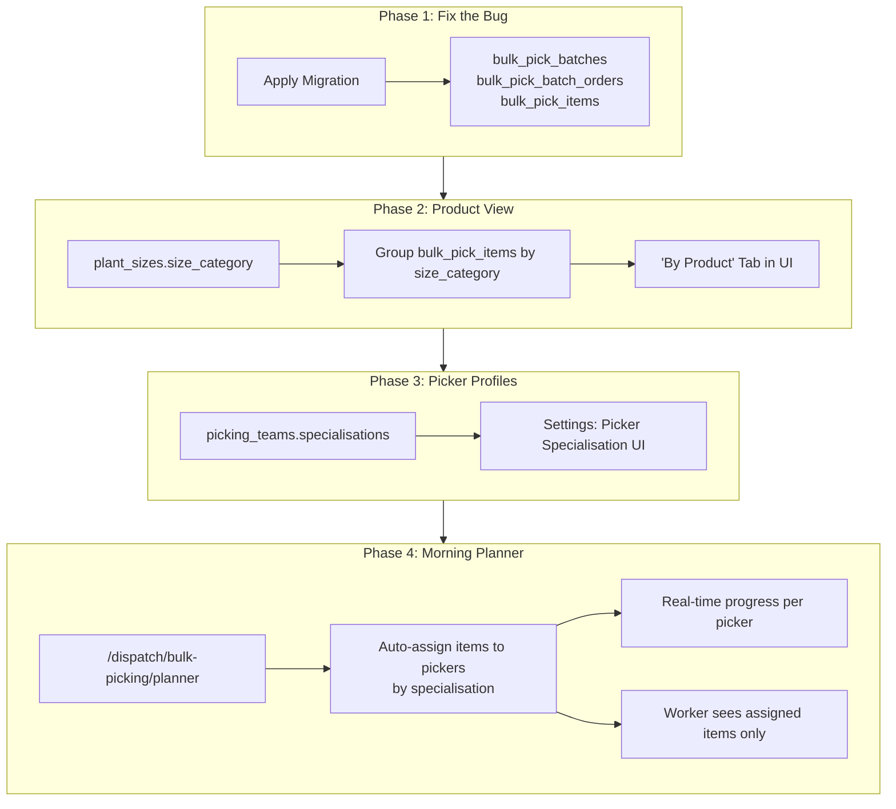
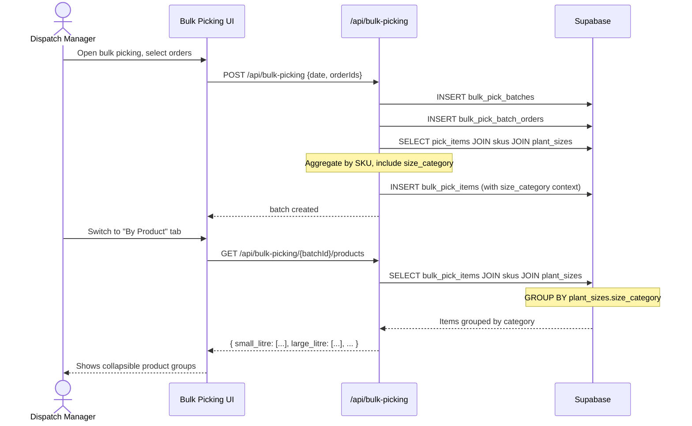
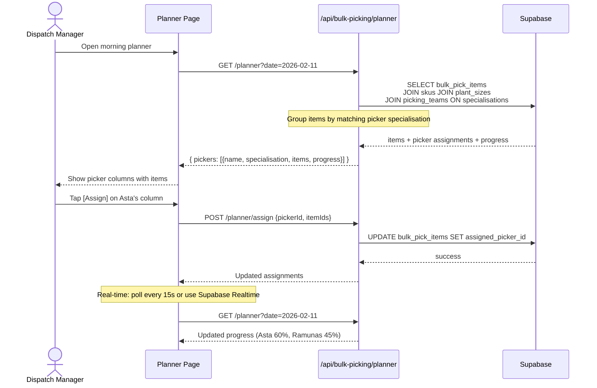

# Implementation Plan: Bulk Picking Overhaul (Dispatch Manager Perspective)

**Status**: Ready
**Created**: 2026-02-11
**Author**: Planner (Dispatch Manager perspective)
**Complexity**: XL (broken into 4 phases, each L or smaller)
**Estimated Sessions**: 6-8
**Related Plans**: `PLAN-picking-redesign.md` (single-order picking UX -- separate concern, can proceed in parallel)

---

## Pre-Flight Check
- Existing PLAN.md: `PLAN-picking-redesign.md` exists but covers single-order picking UX (scan-first flow). This plan covers bulk picking (multiple orders grouped together) and the dispatch manager's planning workflow. They are complementary, not conflicting.
- ROADMAP.md alignment: N/A (no ROADMAP.md found)
- Related plans: `PLAN-picking-redesign.md` fixes `pick_item_multi_batch` bugs. Those fixes are for per-order picking. The bulk picking system uses different tables (`bulk_pick_batches`, `bulk_pick_items`) and different APIs.
- Backlog cross-ref: None

---

## 1. Overview

### Problem Statement

The bulk picking system is completely broken. The migration that creates the 3 required tables (`bulk_pick_batches`, `bulk_pick_batch_orders`, `bulk_pick_items`) was written but never applied to the production database. Every page that touches bulk picking crashes with "Could not find the table 'public.bulk_pick_batches' in the schema cache."

Beyond the bug, the bulk picking system was designed by engineers who have never managed a dispatch floor. It groups orders by delivery date and shows a flat list of aggregated SKUs. In a real nursery:

- **Pickers specialise by product type.** Asta picks planters (3L, 5L, 10L). Ramunas picks the small litres (1L, 1.5L, 2L). Other people handle trays and plugs. The system has no concept of this.
- **The dispatch manager plans the day at 6am.** They need to see "what needs picking today, who is available, and what goes where" -- not "here are some orders grouped by date."
- **Product categories matter more than delivery dates** for picker assignment. A delivery date tells you *when* it needs to go out. A product category tells you *who picks it and where they walk*.
- **Progress tracking is invisible.** There is no way to see "Ramunas has finished his 1L picks for the morning run" without walking to the polytunnel.

### Proposed Solution

Fix the bug first (apply the migration), then incrementally add product-view grouping, picker specialisation profiles, and a morning planning dashboard. Each phase delivers standalone value.

### Scope

**In Scope**:
- Phase 1: Apply the missing migration so bulk picking actually works
- Phase 2: Product-grouped view of bulk pick items (by size category)
- Phase 3: Picker specialisation profiles (what sizes/types each picker handles)
- Phase 4: Morning planning dashboard (today's work, split by picker, with progress)

**Out of Scope**:
- Single-order picking UX redesign (covered by `PLAN-picking-redesign.md`)
- Polytunnel/location mapping (future -- needs physical audit of nursery layout)
- Mobile-native picker app (the worker view at `/worker/dispatch` already exists)
- Barcode scanning improvements (covered by picking redesign plan)
- Stock reservation / allocation logic (covered by `PLAN-stock-allocation.md`)

---

## 2. The Dispatch Manager's Day (User Journey)

This is what a dispatch manager does at 6am, and what the system should support at each step.

### Today (Broken)
```
6:00 AM  Manager arrives. Opens /dispatch/bulk-picking.
         ERROR: "Could not find the table 'public.bulk_pick_batches'"
         Dead end. Manager falls back to paper lists and shouting.

6:15 AM  Manager manually writes pick lists on clipboards.
         Groups items by memory: "Asta, you take all the 3L and 5L."
         "Ramunas, you do the 1L and 1.5L."
         No system record of this assignment.

All day   No progress visibility. Manager walks polytunnels to check.
         "Are you done with the 1L? We need those for the 2pm load."
```

### After Phase 1 (Bug Fixed)
```
6:00 AM  Manager opens /dispatch/bulk-picking. Page loads.
         Sees orders grouped by delivery date. Selects today's orders.
         Creates a bulk batch. Items aggregated by SKU.
         Workers can pick from the aggregated list.

         Better than paper, but still no product grouping or picker assignment.
```

### After Phase 2 (Product View)
```
6:00 AM  Manager opens /dispatch/bulk-picking. Creates batch for today.
         Switches to "By Product" tab. Sees items grouped:

         SMALL LITRE (1L, 1.5L, 2L)          312 units across 8 orders
         LARGE LITRE (3L, 5L, 10L)            87 units across 5 orders
         POTS (P9, P10, P11, P13, P19)        45 units across 3 orders
         CELL TRAYS (40, 84, 104)             20 trays across 2 orders
         PLUG TRAYS (144, 200, 273 Prop)      8 trays across 1 order
         BAREROOT                              0 units
         6 PACKS                               24 units across 2 orders

         Manager can now see what the day looks like by product type.
```

### After Phase 3 (Picker Profiles)
```
6:00 AM  In Settings > Picking Teams, manager has configured:
         - Asta: specialises in "Large Litre" and "Pots"
         - Ramunas: specialises in "Small Litre"
         - Maria: specialises in "Cell Trays" and "Plug Trays"
         - Unassigned: "6 Packs", "Bareroot" (anyone can do these)

         System knows who can pick what.
```

### After Phase 4 (Morning Planner)
```
6:00 AM  Manager opens /dispatch/bulk-picking/planner (new page)
         Sees the "Morning Plan" view:

         +--------------------------------------------------+
         | TODAY'S PICKS - Tuesday 11 Feb                    |
         | 3 delivery runs | 12 orders | 496 total units    |
         +--------------------------------------------------+
         |                                                   |
         | ASTA (Large Litre, Pots)           | 0% done     |
         |   3L Heuchera Marmalade    x40     |             |
         |   5L Hebe Autumn Glory     x25     |             |
         |   10L Photinia Red Robin   x12     |             |
         |   P13 Lavender Hidcote    x45     |             |
         |   TOTAL: 122 units                 |  [Assign]  |
         |                                                   |
         | RAMUNAS (Small Litre)              | 0% done     |
         |   1L Heather Mixed        x180     |             |
         |   1.5L Euonymus Emerald   x80      |             |
         |   2L Escallonia Apple Bl  x52      |             |
         |   TOTAL: 312 units                 |  [Assign]  |
         |                                                   |
         | MARIA (Trays)                      | 0% done     |
         |   84-cell Primula Mix     x12 trys |             |
         |   104-cell Viola Mix      x8 trys  |             |
         |   144-plug Lobelia        x8 trys  |             |
         |   TOTAL: 28 trays                  |  [Assign]  |
         |                                                   |
         | UNASSIGNED                                        |
         |   6-Pack Geranium         x24      | [Assign]   |
         +--------------------------------------------------+

         Manager taps [Assign] on each section.
         Workers see their assigned items on their phone/tablet.
         Progress bars update in real-time as items are picked.

7:30 AM  Manager checks the planner. Asta is 60% done.
         Ramunas is 45% done. Maria finished trays, idle.
         Manager reassigns "6 Packs" to Maria via the planner.

9:00 AM  All picking done. Manager switches to packing view.
         System knows which orders are complete.
```

---

## 3. Requirements

### Functional Requirements

| ID | Requirement | Priority | Phase | Size |
|----|-------------|----------|-------|------|
| FR-1 | Apply missing bulk_pick migration to database | P0 | 1 | S |
| FR-2 | Verify bulk picking page loads and batch creation works | P0 | 1 | S |
| FR-3 | Show bulk pick items grouped by size category (Small Litre, Large Litre, etc.) | P0 | 2 | M |
| FR-4 | Add "By Product" tab alongside existing "Items to Pick" list | P0 | 2 | M |
| FR-5 | Show which orders contribute to each product line | P1 | 2 | S |
| FR-6 | Add `size_category` column to `plant_sizes` table | P0 | 3 | S |
| FR-7 | Add `specialisation` (array of size_category) to `picking_teams` or `picking_team_members` | P0 | 3 | M |
| FR-8 | Settings UI to configure picker specialisations | P1 | 3 | M |
| FR-9 | Morning planner page: today's work split by picker/team | P0 | 4 | L |
| FR-10 | Auto-suggest picker assignment based on specialisation | P1 | 4 | M |
| FR-11 | Real-time progress tracking per picker on planner | P1 | 4 | M |
| FR-12 | Picker sees only their assigned items on worker view | P1 | 4 | M |

### Non-Functional Requirements

| ID | Requirement | Target |
|----|-------------|--------|
| NFR-1 | Bulk picking page loads in < 2s | Performance |
| NFR-2 | All new tables have RLS enabled | Security |
| NFR-3 | Worker view usable on mobile (min 320px width) | Accessibility |
| NFR-4 | Progress updates visible within 5s of pick completion | Responsiveness |

### Assumptions
- Plant sizes in the system match the listed sizes (1L, 1.5L, 2L, 3L, 5L, 10L, P9-P19, 6 Pack, cell trays, plug trays, bareroot)
- `plant_sizes.container_type` enum currently has: `pot`, `tray`, `bareroot`
- `plant_sizes` has `name` and `container_type` but no concept of "category" (small litre vs large litre)
- The `picking_teams` table exists but has no specialisation data
- The 3 bulk picking tables exist in the migration file but are not in the database

### Open Questions
- [x] ~~Do we need to handle the case where a picker is absent?~~ Yes, via manual reassignment in planner (Phase 4)
- [ ] Should the product grouping categories be configurable per org, or hardcoded? (Recommend: hardcoded with override option later)
- [ ] Are there seasonal pickers who change specialisations week-to-week? (Recommend: treat as editable profiles, not permanent)

---

## 4. Technical Design

### Architecture Overview

The system has 4 layers to modify:

1. **Database**: Apply existing migration + add `size_category` + add specialisation to pickers
2. **API**: Extend `/api/bulk-picking` to support product-grouped queries + picker assignment
3. **Manager UI**: Product view tab, morning planner page
4. **Worker UI**: Filtered picker view showing only assigned items

### System Diagram



### Size Category Mapping

This is the core domain concept. Every plant size maps to one of these categories:

```
SIZE CATEGORY       | SIZES INCLUDED                           | container_type
--------------------|------------------------------------------|--------------
small_litre         | 1L, 1.5L, 2L                            | pot
large_litre         | 3L, 5L, 10L                             | pot
pots                | P9, P10, P11, P13, P15, P17, P19        | pot
cell_trays          | 40 Cell, 84 Cell, 104 Cell               | tray
plug_trays          | 144 Plug, 200 Plug, 273 Prop            | tray
six_packs           | 6 Pack                                   | pot (or tray)
bareroot            | Bareroot                                 | bareroot
other               | Anything else                            | any
```

**Implementation approach**: Add a `size_category` text column to `plant_sizes`, then populate it with a data migration based on the `name` and `container_type` columns. This is better than computing it at query time because:
- Categories are stable (they represent physical areas of the nursery)
- Indexing is possible
- The mapping logic lives in SQL, not scattered across TypeScript
- New sizes can be categorised when added

### Database Changes

**Assessment**: Significant -- new column + data migration + team specialisation
**data-engineer Required**: Yes

| Change | Type | Table | Size | Notes |
|--------|------|-------|------|-------|
| Apply existing bulk_pick migration | DDL | 3 new tables | S | Migration file exists, just needs `supabase db push` or manual apply |
| Add `size_category` column | DDL + DML | `plant_sizes` | S | text column + UPDATE based on name patterns |
| Add `specialisations` column | DDL | `picking_teams` | S | text[] array of size_category values |
| Add `assigned_picker_id` column | DDL | `bulk_pick_items` | S | uuid FK to profiles, nullable |
| Add `assigned_team_id` column | DDL | `bulk_pick_items` | S | uuid FK to picking_teams, nullable |

**Handoff to data-engineer**:
- Phase 1: Apply existing migration `20251221100000_picking_workflow_enhancements.sql` to production DB. Verify all 3 tables created with correct constraints and RLS policies.
- Phase 2: Create migration adding `size_category` to `plant_sizes` with data population.
- Phase 3: Create migration adding `specialisations text[]` to `picking_teams`.
- Phase 4: Create migration adding `assigned_picker_id` and `assigned_team_id` to `bulk_pick_items`.

### API Changes

| Endpoint | Method | Purpose | Phase | Size |
|----------|--------|---------|-------|------|
| `/api/bulk-picking` (existing) | GET | Already works -- just needs DB tables to exist | 1 | - |
| `/api/bulk-picking` (existing) | POST | Already works -- just needs DB tables to exist | 1 | - |
| `/api/bulk-picking/[batchId]` (existing) | GET/PATCH | Already works -- just needs DB tables to exist | 1 | - |
| `/api/bulk-picking/[batchId]/products` | GET | Return items grouped by size_category with order breakdown | 2 | M |
| `/api/settings/picking-teams/[teamId]/specialisations` | PATCH | Update team specialisations | 3 | S |
| `/api/bulk-picking/planner` | GET | Today's work split by picker with progress stats | 4 | M |
| `/api/bulk-picking/planner/assign` | POST | Assign bulk pick items to a picker/team | 4 | M |

### Frontend Changes

| Component | Change | Phase | Size | Notes |
|-----------|--------|-------|------|-------|
| `/dispatch/bulk-picking/page.tsx` | Fix -- page will work once DB tables exist | 1 | S | Verify and smoke test |
| `BulkPickingClient.tsx` | Add "By Product" tab toggle | 2 | M | New view mode |
| `ProductGroupView.tsx` (NEW) | Collapsible product category cards with items | 2 | M | Core Phase 2 UI |
| `BulkPickingWorkflowClient.tsx` | Add product-grouped picking view | 2 | M | Alternative to flat list |
| Settings > Picking Teams | Add specialisation multi-select | 3 | M | shadcn multi-select |
| `/dispatch/bulk-picking/planner/page.tsx` (NEW) | Morning planner dashboard | 4 | L | Core Phase 4 page |
| `PickerColumn.tsx` (NEW) | Picker's assigned work with progress bar | 4 | M | Used in planner |
| Worker dispatch page | Filter by assigned picker | 4 | M | Modify existing `/worker/dispatch` |

### Data Flow for Product Grouping



### Data Flow for Morning Planner



---

## 5. Screen Descriptions

### Phase 2: "By Product" Tab in Bulk Picking Workflow

**Location**: `/dispatch/bulk-picking/[batchId]` -- new tab alongside "Picking" and "Packing"

```
+------------------------------------------------------+
| BP-20260211-A4XK                  [In Progress]       |
| Tuesday, February 11, 2026                            |
+------------------------------------------------------+
| [5] Orders  |  [24] Items  |  [496] Units            |
+------------------------------------------------------+
|  [ Picking ]  [ By Product ]  [ Packing ]             |
+------------------------------------------------------+
|                                                        |
| v SMALL LITRE (1L, 1.5L, 2L)     312 units  [65%]   |
|   +----------------------------------------------+    |
|   | 1L Heather Mixed            x180  [PICKED]   |    |
|   | 1.5L Euonymus Emerald Gold  x80   [PENDING]  |    |
|   | 2L Escallonia Apple Blossom x52   [PENDING]  |    |
|   +----------------------------------------------+    |
|   Orders: #1042 (Bord Bia), #1044 (Green Thumb),     |
|           #1047 (Dublin Parks), +5 more               |
|                                                        |
| v LARGE LITRE (3L, 5L, 10L)      87 units   [0%]    |
|   +----------------------------------------------+    |
|   | 3L Heuchera Marmalade       x40   [PENDING]  |    |
|   | 5L Hebe Autumn Glory        x25   [PENDING]  |    |
|   | 10L Photinia Red Robin      x12   [PENDING]  |    |
|   | 10L Griselinia Littoralis   x10   [PENDING]  |    |
|   +----------------------------------------------+    |
|   Orders: #1042, #1045, #1048                         |
|                                                        |
| > POTS (P9-P19)                   45 units   [0%]    |
| > CELL TRAYS                      20 trays   [0%]    |
| > PLUG TRAYS                      8 trays    [0%]    |
| > 6 PACKS                         24 units   [0%]    |
+------------------------------------------------------+
```

**Interaction**:
- Tap a category header to expand/collapse
- Each item row shows: product name, total quantity, status badge
- "Orders:" line at bottom of each group shows which customer orders need these items (click to see breakdown)
- Progress percentage per group calculated from picked_qty / total_qty of items in that group
- Entire view updates when picker marks items as picked in the workflow

### Phase 3: Picker Specialisation Settings

**Location**: Settings > Picking Teams > [Team/Member] > Specialisation

```
+------------------------------------------------------+
| Picking Teams                        [+ New Team]     |
+------------------------------------------------------+
|                                                        |
| Team: Morning Crew                                     |
| +--------------------------------------------------+  |
| |                                                    | |
| | Asta Kontautaite          [Lead]                  | |
| | Specialises in:                                    | |
| | [x] Large Litre (3L, 5L, 10L)                    | |
| | [x] Pots (P9-P19)                                | |
| | [ ] Small Litre    [ ] Cell Trays                 | |
| | [ ] Plug Trays     [ ] 6 Packs    [ ] Bareroot   | |
| |                                                    | |
| | Ramunas Dapkus                                    | |
| | Specialises in:                                    | |
| | [x] Small Litre (1L, 1.5L, 2L)                   | |
| | [ ] Large Litre    [ ] Pots                       | |
| | [ ] Cell Trays     [ ] Plug Trays                 | |
| |                                                    | |
| | Maria Nowak                                       | |
| | Specialises in:                                    | |
| | [x] Cell Trays (40, 84, 104)                     | |
| | [x] Plug Trays (144, 200, 273)                   | |
| |                                                    | |
| +--------------------------------------------------+  |
+------------------------------------------------------+
```

**Design notes**:
- Specialisations are checkboxes, not dropdowns (pickers can do multiple categories)
- Show the size names in parentheses so the manager recognises them
- Team-level specialisations combine member specialisations (for reporting)
- A picker with NO specialisations is treated as "can pick anything"

### Phase 4: Morning Planner

**Location**: `/dispatch/bulk-picking/planner` (new page, linked from bulk picking)

```
+------------------------------------------------------+
| Morning Plan - Tuesday 11 Feb              [Refresh]  |
| 3 delivery runs | 12 orders | 496 total units        |
+------------------------------------------------------+
|                                                        |
| +------ ASTA ----+  +--- RAMUNAS ---+  +--- MARIA --+|
| | Large Litre,   |  | Small Litre   |  | Trays      ||
| | Pots           |  |               |  |            ||
| |                |  |               |  |            ||
| | [====    ] 30% |  | [==      ] 15%|  | [     ] 0% ||
| | 122 units      |  | 312 units     |  | 28 trays   ||
| |                |  |               |  |            ||
| | 3L Heuchera x40|  | 1L Heather x80|  | 84-cell x12||
| | 5L Hebe     x25|  | 1.5L Euon  x80|  | 104-cell x8||
| | 10L Photinia x12| | 2L Escall  x52|  | 144-plug x8||
| | 10L Grisel  x10|  |               |  |            ||
| | P13 Lavender x45| |               |  |            ||
| |                |  |               |  |            ||
| | [Assign]       |  | [Assign]      |  | [Assign]   ||
| | [Print List]   |  | [Print List]  |  | [Print List]||
| +----------------+  +---------------+  +------------+|
|                                                        |
| UNASSIGNED                                             |
| 6 Pack Geranium x24                    [Assign to...] |
+------------------------------------------------------+
```

**Interaction**:
- "Assign" sends items to the picker (updates `bulk_pick_items.assigned_picker_id`)
- "Print List" generates a simple PDF pick list for that picker (product, qty, location hint)
- Unassigned items appear at bottom with a dropdown to assign to any available picker
- Progress bars poll every 15 seconds (or use Supabase Realtime subscription)
- Clicking a picker column expands to show per-item status (picked/pending/short)
- Drag-and-drop between columns to reassign individual items (P2, nice-to-have)

### Worker View Changes (Phase 4)

**Location**: `/worker/dispatch` (existing page, modified)

Currently shows all orders. After Phase 4, if the logged-in user has been assigned bulk pick items, they see a focused view:

```
+------------------------------------------------------+
| Your Picks Today                       [Refresh]      |
| Batch: BP-20260211-A4XK                              |
| Category: Small Litre                                 |
+------------------------------------------------------+
|                                                        |
| [======     ] 45% complete (140/312 units)            |
|                                                        |
| PENDING                                                |
| +--------------------------------------------------+  |
| | 1.5L Euonymus Emerald Gold           x80         |  |
| | For: #1042 (x30), #1044 (x20), #1047 (x30)      |  |
| |                                     [Pick All]   |  |
| +--------------------------------------------------+  |
| +--------------------------------------------------+  |
| | 2L Escallonia Apple Blossom          x52         |  |
| | For: #1045 (x25), #1048 (x27)                    |  |
| |                                     [Pick All]   |  |
| +--------------------------------------------------+  |
|                                                        |
| PICKED                                                 |
| +--------------------------------------------------+  |
| | 1L Heather Mixed              180/180  [DONE]    |  |
| +--------------------------------------------------+  |
+------------------------------------------------------+
```

**Key UX decisions for worker view**:
- Show ONLY items assigned to this picker (not the entire batch)
- Show which orders each item feeds into (so the picker understands why they are picking 80x Euonymus)
- Big touch targets (56px minimum height for action buttons -- gloves, wet screens)
- Progress bar at top is the main motivator
- "Pick All" does the same as the existing pick flow (tap -> quantity confirm -> done)
- Pull-to-refresh for latest status

---

## 6. Alternatives Considered

| Approach | Pros | Cons | Decision |
|----------|------|------|----------|
| **A: Size category on plant_sizes (chosen)** | Clean data model, indexable, reusable across features | Requires migration + data population | Selected -- categories are stable, worth modelling properly |
| **B: Compute category in TypeScript** | No migration needed, fast to implement | Logic scattered across files, no DB indexing, inconsistent | Rejected -- too fragile for a core domain concept |
| **C: Lookup table for categories** | Most normalised, allows custom categories per org | Over-engineered for 7 categories, more joins | Rejected for now -- YAGNI. Can migrate to this later if orgs need custom categories |
| **D: Picker specialisation on user profile** | Simple, one place to look | Not all users are pickers, pollutes profile with dispatch concerns | Rejected -- keep it on picking_teams/members where it belongs |
| **E: Picker specialisation on picking_teams only** | Team-level assignment is simpler | In practice, each team member has different strengths | Rejected -- need member-level specialisation. Team inherits from members. |

**Decision Rationale**: Option A + E gives us a clean, indexable size_category that works for grouping, and member-level specialisation that reflects the real-world assignment pattern ("Asta does planters" not "the morning team does planters").

---

## 7. Implementation Plan

### Phase 1: Fix the Bug (P0) -- Get Bulk Picking Working

| # | Task | Agent | Size | Depends On | Acceptance Criteria |
|---|------|-------|------|------------|---------------------|
| 1.1 | Apply the existing `20251221100000_picking_workflow_enhancements.sql` migration to the production Supabase database | `data-engineer` | S | - | All 3 tables exist: `bulk_pick_batches`, `bulk_pick_batch_orders`, `bulk_pick_items`. RLS enabled. Triggers working. |
| 1.2 | Verify `/dispatch/bulk-picking` page loads without errors | `verifier` | S | 1.1 | Page renders, shows orders grouped by delivery date, no console errors |
| 1.3 | Smoke test: Create a bulk batch, pick items, pack an order | `verifier` | S | 1.2 | Full workflow completes: create batch -> start picking -> pick items -> complete picking -> pack order -> batch completes |

**Phase 1 Complete When**:
- [ ] Bulk picking page loads without schema cache errors
- [ ] A bulk batch can be created from selected orders
- [ ] Items can be picked and orders can be packed
- [ ] No regressions in existing picking workflow

### Phase 2: Product View (P0-P1) -- See Items by Category

| # | Task | Agent | Size | Depends On | Acceptance Criteria |
|---|------|-------|------|------------|---------------------|
| 2.1 | Create migration: add `size_category text` column to `plant_sizes`, populate from existing `name` and `container_type` data | `data-engineer` | M | Phase 1 | Column exists, all existing sizes have a category assigned, CHECK constraint ensures valid values |
| 2.2 | Create API endpoint `GET /api/bulk-picking/[batchId]/products` that returns items grouped by size_category | `feature-builder` | M | 2.1 | Returns JSON with items nested under category keys, includes order breakdown per item |
| 2.3 | Build `ProductGroupView` component: collapsible category cards showing items, quantities, progress, and contributing orders | `feature-builder` | M | 2.2 | Categories expand/collapse, show progress %, list items with status badges, show order numbers |
| 2.4 | Add "By Product" tab to `BulkPickingWorkflowClient.tsx` alongside existing Picking/Packing tabs | `feature-builder` | S | 2.3 | Tab switches between flat list and product-grouped view, state persists during session |
| 2.5 | Verify product grouping accuracy: create test batch, confirm items grouped correctly | `verifier` | S | 2.4 | Items match expected categories, quantities aggregate correctly, edge cases (unknown sizes) handled |

**Phase 2 Complete When**:
- [ ] All plant sizes have a `size_category` assigned
- [ ] Bulk pick items are viewable grouped by product category
- [ ] Each category shows contributing orders
- [ ] Progress percentage per category is accurate

### Phase 3: Picker Profiles (P0-P1) -- Who Picks What

| # | Task | Agent | Size | Depends On | Acceptance Criteria |
|---|------|-------|------|------------|---------------------|
| 3.1 | Create migration: add `specialisations text[]` to `picking_team_members` (member-level, not just team-level) | `data-engineer` | S | Phase 2 | Column exists, nullable (empty means "picks anything"), values constrained to valid size_categories |
| 3.2 | Create API endpoint `PATCH /api/settings/picking-teams/[teamId]/members/[memberId]/specialisations` | `feature-builder` | S | 3.1 | Updates specialisations array, validates values against known size_categories |
| 3.3 | Build specialisation multi-select UI in Settings > Picking Teams member edit | `feature-builder` | M | 3.2 | Checkbox list of size categories with human-readable labels (e.g. "Small Litre (1L, 1.5L, 2L)"), saves on change |
| 3.4 | Add computed `team_specialisations` view/RPC that aggregates all member specialisations per team | `data-engineer` | S | 3.1 | View returns team_id, array of all specialisations across members |
| 3.5 | Verify: configure Asta for Large Litre + Pots, Ramunas for Small Litre, confirm data persists | `verifier` | S | 3.3 | Specialisations save and reload correctly, appear in team detail views |

**Phase 3 Complete When**:
- [ ] Each picker can have specialisations assigned
- [ ] Specialisations visible in Settings UI
- [ ] Team-level specialisations computed from members
- [ ] Data persists across sessions

### Phase 4: Morning Planner (P0-P1) -- Smart Daily Planning

| # | Task | Agent | Size | Depends On | Acceptance Criteria |
|---|------|-------|------|------------|---------------------|
| 4.1 | Create migration: add `assigned_picker_id uuid` and `assigned_team_id uuid` to `bulk_pick_items` | `data-engineer` | S | Phase 3 | Columns exist with FK constraints, nullable, indexed |
| 4.2 | Create API `GET /api/bulk-picking/planner?date=YYYY-MM-DD` returning today's work split by picker/team based on specialisations | `feature-builder` | M | 4.1 | Returns picker columns with items, quantities, progress stats. Unmatched items in "unassigned" bucket. |
| 4.3 | Create API `POST /api/bulk-picking/planner/assign` to assign items to a picker | `feature-builder` | S | 4.1 | Updates `assigned_picker_id` on specified items, returns updated assignments |
| 4.4 | Build planner page `/dispatch/bulk-picking/planner/page.tsx` with picker columns, items, progress bars, assign/print actions | `feature-builder` | L | 4.2, 4.3 | Page shows picker columns, items per picker, progress bars, Assign and Print List buttons work |
| 4.5 | Add progress polling (15s interval) or Supabase Realtime subscription to planner | `feature-builder` | M | 4.4 | Progress bars update when workers pick items, without manual refresh |
| 4.6 | Modify worker dispatch page to filter by `assigned_picker_id` when picker has bulk pick assignments | `feature-builder` | M | 4.3 | Picker sees only their assigned items, with order context ("For: #1042 x30, #1044 x20") |
| 4.7 | Add "Print Pick List" function that generates a simple printable view for a picker's assignments | `feature-builder` | S | 4.4 | Print button opens printable page with product name, size, quantity, location hint. Usable on A4. |
| 4.8 | End-to-end test: Manager creates batch, opens planner, assigns pickers, workers see their items, progress updates | `verifier` | M | 4.6 | Full workflow works: plan -> assign -> pick -> track progress |

**Phase 4 Complete When**:
- [ ] Morning planner shows today's work split by picker
- [ ] Manager can assign items to pickers
- [ ] Workers see only their assigned items
- [ ] Progress tracks in near-real-time
- [ ] Pick lists printable as backup

---

## 8. Risks and Mitigations

| Risk | Likelihood | Impact | Mitigation |
|------|------------|--------|------------|
| Migration already partially applied (some tables exist, some do not) | Low | Medium | Use `CREATE TABLE IF NOT EXISTS` (already in migration). Verify each table individually before and after. |
| Size category mapping misses some plant sizes | Medium | Low | Include `other` category as catch-all. Log unmapped sizes for review. Add admin UI to manually categorise later. |
| Pickers don't check their phones | Medium | Medium | Print List feature (Phase 4) ensures paper backup. Progress tracking still works when items are picked via any method. |
| Real-time progress requires Supabase Realtime which may have connection issues in polytunnels | Medium | Low | Fall back to 15-second polling. Polling is simpler and more reliable in poor-connectivity environments. |
| Bulk pick items table doesn't track which specific order an item came from (only aggregated by SKU) | Low | Medium | The order breakdown is recoverable by joining `bulk_pick_batch_orders` -> `pick_lists` -> `pick_items` -> `order_items` -> `skus`. Add this join to the product view API. |
| Picking redesign plan (PLAN-picking-redesign.md) changes the pick_item flow | Low | Low | Bulk picking uses `bulk_pick_items` (different table). The per-order picking redesign affects `pick_items`. They are separate flows. |

---

## 9. Definition of Done

Feature is complete when:
- [ ] All P0 tasks in all 4 phases complete
- [ ] All P1 tasks complete (or explicitly deferred with reason)
- [ ] Bulk picking page loads and full workflow works (Phase 1)
- [ ] Items viewable by product category with accurate grouping (Phase 2)
- [ ] Picker specialisations configurable in settings (Phase 3)
- [ ] Morning planner works with assignment and progress tracking (Phase 4)
- [ ] Tests passing (`verifier`)
- [ ] Security checked -- all new tables have RLS (`security-auditor`)
- [ ] Worker view shows only assigned items when applicable

---

## 10. Handoff Notes

### Jimmy Command String
```
jimmy execute .claude/plans/bulk-picking-dispatch-plan.md --mode thorough
```

### For Jimmy (Routing)
- **Start with**: Phase 1 is `data-engineer` applying the migration, then `verifier` for smoke test.
- **DB Work Required**: Yes -- every phase has a migration.
- **Recommended Mode**: thorough (this touches DB schema, API, and 2 different UI surfaces)
- **Critical Dependencies**: Phase 1 must complete before anything else. Each subsequent phase depends on the prior phase's DB migration.
- **Estimated Sessions**: 6-8 (Phase 1: 1, Phase 2: 2, Phase 3: 1-2, Phase 4: 2-3)

### For data-engineer
Phase 1: The migration file already exists at `supabase/migrations/20251221100000_picking_workflow_enhancements.sql`. It needs to be applied to the production database. The file uses `CREATE TABLE IF NOT EXISTS` so it is safe to re-run. Verify all 3 tables, their RLS policies, indexes, and triggers.

Phase 2: Create a new migration that adds `size_category text` to `plant_sizes` with a CHECK constraint: `size_category IN ('small_litre', 'large_litre', 'pots', 'cell_trays', 'plug_trays', 'six_packs', 'bareroot', 'other')`. Then populate based on:
- Names containing "1L", "1.5L", "2L" and container_type = 'pot' -> 'small_litre'
- Names containing "3L", "5L", "10L" and container_type = 'pot' -> 'large_litre'
- Names starting with "P" followed by digits (P9, P10, etc.) -> 'pots'
- Names containing "Cell" -> 'cell_trays'
- Names containing "Plug" or "Prop" -> 'plug_trays'
- Names containing "6 Pack" -> 'six_packs'
- container_type = 'bareroot' -> 'bareroot'
- Everything else -> 'other'

Phase 3: Add `specialisations text[]` to `picking_team_members`. No default -- NULL means "can pick anything".

Phase 4: Add `assigned_picker_id uuid REFERENCES profiles(id)` and `assigned_team_id uuid REFERENCES picking_teams(id)` to `bulk_pick_items`. Add indexes on both columns.

### For feature-builder
- **Patterns to follow**: The existing `BulkPickingClient.tsx` and `BulkPickingWorkflowClient.tsx` are well-structured. Follow the same pattern of server-side data fetching in `page.tsx` and client-side state management in the `*Client.tsx` component.
- **Key files to reference**:
  - `/Users/patrickdoran/Hortitrack/hortitrack/src/app/dispatch/bulk-picking/BulkPickingClient.tsx` -- batch creation UI
  - `/Users/patrickdoran/Hortitrack/hortitrack/src/app/dispatch/bulk-picking/[batchId]/BulkPickingWorkflowClient.tsx` -- workflow UI
  - `/Users/patrickdoran/Hortitrack/hortitrack/src/app/api/bulk-picking/route.ts` -- API patterns
  - `/Users/patrickdoran/Hortitrack/hortitrack/src/app/(worker)/worker/dispatch/page.tsx` -- worker view to modify
- **Gotchas**:
  - The `BulkPickingWorkflowClient` already has good patterns for picking/packing phases. The "By Product" tab is a third phase tab, not a replacement.
  - The worker dispatch page uses `PickerTask` type from `src/lib/dispatch/types.ts`. Bulk pick assignments need a compatible structure or a new section.
  - The `plant_sizes` table is shared (no `org_id`). The `size_category` column is also shared. This is fine -- size categories are universal.

### For verifier
- Phase 1: Full smoke test of create batch -> pick -> pack -> complete workflow
- Phase 2: Verify grouping accuracy by checking every plant size maps to the correct category. Test with edge cases: a size name that does not match any pattern should end up in "other".
- Phase 3: Configure specialisations, reload page, confirm persistence
- Phase 4: Full end-to-end: manager creates plan, assigns pickers, worker logs in and sees only their items, picks items, manager sees progress update

### For security-auditor
- All existing bulk pick tables already have RLS policies (defined in the migration). Verify they work correctly.
- New columns (`size_category`, `specialisations`, `assigned_picker_id`) do not need separate RLS -- they are on tables that already have org-scoped RLS.
- The planner API endpoints must verify org membership (use `getUserAndOrg()` pattern).
- Worker view filtering by `assigned_picker_id` must ensure the picker can only see items from their org (already handled by existing RLS on `bulk_pick_items` via `bulk_pick_batches.org_id`).
