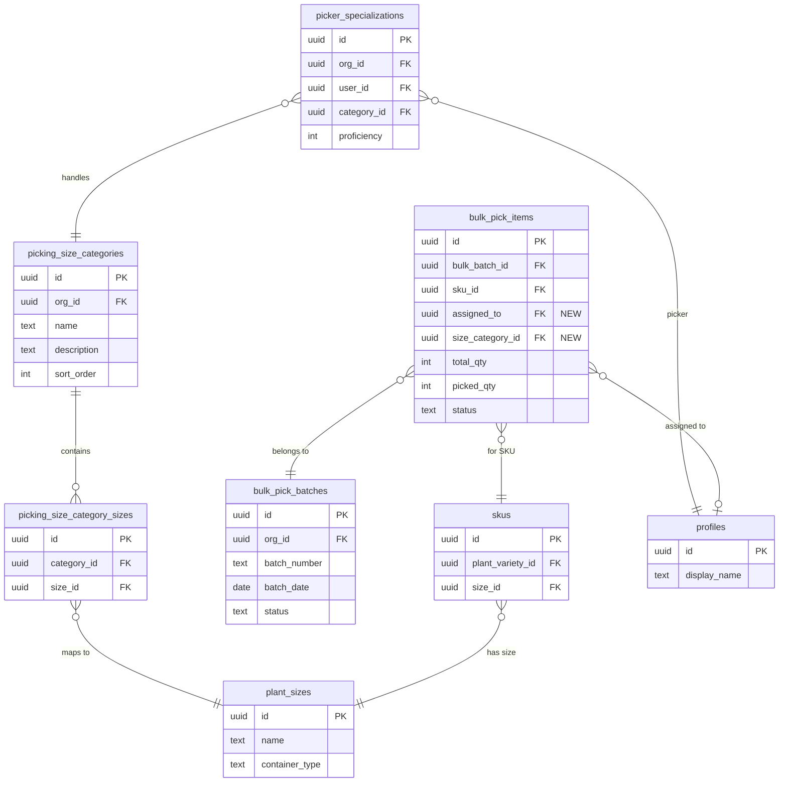
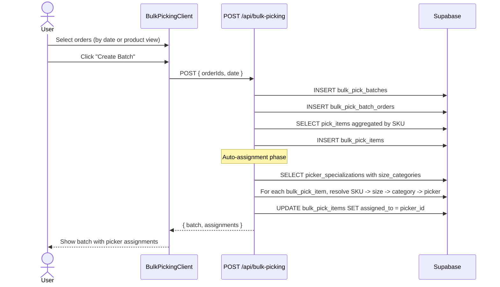
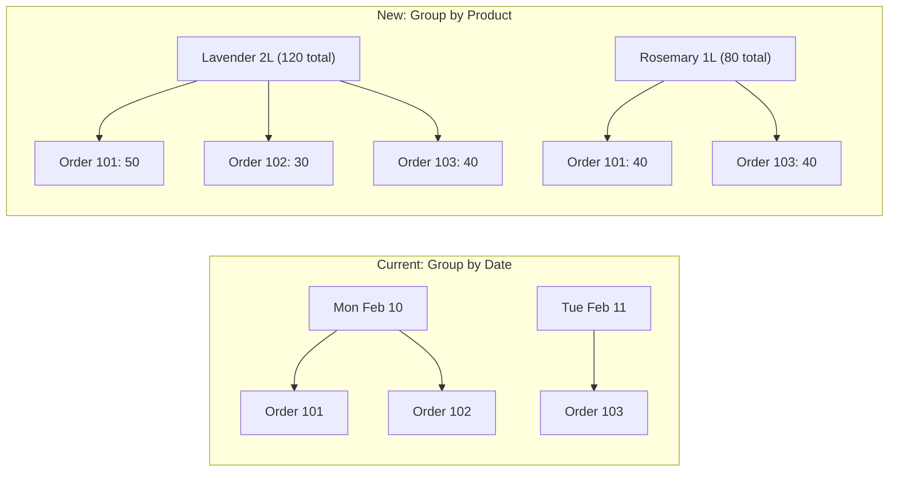

# Implementation Plan: Bulk Picking System Overhaul

**Status**: Ready
**Created**: 2026-02-11
**Author**: Planner (Senior Software Engineer perspective)
**Complexity**: XL (broken into 4 phases, each L or smaller)
**Estimated Sessions**: 5-7

---

## Pre-Flight Check
- Existing PLAN.md: PLAN-picking-redesign.md exists (covers single-order picking UX, not bulk picking). This plan is complementary -- it focuses on the **bulk** picking flow, picker specialization, and product-based grouping.
- ROADMAP.md alignment: N/A (no ROADMAP.md found)
- Related plans: `PLAN-picking-redesign.md` -- redesigns scan-first single-item picking UX. Our plan builds on top of that, assuming single-item picking works. No conflicts.
- Backlog cross-ref: None found

---

## 1. Overview

### Problem Statement

The bulk picking system is **completely broken** -- the migration that creates the three core tables (`bulk_pick_batches`, `bulk_pick_batch_orders`, `bulk_pick_items`) was never applied to the production database. All API routes and UI pages reference these non-existent tables, resulting in "Could not find the table 'public.bulk_pick_batches' in the schema cache" errors.

Beyond the bug, the nursery owner has three functional requirements:
1. **Group by product**, not just delivery date -- they want to see what products span across orders
2. **Picker specialization** -- Asta picks planters, Ramunas picks 1L/1.5L/2L. Assign items to pickers based on what they handle
3. **Simpler and more transparent** -- reduce cognitive load for warehouse staff

### Proposed Solution

Fix the database first, then layer on picker specialization and product-based grouping:

1. **Phase 1**: Apply the existing migration (with minor corrections) to create the bulk picking tables
2. **Phase 2**: Add a `picker_specializations` table and `pick_assignments` table to model what each picker handles and assign bulk items to specific pickers
3. **Phase 3**: Rebuild the batch creation UI to support both "by delivery date" and "by product" grouping views
4. **Phase 4**: Build a smart assignment algorithm that auto-suggests picker assignments based on specializations

### Scope

**In Scope**:
- Applying the missing migration (fixing the bug)
- Picker specialization data model (what sizes/categories each picker handles)
- Pick assignment model (assigning bulk pick items to specific pickers)
- Product-based grouping view for batch creation
- Auto-assignment algorithm for picker suggestions
- UI changes to support the above

**Out of Scope**:
- Redesigning the single-item picking scan flow (covered by `PLAN-picking-redesign.md`)
- Mobile-native app / PWA changes
- Barcode/label generation changes
- Real-time collaboration (multiple pickers editing same batch simultaneously)
- Reporting / analytics dashboards for picking performance

---

## 2. Requirements

### Functional Requirements

| ID | Requirement | Priority | Size |
|----|-------------|----------|------|
| FR-1 | Bulk picking tables must exist in the database | P0 | S |
| FR-2 | Existing bulk picking UI and API must work end-to-end | P0 | S |
| FR-3 | Users can define picker specializations (which sizes/categories a picker handles) | P0 | M |
| FR-4 | Bulk pick items can be assigned to specific pickers | P0 | M |
| FR-5 | Batch creation view shows orders grouped by product (SKU) in addition to delivery date | P0 | M |
| FR-6 | System auto-suggests picker assignments based on specializations | P1 | M |
| FR-7 | Pickers see only their assigned items when viewing a batch | P1 | S |
| FR-8 | Batch detail shows picker assignment summary (who picks what) | P1 | S |
| FR-9 | Admin can override auto-assignments manually | P2 | S |
| FR-10 | Product grouping shows aggregated quantities across all selected orders | P1 | S |

### Non-Functional Requirements

| ID | Requirement | Target |
|----|-------------|--------|
| NFR-1 | Page load with 100 orders | < 2 seconds |
| NFR-2 | Assignment algorithm for 50 items | < 500ms |
| NFR-3 | All new tables have RLS | 100% coverage |
| NFR-4 | TypeScript strict mode | Zero `any` types in new code |

### Assumptions
- The existing migration SQL is structurally correct (just never applied)
- `picking_teams` and `picking_team_members` tables already exist in the database
- The `profiles` table has `display_name` for showing picker names
- The `plant_sizes` table has `container_type` (enum: pot, tray, bareroot) and `name` for categorization
- Pickers are already org members (via `org_memberships`)

### Open Questions
- [x] Should specializations be at the team level or individual picker level? **Decision: Individual picker level** -- the owner specifically names "Asta picks planters, Ramunas picks 1L/1.5L/2L", suggesting individual specializations
- [x] How to categorize sizes for specialization? **Decision: Use "size categories"** -- group plant_sizes into logical categories (small pots: P9-P19/1L/1.5L/2L, large pots: 3L/5L/10L, trays: 6 Pack/cell trays/plugs, bareroot). Allow custom assignment of sizes to categories.
- [ ] Should picker specializations be per-org or global? **Recommended: per-org** -- different nurseries have different workflows

---

## 3. Technical Design

### Architecture Overview

The system adds two new concepts on top of the existing bulk picking tables:

1. **Size Categories** -- logical groupings of plant sizes (e.g., "Small Pots" = P9, 1L, 1.5L, 2L). These are org-configurable.
2. **Picker Specializations** -- which size categories each picker handles. A picker can handle multiple categories.
3. **Pick Assignments** -- when a bulk batch is created, items are assigned to pickers based on the SKU's size category matching the picker's specializations.

The existing `bulk_pick_items` table gets an `assigned_to` column pointing to the picker (user_id). The new `picker_specializations` table maps pickers to size categories.

### System Diagram



### Data Flow: Batch Creation with Auto-Assignment



### Data Flow: Product-Based Grouping



### Database Changes

**Assessment**: Significant -- 3 new tables + 2 column additions + new migration for unapplied tables
**data-engineer Required**: Yes

#### Phase 1: Apply Existing Migration

The migration at `20251221100000_picking_workflow_enhancements.sql` needs to be applied. It creates:
- `bulk_pick_batches` (with RLS)
- `bulk_pick_batch_orders` (with RLS)
- `bulk_pick_items` (with RLS)
- Triggers for updated_at
- Also adds columns to `order_packing` (trolley_type, shelves, qc_notes, qc_checklist, trolley_numbers)

**Strategy**: Apply via Supabase dashboard SQL editor or `supabase db push`. The migration uses `IF NOT EXISTS` / `IF NOT EXISTS` guards, so it is safe to re-run.

#### Phase 2: New Tables for Picker Specialization

**Table: `picking_size_categories`**

```sql
CREATE TABLE public.picking_size_categories (
  id uuid NOT NULL DEFAULT gen_random_uuid(),
  org_id uuid NOT NULL,
  name text NOT NULL,
  description text,
  sort_order integer NOT NULL DEFAULT 0,
  is_active boolean NOT NULL DEFAULT true,
  created_at timestamptz NOT NULL DEFAULT now(),
  updated_at timestamptz NOT NULL DEFAULT now(),

  CONSTRAINT picking_size_categories_pkey PRIMARY KEY (id),
  CONSTRAINT picking_size_categories_org_fkey FOREIGN KEY (org_id)
    REFERENCES public.organizations(id) ON DELETE CASCADE,
  CONSTRAINT picking_size_categories_unique_name UNIQUE (org_id, name)
);
```

Purpose: Groups like "Small Pots" (P9, 1L, 1.5L, 2L), "Large Pots" (3L, 5L, 10L), "Trays" (6 Pack, cell trays, plugs), "Bareroot", "Planters" (custom). Org-configurable.

**Default seed data** (inserted by migration for existing orgs):

| Category | Sizes Included |
|----------|---------------|
| Small Pots | P9, P10, P11, P12, P13, P14, P15, P17, P19, 1L, 1.5L, 2L |
| Large Pots | 3L, 5L, 10L |
| Trays & Plugs | 6 Pack, 40 Cell Tray, 84 Cell Tray, 104 Cell Tray, 144 Plugs, 200 Plugs, 273 Prop |
| Bareroot | Bareroot |

**Table: `picking_size_category_sizes`** (junction)

```sql
CREATE TABLE public.picking_size_category_sizes (
  id uuid NOT NULL DEFAULT gen_random_uuid(),
  category_id uuid NOT NULL,
  size_id uuid NOT NULL,

  CONSTRAINT picking_size_category_sizes_pkey PRIMARY KEY (id),
  CONSTRAINT picking_size_category_sizes_cat_fkey FOREIGN KEY (category_id)
    REFERENCES public.picking_size_categories(id) ON DELETE CASCADE,
  CONSTRAINT picking_size_category_sizes_size_fkey FOREIGN KEY (size_id)
    REFERENCES public.plant_sizes(id) ON DELETE CASCADE,
  CONSTRAINT picking_size_category_sizes_unique UNIQUE (category_id, size_id)
);
```

**Table: `picker_specializations`**

```sql
CREATE TABLE public.picker_specializations (
  id uuid NOT NULL DEFAULT gen_random_uuid(),
  org_id uuid NOT NULL,
  user_id uuid NOT NULL,
  category_id uuid NOT NULL,
  proficiency integer NOT NULL DEFAULT 1 CHECK (proficiency BETWEEN 1 AND 3),
  -- 1 = can pick, 2 = preferred, 3 = expert
  created_at timestamptz NOT NULL DEFAULT now(),

  CONSTRAINT picker_specializations_pkey PRIMARY KEY (id),
  CONSTRAINT picker_specializations_org_fkey FOREIGN KEY (org_id)
    REFERENCES public.organizations(id) ON DELETE CASCADE,
  CONSTRAINT picker_specializations_user_fkey FOREIGN KEY (user_id)
    REFERENCES auth.users(id) ON DELETE CASCADE,
  CONSTRAINT picker_specializations_cat_fkey FOREIGN KEY (category_id)
    REFERENCES public.picking_size_categories(id) ON DELETE CASCADE,
  CONSTRAINT picker_specializations_unique UNIQUE (org_id, user_id, category_id)
);
```

Purpose: "Asta handles Large Pots (proficiency: 3)" and "Ramunas handles Small Pots (proficiency: 3)".

**Column additions to `bulk_pick_items`**:

```sql
ALTER TABLE public.bulk_pick_items
  ADD COLUMN IF NOT EXISTS assigned_to uuid
    REFERENCES auth.users(id) ON DELETE SET NULL;

ALTER TABLE public.bulk_pick_items
  ADD COLUMN IF NOT EXISTS size_category_id uuid
    REFERENCES public.picking_size_categories(id) ON DELETE SET NULL;

CREATE INDEX IF NOT EXISTS idx_bulk_pick_items_assigned
  ON public.bulk_pick_items(assigned_to)
  WHERE assigned_to IS NOT NULL;
```

### API Changes

| Endpoint | Method | Purpose | Size | Phase |
|----------|--------|---------|------|-------|
| `/api/bulk-picking` POST | Modify | Add auto-assignment logic after item creation | M | 4 |
| `/api/bulk-picking` GET | Modify | Include assigned_to in item data | S | 3 |
| `/api/picking/size-categories` | GET/POST | CRUD for size categories | M | 2 |
| `/api/picking/size-categories/[id]` | PATCH/DELETE | Update/delete categories | S | 2 |
| `/api/picking/specializations` | GET/POST/DELETE | Manage picker specializations | M | 2 |
| `/api/bulk-picking/preview-products` | GET | Get product aggregation across orders | M | 3 |
| `/api/bulk-picking/[batchId]` PATCH | Modify | Add `reassign_item` action | S | 4 |

### Frontend Changes

| Component | Change | Size | Phase |
|-----------|--------|------|-------|
| `BulkPickingClient.tsx` | Add product grouping tab + picker assignment display | L | 3 |
| `BulkPickingWorkflowClient.tsx` | Show "My Items" vs "All Items" toggle per picker | M | 3 |
| New: `PickerSpecializationSettings.tsx` | Admin UI for managing picker specializations | M | 2 |
| New: `SizeCategoryManager.tsx` | Admin UI for managing size categories | M | 2 |
| New: `PickerAssignmentView.tsx` | Shows batch items grouped by assigned picker | M | 3 |
| `page.tsx` (bulk-picking) | Fetch size categories + specializations for grouping | S | 3 |

---

## 4. Alternatives Considered

### Alternative A: Tag-Based Specializations (Free-form tags on pickers)

| Pros | Cons |
|------|------|
| Maximum flexibility | No structure = hard to auto-assign |
| No new category tables needed | Tags drift and become inconsistent |
| Quick to implement | Can't do meaningful aggregation |

**Rejected**: Tags are too loose for reliable auto-assignment. The owner gave clear category examples (planters, 1L/1.5L/2L), which map well to structured categories.

### Alternative B: Specializations on `picking_teams` instead of individual users

| Pros | Cons |
|------|------|
| Fewer rows to manage | Owner named individuals (Asta, Ramunas), not teams |
| Matches existing team model | Teams are too coarse -- one person may be in multiple teams |
| Simpler assignment | Can't handle "Asta does planters AND 5L" |

**Rejected**: The owner thinks in terms of individual pickers, not teams. We keep teams for organizational grouping but add individual specializations.

### Alternative C: Hardcoded size groups based on `container_type` enum (pot/tray/bareroot)

| Pros | Cons |
|------|------|
| Zero new tables | Only 3 groups -- too coarse (1L and 10L are both "pot") |
| Trivial to implement | Can't separate small pots from large pots |
| No admin UI needed | Can't add "Planters" as a custom category |

**Rejected**: The existing `container_type` enum has only 3 values (pot, tray, bareroot). The owner needs finer granularity -- "1L/1.5L/2L" vs "planters" are both pots but handled by different people.

### **Selected: Alternative D -- Size Categories (org-configurable groupings)**

Best balance of structure and flexibility:
- Categories are org-configurable (can add "Planters" as a category)
- Each category maps to specific `plant_sizes` via junction table
- Specializations link pickers to categories with proficiency levels
- Auto-assignment is deterministic: SKU -> size -> category -> picker

**Decision Rationale**: This approach directly models how the nursery owner thinks about picking ("Asta does planters, Ramunas does small pots") while remaining configurable for different nurseries. The proficiency level (1-3) enables smart assignment when multiple pickers can handle the same category.

---

## 5. Implementation Plan

### Phase 1: Fix the Bug -- Apply Missing Migration (P0)

| # | Task | Agent | Size | Depends On | Acceptance Criteria |
|---|------|-------|------|------------|---------------------|
| 1.1 | Apply migration `20251221100000_picking_workflow_enhancements.sql` to production database | `data-engineer` | S | - | Tables `bulk_pick_batches`, `bulk_pick_batch_orders`, `bulk_pick_items` exist. RLS enabled. Triggers active. |
| 1.2 | Verify existing API routes work after migration | `verifier` | S | 1.1 | GET `/api/bulk-picking` returns empty array (not error). POST creates a batch successfully. |
| 1.3 | Regenerate Supabase TypeScript types | `feature-builder` | S | 1.1 | `database.types.ts` includes bulk_pick_batches, bulk_pick_batch_orders, bulk_pick_items types. |

**Phase 1 Complete When**:
- [ ] Navigating to `/dispatch/bulk-picking` loads without errors
- [ ] Creating a batch from selected orders works end-to-end
- [ ] Batch detail page loads and displays items
- [ ] TypeScript types include all 3 new tables

**Migration Strategy**: Since the migration uses `CREATE TABLE IF NOT EXISTS` and `ADD COLUMN IF NOT EXISTS`, it is safe to apply even if partially applied. Run the full migration SQL in the Supabase SQL editor or via `supabase db push`.

---

### Phase 2: Picker Specialization Schema + Admin UI (P0)

| # | Task | Agent | Size | Depends On | Acceptance Criteria |
|---|------|-------|------|------------|---------------------|
| 2.1 | Create migration for `picking_size_categories`, `picking_size_category_sizes`, `picker_specializations` tables with RLS | `data-engineer` | M | Phase 1 | Tables exist, RLS policies active, indexes created. |
| 2.2 | Seed default size categories (Small Pots, Large Pots, Trays & Plugs, Bareroot) with size mappings | `data-engineer` | S | 2.1 | Default categories exist with correct size_id mappings for the org. |
| 2.3 | Add `assigned_to` and `size_category_id` columns to `bulk_pick_items` | `data-engineer` | S | 2.1 | Columns exist, FK constraints active, index on assigned_to. |
| 2.4 | Create API routes for size categories CRUD (`/api/picking/size-categories`) | `feature-builder` | M | 2.1 | GET lists categories with sizes. POST creates. PATCH updates. DELETE removes (if no specializations reference it). |
| 2.5 | Create API routes for picker specializations (`/api/picking/specializations`) | `feature-builder` | M | 2.1 | GET lists specializations with picker name + category name. POST creates. DELETE removes. |
| 2.6 | Build `SizeCategoryManager` component | `feature-builder` | M | 2.4 | Admin can view, create, edit, delete size categories. Can add/remove sizes from each category via multi-select. |
| 2.7 | Build `PickerSpecializationSettings` component | `feature-builder` | M | 2.5 | Admin can assign pickers to categories with proficiency. Shows matrix: pickers (rows) x categories (columns). |
| 2.8 | Add settings page or section for picker specializations | `feature-builder` | S | 2.6, 2.7 | Accessible from dispatch settings or inline on bulk picking page. |

**Phase 2 Complete When**:
- [ ] Size categories table populated with defaults
- [ ] Admin can manage size categories (add/edit/delete)
- [ ] Admin can assign picker specializations (Asta -> Large Pots, Ramunas -> Small Pots)
- [ ] `bulk_pick_items` has `assigned_to` and `size_category_id` columns
- [ ] All new tables have RLS policies scoped to org_id

**Schema Details for data-engineer**:

Full migration SQL (Phase 2):

```sql
-- ================================================
-- PICKING SIZE CATEGORIES
-- ================================================

CREATE TABLE public.picking_size_categories (
  id uuid NOT NULL DEFAULT gen_random_uuid(),
  org_id uuid NOT NULL,
  name text NOT NULL,
  description text,
  sort_order integer NOT NULL DEFAULT 0,
  is_active boolean NOT NULL DEFAULT true,
  created_at timestamptz NOT NULL DEFAULT now(),
  updated_at timestamptz NOT NULL DEFAULT now(),

  CONSTRAINT picking_size_categories_pkey PRIMARY KEY (id),
  CONSTRAINT picking_size_categories_org_fkey FOREIGN KEY (org_id)
    REFERENCES public.organizations(id) ON DELETE CASCADE,
  CONSTRAINT picking_size_categories_unique_name UNIQUE (org_id, name)
);

CREATE INDEX idx_picking_size_categories_org
  ON public.picking_size_categories(org_id) WHERE is_active = true;

-- Junction: which plant_sizes belong to which category
CREATE TABLE public.picking_size_category_sizes (
  id uuid NOT NULL DEFAULT gen_random_uuid(),
  category_id uuid NOT NULL,
  size_id uuid NOT NULL,

  CONSTRAINT picking_size_category_sizes_pkey PRIMARY KEY (id),
  CONSTRAINT picking_size_category_sizes_cat_fkey FOREIGN KEY (category_id)
    REFERENCES public.picking_size_categories(id) ON DELETE CASCADE,
  CONSTRAINT picking_size_category_sizes_size_fkey FOREIGN KEY (size_id)
    REFERENCES public.plant_sizes(id) ON DELETE CASCADE,
  CONSTRAINT picking_size_category_sizes_unique UNIQUE (category_id, size_id)
);

-- ================================================
-- PICKER SPECIALIZATIONS
-- ================================================

CREATE TABLE public.picker_specializations (
  id uuid NOT NULL DEFAULT gen_random_uuid(),
  org_id uuid NOT NULL,
  user_id uuid NOT NULL,
  category_id uuid NOT NULL,
  proficiency integer NOT NULL DEFAULT 1 CHECK (proficiency BETWEEN 1 AND 3),
  created_at timestamptz NOT NULL DEFAULT now(),

  CONSTRAINT picker_specializations_pkey PRIMARY KEY (id),
  CONSTRAINT picker_specializations_org_fkey FOREIGN KEY (org_id)
    REFERENCES public.organizations(id) ON DELETE CASCADE,
  CONSTRAINT picker_specializations_user_fkey FOREIGN KEY (user_id)
    REFERENCES auth.users(id) ON DELETE CASCADE,
  CONSTRAINT picker_specializations_cat_fkey FOREIGN KEY (category_id)
    REFERENCES public.picking_size_categories(id) ON DELETE CASCADE,
  CONSTRAINT picker_specializations_unique UNIQUE (org_id, user_id, category_id)
);

CREATE INDEX idx_picker_specializations_org
  ON public.picker_specializations(org_id);
CREATE INDEX idx_picker_specializations_user
  ON public.picker_specializations(user_id);

-- ================================================
-- BULK PICK ITEMS: Add assignment columns
-- ================================================

ALTER TABLE public.bulk_pick_items
  ADD COLUMN IF NOT EXISTS assigned_to uuid
    REFERENCES auth.users(id) ON DELETE SET NULL;

ALTER TABLE public.bulk_pick_items
  ADD COLUMN IF NOT EXISTS size_category_id uuid
    REFERENCES public.picking_size_categories(id) ON DELETE SET NULL;

CREATE INDEX IF NOT EXISTS idx_bulk_pick_items_assigned
  ON public.bulk_pick_items(assigned_to)
  WHERE assigned_to IS NOT NULL;

CREATE INDEX IF NOT EXISTS idx_bulk_pick_items_category
  ON public.bulk_pick_items(size_category_id)
  WHERE size_category_id IS NOT NULL;

-- ================================================
-- RLS POLICIES
-- ================================================

ALTER TABLE public.picking_size_categories ENABLE ROW LEVEL SECURITY;
ALTER TABLE public.picking_size_category_sizes ENABLE ROW LEVEL SECURITY;
ALTER TABLE public.picker_specializations ENABLE ROW LEVEL SECURITY;

-- Size categories: org-scoped
CREATE POLICY "Users can view size categories in their org"
  ON public.picking_size_categories FOR SELECT TO authenticated
  USING (org_id IN (
    SELECT org_id FROM public.org_memberships WHERE user_id = auth.uid()
  ));

CREATE POLICY "Users can manage size categories in their org"
  ON public.picking_size_categories FOR ALL TO authenticated
  USING (org_id IN (
    SELECT org_id FROM public.org_memberships WHERE user_id = auth.uid()
  ));

-- Size category sizes: via category org
CREATE POLICY "Users can view size category sizes"
  ON public.picking_size_category_sizes FOR SELECT TO authenticated
  USING (category_id IN (
    SELECT id FROM public.picking_size_categories
    WHERE org_id IN (SELECT org_id FROM public.org_memberships WHERE user_id = auth.uid())
  ));

CREATE POLICY "Users can manage size category sizes"
  ON public.picking_size_category_sizes FOR ALL TO authenticated
  USING (category_id IN (
    SELECT id FROM public.picking_size_categories
    WHERE org_id IN (SELECT org_id FROM public.org_memberships WHERE user_id = auth.uid())
  ));

-- Picker specializations: org-scoped
CREATE POLICY "Users can view picker specializations in their org"
  ON public.picker_specializations FOR SELECT TO authenticated
  USING (org_id IN (
    SELECT org_id FROM public.org_memberships WHERE user_id = auth.uid()
  ));

CREATE POLICY "Users can manage picker specializations in their org"
  ON public.picker_specializations FOR ALL TO authenticated
  USING (org_id IN (
    SELECT org_id FROM public.org_memberships WHERE user_id = auth.uid()
  ));

-- Triggers
CREATE TRIGGER update_picking_size_categories_updated_at
  BEFORE UPDATE ON public.picking_size_categories
  FOR EACH ROW EXECUTE FUNCTION update_updated_at_column();

-- Service role grants
GRANT ALL ON public.picking_size_categories TO service_role;
GRANT ALL ON public.picking_size_category_sizes TO service_role;
GRANT ALL ON public.picker_specializations TO service_role;
```

---

### Phase 3: Product-Based Grouping UI (P0-P1)

| # | Task | Agent | Size | Depends On | Acceptance Criteria |
|---|------|-------|------|------------|---------------------|
| 3.1 | Create `GET /api/bulk-picking/preview-products` endpoint that aggregates order items by SKU across selected orders | `feature-builder` | M | Phase 1 | Given order IDs, returns `[{ skuId, productName, sizeName, sizeCategory, totalQty, orders: [{orderId, orderNumber, qty}] }]` sorted by category then product name. |
| 3.2 | Refactor `BulkPickingClient.tsx` to add a "By Product" tab alongside "By Date" | `feature-builder` | L | 3.1 | Two tabs at top: "By Delivery Date" (existing) and "By Product" (new). Product tab shows items grouped by size category with aggregated quantities. |
| 3.3 | Build product grouping view component | `feature-builder` | M | 3.1 | Shows a card per size category (e.g., "Small Pots - 340 units"). Expandable to show individual products within. Each product shows quantity breakdown by order. |
| 3.4 | Add picker assignment display to batch detail page | `feature-builder` | M | Phase 2 | `BulkPickingWorkflowClient.tsx` shows items grouped by assigned picker. Each picker section shows their items with progress. Unassigned items shown separately. |
| 3.5 | Add "My Items" filter toggle to batch workflow | `feature-builder` | S | 3.4 | When logged-in user is a picker with assignments, toggle filters to show only their items. Default: show all. |
| 3.6 | Modify `GET /api/bulk-picking` and `GET /api/bulk-picking/[batchId]` to include assignment data | `feature-builder` | S | Phase 2 | Item data includes `assignedTo`, `assignedToName`, `sizeCategoryName`. |

**Phase 3 Complete When**:
- [ ] Batch creation page has both "By Date" and "By Product" tabs
- [ ] Product tab shows SKUs aggregated across orders with size category grouping
- [ ] Batch detail page shows items grouped by assigned picker
- [ ] "My Items" toggle works for individual pickers

**UI Wireframe: Product Grouping View**

```
+--------------------------------------------------+
| Create New Bulk Pick                              |
| [By Delivery Date] [By Product]  <-- tab switcher |
+--------------------------------------------------+
|                                                    |
| Select date range: [Feb 10] to [Feb 14]  [Apply]  |
|                                                    |
| --- Small Pots (340 units across 12 orders) ---   |
| [x] Lavender angustifolia 1L    120 units  5 ord  |
| [x] Rosemary officinalis 1.5L    80 units  3 ord  |
| [x] Thyme vulgaris 2L            60 units  4 ord  |
| [ ] Salvia nemorosa P9            80 units  6 ord  |
|                                                    |
| --- Large Pots (180 units across 8 orders) ---    |
| [x] Lavender angustifolia 3L     50 units  3 ord  |
| [x] Hydrangea paniculata 5L      30 units  2 ord  |
| [ ] Acer palmatum 10L            100 units  3 ord  |
|                                                    |
| --- Trays & Plugs (2400 units across 4 orders) -- |
| [ ] Mixed herbs 6 Pack           400 units  2 ord  |
| [ ] Bedding mix 84 Cell Tray    2000 units  2 ord  |
+--------------------------------------------------+
| [8 products selected from 15 orders]               |
| [Create Batch]                                     |
+--------------------------------------------------+
```

**UI Wireframe: Picker Assignment View (Batch Detail)**

```
+--------------------------------------------------+
| BP-20260211-A4F2                                  |
| Tuesday, February 11, 2026                        |
| [Picking] [Packing]                               |
+--------------------------------------------------+
| [All Items] [My Items]  <-- toggle                |
|                                                    |
| --- Asta (Large Pots) --- 3/5 picked             |
| [x] Lavender 3L          x50  PICKED              |
| [x] Hydrangea 5L         x30  PICKED              |
| [x] Acer 10L             x40  PICKED              |
| [ ] Photinia 3L           x25  PENDING             |
| [ ] Viburnum 5L           x15  PENDING             |
|                                                    |
| --- Ramunas (Small Pots) --- 1/3 picked           |
| [x] Lavender 1L          x120  PICKED             |
| [ ] Rosemary 1.5L         x80  PENDING             |
| [ ] Thyme 2L              x60  PENDING             |
|                                                    |
| --- Unassigned --- 0/2 picked                      |
| [ ] Mixed herbs 6 Pack   x400  PENDING             |
| [ ] Bedding 84 Cell      x2000  PENDING            |
+--------------------------------------------------+
```

---

### Phase 4: Smart Assignment Algorithm (P1)

| # | Task | Agent | Size | Depends On | Acceptance Criteria |
|---|------|-------|------|------------|---------------------|
| 4.1 | Implement assignment algorithm as a server-side function | `feature-builder` | M | Phase 2, Phase 3 | Given bulk_pick_items and picker_specializations, assigns each item to the best-fit picker. Handles: unmatched items (left unassigned), multiple pickers for same category (round-robin or load balance by quantity). |
| 4.2 | Integrate auto-assignment into `POST /api/bulk-picking` batch creation | `feature-builder` | M | 4.1 | After creating bulk_pick_items, run assignment algorithm and update assigned_to. Return assignments in response. |
| 4.3 | Add "Reassign" action to batch PATCH API | `feature-builder` | S | 4.1 | New action `reassign_item` accepts `{itemId, assignedTo}`. Updates bulk_pick_item.assigned_to. |
| 4.4 | Add manual reassignment UI to batch detail page | `feature-builder` | M | 4.3, 3.4 | Dropdown on each item to change assigned picker. Shows available pickers with their specializations. |
| 4.5 | Add "Re-run Auto-Assign" button to batch detail | `feature-builder` | S | 4.2 | Button re-runs algorithm for unassigned items or all items. Confirmation dialog before overwriting manual assignments. |

**Phase 4 Complete When**:
- [ ] New batches auto-assign items to pickers based on specializations
- [ ] Assignment algorithm respects proficiency levels (prefer proficiency 3 over 1)
- [ ] Unmatched items (no picker for that size category) remain unassigned
- [ ] Admin can manually reassign any item
- [ ] "Re-run Auto-Assign" button works for batches with unassigned items

**Assignment Algorithm (Pseudocode)**:

```typescript
function autoAssignItems(
  items: BulkPickItem[],
  specializations: PickerSpecialization[],
  sizeCategoryMap: Map<string, string> // sizeId -> categoryId
): Map<string, string> {
  // Result: itemId -> userId
  const assignments = new Map<string, string>();

  // Build: categoryId -> [{ userId, proficiency }] sorted by proficiency DESC
  const categoryPickers = buildCategoryPickerMap(specializations);

  // Track picker load (total units assigned)
  const pickerLoad = new Map<string, number>();

  // Sort items by total_qty DESC (assign biggest items first for better balance)
  const sortedItems = [...items].sort((a, b) => b.totalQty - a.totalQty);

  for (const item of sortedItems) {
    // Resolve: SKU -> size -> category
    const categoryId = sizeCategoryMap.get(item.sizeId);
    if (!categoryId) continue; // No category for this size, leave unassigned

    const pickers = categoryPickers.get(categoryId);
    if (!pickers || pickers.length === 0) continue; // No picker for this category

    // Among highest proficiency pickers, pick the one with lowest current load
    const maxProficiency = pickers[0].proficiency;
    const topPickers = pickers.filter(p => p.proficiency === maxProficiency);

    const bestPicker = topPickers.reduce((best, p) => {
      const bestLoad = pickerLoad.get(best.userId) || 0;
      const pLoad = pickerLoad.get(p.userId) || 0;
      return pLoad < bestLoad ? p : best;
    });

    assignments.set(item.id, bestPicker.userId);
    pickerLoad.set(
      bestPicker.userId,
      (pickerLoad.get(bestPicker.userId) || 0) + item.totalQty
    );
  }

  return assignments;
}
```

---

## 6. Risks & Mitigations

| Risk | Likelihood | Impact | Mitigation |
|------|------------|--------|------------|
| Migration fails on production (conflicting state) | Low | High | Migration uses IF NOT EXISTS guards. Test on a branch DB first. |
| Picker specializations not configured by admin | Medium | Medium | System works without specializations -- items simply remain unassigned. Add onboarding prompt to configure. |
| Size categories don't match nursery's mental model | Low | Medium | Categories are fully configurable. Defaults cover common cases. |
| Product grouping query slow with many orders | Low | Medium | Aggregate query uses indexes on sku_id and order_id. Limit to 200 orders. Use DB-side aggregation. |
| Assignment algorithm produces unbalanced loads | Medium | Low | Algorithm includes load balancing. Admin can always manually reassign. |
| Conflict with PLAN-picking-redesign changes | Low | Medium | Plans are complementary -- picking redesign changes single-item scan flow, this changes batch-level grouping/assignment. No overlapping files except potentially BulkPickingWorkflowClient.tsx. |

---

## 7. Definition of Done

Feature is complete when:
- [ ] All P0 tasks complete (Phases 1-3)
- [ ] All P1 tasks complete (Phase 4 auto-assignment)
- [ ] P2 tasks: deferred to backlog (manual override refinements)
- [ ] Tests passing (`verifier`)
  - [ ] Migration applies cleanly on fresh DB
  - [ ] API routes return correct data shapes
  - [ ] Assignment algorithm handles edge cases (no specializations, no matching category, single picker)
- [ ] Code reviewed (`reviewer`)
- [ ] Security checked (`security-auditor`)
  - [ ] All new tables have RLS
  - [ ] API routes check auth
  - [ ] No org_id leakage
- [ ] User acceptance: nursery owner confirms
  - [ ] Can create a batch from product grouping view
  - [ ] Asta sees her assigned items (large pots)
  - [ ] Ramunas sees his assigned items (small pots)
  - [ ] Unassigned items visible to everyone

---

## 8. Handoff Notes

### Jimmy Command String

```
jimmy execute .claude/plans/bulk-picking-engineer-plan.md --mode thorough
```

### For Jimmy (Routing)

- **Start with**: Phase 1 (data-engineer applies migration) -- this unblocks everything
- **DB Work Required**: Yes -- 1 existing migration to apply + 1 new migration (3 tables, 2 columns)
- **Recommended Mode**: thorough (DB changes + new feature)
- **Critical Dependencies**: Phase 1 must complete before any other phase. Phase 2 must complete before Phase 4.
- **Estimated Sessions**: 5-7
- **Parallel work**: Phase 3 tasks 3.1-3.3 (product grouping UI) can start as soon as Phase 1 is done, in parallel with Phase 2

### For data-engineer

1. **Phase 1**: Apply migration `supabase/migrations/20251221100000_picking_workflow_enhancements.sql`. Verify tables exist. Regenerate types.
2. **Phase 2**: Create new migration with 3 tables (`picking_size_categories`, `picking_size_category_sizes`, `picker_specializations`), 2 column additions to `bulk_pick_items`, RLS policies, indexes, and triggers. See full SQL in Phase 2 section above.
3. **Seed data**: Insert default size categories for existing orgs. Map plant_sizes to categories based on name/container_type.

### For feature-builder

- **Patterns to follow**: Existing API routes at `/api/bulk-picking/route.ts` show the pattern -- `getUserAndOrg()` for auth, `getSupabaseServerApp()` for DB, structured error handling with logger.
- **Component patterns**: `BulkPickingClient.tsx` shows the tab-based UI pattern with Card/Badge/Checkbox. Follow same style.
- **Key types**: The `BulkPickItem` interface in `BulkPickingWorkflowClient.tsx` needs `assignedTo`, `assignedToName`, `sizeCategoryName` fields added.
- **Gotcha**: The server page at `page.tsx` uses `getUserAndOrg()` which returns `{orgId, userId, supabase}`. All new server-side data fetching should use this pattern.
- **Gotcha**: `any` types are used throughout existing code (e.g., `(b: any) => ...` in transformations). New code should use proper types from generated Supabase types.

### For verifier

- **Phase 1 verification**: Navigate to `/dispatch/bulk-picking`, confirm no schema cache error. Create a batch, confirm it appears. Open batch detail, confirm items load.
- **Phase 2 verification**: Create size categories via API. Assign specializations. Verify RLS (user from another org cannot see categories).
- **Phase 3 verification**: Product grouping tab shows correct aggregated quantities. Batch detail shows items grouped by picker.
- **Phase 4 verification**: Create batch with specializations configured. Verify items auto-assigned correctly. Verify manual reassignment works.
- **Edge cases**: Empty orders (no items), orders with SKUs that have no size category mapping, no picker specializations configured, single picker handling all categories.

### For security-auditor

- All 3 new tables need RLS audit: `picking_size_categories`, `picking_size_category_sizes`, `picker_specializations`
- Column additions to `bulk_pick_items` don't change RLS (existing policies cover it)
- New API routes need auth check verification
- Verify no cross-org data leakage in product aggregation query
- Verify picker specializations are org-scoped (user can't see/manage specializations for other orgs)
