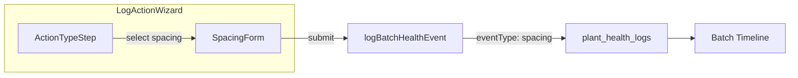
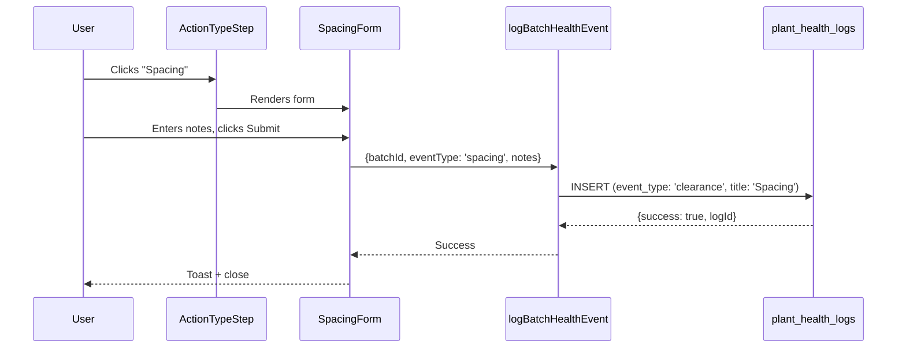

# Implementation Plan: Add Spacing Action to Log Action Wizard

**Status**: Ready
**Created**: 2026-02-05
**Author**: Planner
**Complexity**: S
**Estimated Sessions**: 1

---

## Pre-Flight Check
- Existing PLAN.md: N/A (new feature plan)
- ROADMAP.md alignment: N/A
- Related plans: None
- Backlog cross-ref: None

---

## 1. Overview

### Problem Statement
Growers need to record when they space out batches (physically separate plants to give them room to grow). Currently, spacing is not available in the Log Action wizard, forcing growers to either skip logging this important care activity or use workarounds like adding notes to other actions.

Spacing is a common nursery care activity that:
- Prevents plant crowding and improves air circulation
- Reduces disease pressure
- Can be triggered by scout observations (e.g., "plants look crowded")

### Proposed Solution
Add a "Spacing" action to the Log Action wizard under the CARE section, alongside Pruning and Weeding. The implementation follows the established pattern for care actions and leverages the existing `batch-health` action server which already supports `eventType: 'spacing'`.

### Scope
**In Scope**:
- Add Spacing as a new action type in the Log Action wizard
- Create SpacingForm component following PruningForm/WeedingForm pattern
- Add Spacing to ACTION_META with appropriate metadata
- Update wizard index to render SpacingForm

**Out of Scope**:
- Scout observation integration (future enhancement - can trigger spacing task)
- Spacing-specific data fields (current/new spacing measurements)
- Bulk spacing operations across multiple batches
- Task creation workflow from scout observations

---

## 2. Requirements

### Functional Requirements
| ID | Requirement | Priority | Size |
|----|-------------|----------|------|
| FR-1 | Spacing action appears under CARE section in Log Action wizard | P0 | S |
| FR-2 | SpacingForm captures optional notes about the spacing activity | P0 | S |
| FR-3 | Spacing events are logged to plant_health_logs table | P0 | S |
| FR-4 | Spacing appears in batch history timeline | P1 | S |

### Non-Functional Requirements
| ID | Requirement | Target |
|----|-------------|--------|
| NFR-1 | Form follows existing UI patterns | Match Pruning/Weeding forms |
| NFR-2 | Type safety | Zero TypeScript errors |

### Assumptions
- The `logBatchHealthEvent` action already handles `eventType: 'spacing'` (confirmed in code review)
- The `plant_health_logs` table already supports spacing via `event_type: 'clearance'` mapping (confirmed)
- Spacing is a simple care action with no special data requirements beyond notes

### Open Questions
- None - all requirements are clear based on existing patterns

---

## 3. Technical Design

### Architecture Overview
The Spacing action follows the identical pattern used for Pruning and Weeding:
1. User selects "Spacing" from the CARE section
2. SpacingForm is rendered with a notes field
3. On submit, `logBatchHealthEvent` is called with `eventType: 'spacing'`
4. Event is stored in `plant_health_logs` with `event_type: 'clearance'`
5. Batch timeline shows the spacing event

### System Diagram


### Database Changes
**Assessment**: None
**data-engineer Required**: No

The database already supports spacing:
- `plant_health_logs` table exists with RLS
- `logBatchHealthEvent` maps `spacing` -> `clearance` event_type
- `title` is set to 'Spacing' for display

### API Changes
None - existing `logBatchHealthEvent` action already handles spacing

### Frontend Changes
| Component | Change | Size | Notes |
|-----------|--------|------|-------|
| `src/types/batch-actions.ts` | Add 'spacing' to CareActionType, ACTION_META | S | Type + metadata |
| `src/components/batches/LogActionWizard/forms/SpacingForm.tsx` | New file | S | Copy WeedingForm pattern |
| `src/components/batches/LogActionWizard/index.tsx` | Import SpacingForm, add case | S | 3 lines |
| `src/components/batches/LogActionWizard/ActionTypeStep.tsx` | Add icon import | S | 1 line |

### Data Flow


---

## 4. Alternatives Considered

| Approach | Pros | Cons | Decision |
|----------|------|------|----------|
| **Option A - Simple notes form** | Matches existing patterns, minimal code | No spacing-specific fields | Selected |
| Option B - Add spacing measurements | Captures before/after spacing data | Over-engineering for initial release | Rejected: Can add later if needed |
| Option C - Mechanical treatment integration | Links to IPM spot treatments | Adds complexity, different workflow | Rejected: Different use case |

**Decision Rationale**: Option A provides immediate value with minimal implementation risk. Spacing is conceptually similar to weeding (a maintenance care action) and doesn't require special data capture. If users request specific spacing measurements (e.g., "spaced from 4" to 6""), this can be added as a future enhancement.

---

## 5. Implementation Plan

### Phase 1: Types & Metadata (P0)
| # | Task | Agent | Size | Depends On | Acceptance Criteria |
|---|------|-------|------|------------|---------------------|
| 1.1 | Add 'spacing' to CareActionType union | `feature-builder` | S | - | Type compiles without errors |
| 1.2 | Add ACTION_META entry for spacing | `feature-builder` | S | 1.1 | Spacing has label, icon, category, description |

**Phase 1 Complete When**:
- [x] CareActionType includes 'spacing'
- [x] ACTION_META['spacing'] defined with category: 'care'

### Phase 2: SpacingForm Component (P0)
| # | Task | Agent | Size | Depends On | Acceptance Criteria |
|---|------|-------|------|------------|---------------------|
| 2.1 | Create SpacingForm.tsx | `feature-builder` | S | Phase 1 | Form renders with notes field |
| 2.2 | Wire form to logBatchHealthEvent | `feature-builder` | S | 2.1 | Submit calls action with eventType: 'spacing' |

**Phase 2 Complete When**:
- [x] SpacingForm.tsx exists in forms/ directory
- [x] Form matches Weeding/Pruning pattern

### Phase 3: Wizard Integration (P0)
| # | Task | Agent | Size | Depends On | Acceptance Criteria |
|---|------|-------|------|------------|---------------------|
| 3.1 | Import SpacingForm in wizard index | `feature-builder` | S | Phase 2 | No import errors |
| 3.2 | Add spacing case to renderForm switch | `feature-builder` | S | 3.1 | Spacing action renders SpacingForm |
| 3.3 | Add Maximize2 icon to ActionTypeStep | `feature-builder` | S | 3.1 | Icon displays for spacing |

**Phase 3 Complete When**:
- [x] Spacing appears in CARE section of wizard
- [x] Clicking Spacing shows SpacingForm
- [x] Submitting logs event successfully

### Phase 4: Verification (P1)
| # | Task | Agent | Size | Depends On | Acceptance Criteria |
|---|------|-------|------|------------|---------------------|
| 4.1 | Manual test wizard flow | `verifier` | S | Phase 3 | End-to-end flow works |
| 4.2 | Verify event appears in batch history | `verifier` | S | 4.1 | "Spacing" shows in timeline |

**Phase 4 Complete When**:
- [x] Can log spacing action from wizard
- [x] Event persists to database
- [x] Event shows in batch timeline

---

## 6. Risks & Mitigations

| Risk | Likelihood | Impact | Mitigation |
|------|------------|--------|------------|
| Icon not available | Low | Low | Use Maximize2 (expand icon) from lucide-react |
| Existing spacing enum conflict | Low | Low | Already in MECHANICAL_ACTION_TYPES, separate from wizard actions |

---

## 7. Definition of Done

Feature is complete when:
- [x] Spacing appears under CARE section in Log Action wizard
- [x] SpacingForm allows entering optional notes
- [x] Submitting creates plant_health_logs entry
- [x] Toast confirms success
- [x] Event appears in batch history timeline
- [x] No TypeScript errors
- [x] Manual testing passes

---

## 8. Handoff Notes

### Jimmy Command String
```bash
jimmy execute .claude/plans/PLAN-add-spacing-action.md --mode standard
```

### For Jimmy (Routing)
- **Start with**: `feature-builder` (no DB changes needed)
- **DB Work Required**: No
- **Recommended Mode**: standard
- **Critical Dependencies**: None
- **Estimated Sessions**: 1 (< 2 hours)

### For feature-builder

**Key Files to Modify**:
1. `/Users/patrickdoran/Hortitrack/hortitrack/src/types/batch-actions.ts`
   - Add 'spacing' to `CareActionType` union (line ~21)
   - Add ACTION_META entry for 'spacing' (after line ~168)

2. `/Users/patrickdoran/Hortitrack/hortitrack/src/components/batches/LogActionWizard/forms/SpacingForm.tsx`
   - NEW FILE - copy WeedingForm.tsx as template
   - Change schema name, form name, labels
   - Call `logBatchHealthEvent` with `eventType: 'spacing'`

3. `/Users/patrickdoran/Hortitrack/hortitrack/src/components/batches/LogActionWizard/index.tsx`
   - Import SpacingForm (line ~27)
   - Add case 'spacing' to renderForm switch (after line ~131)

4. `/Users/patrickdoran/Hortitrack/hortitrack/src/components/batches/LogActionWizard/ActionTypeStep.tsx`
   - Import Maximize2 icon from lucide-react (line ~13)
   - Add to ICON_MAP (line ~29)

**Pattern to Follow**:
- Copy `/Users/patrickdoran/Hortitrack/hortitrack/src/components/batches/LogActionWizard/forms/WeedingForm.tsx`
- The server action `logBatchHealthEvent` already handles `eventType: 'spacing'`

**Example ACTION_META Entry**:
```typescript
spacing: {
  label: 'Spacing',
  icon: 'Maximize2',
  category: 'care',
  description: 'Space out plants',
},
```

### For verifier
- Test from batch detail page -> Log Action button
- Verify Spacing appears under CARE section (with Pruning, Weeding)
- Submit with notes, verify toast
- Check batch history shows "Spacing" event

### For security-auditor
Not required - no new endpoints or RLS changes

---

## Appendix: Code Snippets

### SpacingForm.tsx Template
```typescript
'use client';

import * as React from 'react';
import { useForm } from 'react-hook-form';
import { zodResolver } from '@hookform/resolvers/zod';
import { Button } from '@/components/ui/button';
import {
  Form,
  FormControl,
  FormField,
  FormItem,
  FormLabel,
  FormMessage,
} from '@/components/ui/form';
import { Textarea } from '@/components/ui/textarea';
import { Loader2 } from 'lucide-react';
import { toast } from 'sonner';
import { z } from 'zod';
import { logBatchHealthEvent } from '@/app/actions/batch-health';

const SpacingFormSchema = z.object({
  notes: z.string().max(500).optional(),
});

type SpacingFormInput = z.infer<typeof SpacingFormSchema>;

type SpacingFormProps = {
  batchId: string;
  onComplete: () => void;
  onCancel: () => void;
  setIsSubmitting: (value: boolean) => void;
};

export function SpacingForm({
  batchId,
  onComplete,
  onCancel,
  setIsSubmitting,
}: SpacingFormProps) {
  const [loading, setLoading] = React.useState(false);

  const form = useForm<SpacingFormInput>({
    resolver: zodResolver(SpacingFormSchema),
    defaultValues: {
      notes: '',
    },
  });

  const onSubmit = async (values: SpacingFormInput) => {
    setLoading(true);
    setIsSubmitting(true);

    try {
      const result = await logBatchHealthEvent({
        batchId,
        eventType: 'spacing',
        notes: values.notes || undefined,
      });

      if (result.success) {
        onComplete();
      } else {
        toast.error('Failed to log action', {
          description: result.error,
        });
      }
    } catch (error) {
      toast.error('Error logging action', {
        description: String(error),
      });
    } finally {
      setLoading(false);
      setIsSubmitting(false);
    }
  };

  return (
    <Form {...form}>
      <form onSubmit={form.handleSubmit(onSubmit)} className="space-y-4">
        <FormField
          name="notes"
          control={form.control}
          render={({ field }) => (
            <FormItem>
              <FormLabel>Notes</FormLabel>
              <FormControl>
                <Textarea
                  rows={3}
                  placeholder="Any additional notes about the spacing..."
                  {...field}
                />
              </FormControl>
              <FormMessage />
            </FormItem>
          )}
        />

        <div className="flex justify-end gap-2 pt-4">
          <Button type="button" variant="outline" onClick={onCancel} disabled={loading}>
            Cancel
          </Button>
          <Button type="submit" disabled={loading}>
            {loading ? (
              <>
                <Loader2 className="h-4 w-4 mr-2 animate-spin" />
                Saving...
              </>
            ) : (
              'Log Spacing'
            )}
          </Button>
        </div>
      </form>
    </Form>
  );
}

export default SpacingForm;
```

---

*Plan created by Planner agent following established patterns.*
