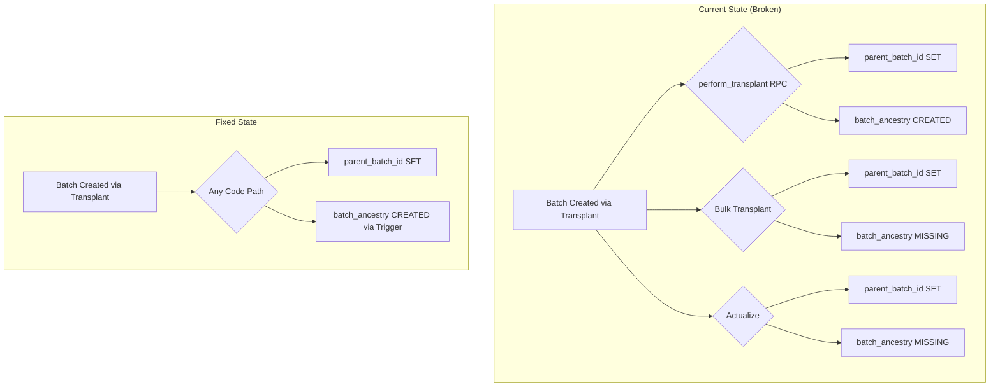

# Implementation Plan: Batch Ancestry Data Fix

**Status**: Ready
**Created**: 2026-02-03
**Author**: Jimmy (via ultrathink-debugger investigation)
**Complexity**: M (Medium)
**Estimated Sessions**: 1-2

---

## Pre-Flight Check
- Existing PLAN.md: Yes (Dispatch Module Type Safety) - keeping separate
- ROADMAP.md alignment: Production data integrity
- Related plans: None
- Backlog cross-ref: None

---

## 1. Overview

### Problem Statement
Users report they cannot see mother batch information for many of their batches. Investigation revealed:

**Root Causes Identified**:

1. **Two inconsistent mechanisms for tracking parent batches**:
   - `batches.parent_batch_id` column (direct foreign key, added Dec 4, 2025)
   - `batch_ancestry` table (many-to-many with proportions)
   - Only 10 of 56 batches have `parent_batch_id` set
   - Only 16 ancestry records exist covering 15 child batches

2. **Historical data gap**:
   - Batches created before Dec 4, 2025 have TRANSPLANT_IN events but neither `parent_batch_id` nor `batch_ancestry` records populated
   - The migration added the column but didn't backfill existing relationships

3. **Multiple code paths creating batches inconsistently**:
   - `perform_transplant` RPC: Correctly sets BOTH fields
   - Bulk transplant/actualization: May only set `parent_batch_id` without ancestry record
   - Direct batch creation: Doesn't set parent relationships at all

4. **Ancestry display logic works correctly** but has nothing to show:
   - API at `/api/production/batches/[id]/ancestry/route.ts` tries batch_ancestry first, then falls back to `parent_batch_id`
   - Both are empty for most batches

### Evidence from Database

```
Total batches:                    56
Batches with parent_batch_id:     10 (17.8%)
Batches in batch_ancestry:        15 children, 16 records
Batches with TRANSPLANT_IN event: 11+ (have from_batch_id in payload)
```

Key finding: Many batches have TRANSPLANT_IN events with `from_batch_id` in payload, but neither `parent_batch_id` nor `batch_ancestry` records.

### Proposed Solution

1. **Backfill historical data** from batch_events
2. **Ensure consistency** between `parent_batch_id` and `batch_ancestry`
3. **Update code paths** to always create both records
4. **Add database trigger** to auto-maintain consistency

---

## 2. Requirements

### Functional Requirements
| ID | Requirement | Priority | Size |
|----|-------------|----------|------|
| FR-1 | Backfill `parent_batch_id` from TRANSPLANT_IN events | P0 | M |
| FR-2 | Backfill `batch_ancestry` records from TRANSPLANT_IN events | P0 | M |
| FR-3 | Sync existing `parent_batch_id` to `batch_ancestry` where missing | P0 | S |
| FR-4 | Create database trigger to maintain consistency on INSERT | P1 | M |
| FR-5 | Update bulk transplant code to create ancestry records | P1 | S |

### Non-Functional Requirements
| ID | Requirement | Target |
|----|-------------|--------|
| NFR-1 | Zero data loss | All existing relationships preserved |
| NFR-2 | Idempotent migration | Can run multiple times safely |
| NFR-3 | Ancestry UI shows correct data | All transplanted batches show parents |

### Assumptions
- TRANSPLANT_IN events contain accurate `from_batch_id` in payload
- The `from_batch_id` in events is always a valid batch UUID
- Historical data is recoverable from events

---

## 3. Technical Design

### Architecture Overview



### Database Changes

**Assessment**: Yes - data backfill migration + trigger
**data-engineer Required**: Yes

### Migration Strategy

```sql
-- Step 1: Backfill parent_batch_id from TRANSPLANT_IN events
UPDATE batches b
SET parent_batch_id = (e.payload->>'from_batch_id')::uuid
FROM batch_events e
WHERE e.batch_id = b.id
  AND e.type = 'TRANSPLANT_IN'
  AND b.parent_batch_id IS NULL
  AND e.payload->>'from_batch_id' IS NOT NULL;

-- Step 2: Sync batch_ancestry from parent_batch_id where missing
INSERT INTO batch_ancestry (org_id, parent_batch_id, child_batch_id, proportion)
SELECT
  b.org_id,
  b.parent_batch_id,
  b.id,
  1.0  -- Default proportion for single-parent relationships
FROM batches b
WHERE b.parent_batch_id IS NOT NULL
  AND NOT EXISTS (
    SELECT 1 FROM batch_ancestry ba
    WHERE ba.child_batch_id = b.id
  )
ON CONFLICT DO NOTHING;

-- Step 3: Create trigger to auto-sync on INSERT/UPDATE
CREATE OR REPLACE FUNCTION sync_batch_ancestry()
RETURNS TRIGGER AS $$
BEGIN
  -- Only proceed if parent_batch_id is being set/changed
  IF NEW.parent_batch_id IS NOT NULL AND
     (OLD IS NULL OR OLD.parent_batch_id IS DISTINCT FROM NEW.parent_batch_id) THEN

    -- Insert ancestry record if not exists
    INSERT INTO batch_ancestry (org_id, parent_batch_id, child_batch_id, proportion)
    VALUES (NEW.org_id, NEW.parent_batch_id, NEW.id, 1.0)
    ON CONFLICT (parent_batch_id, child_batch_id) DO NOTHING;
  END IF;

  RETURN NEW;
END;
$$ LANGUAGE plpgsql;

CREATE TRIGGER trg_sync_batch_ancestry
AFTER INSERT OR UPDATE OF parent_batch_id ON batches
FOR EACH ROW
EXECUTE FUNCTION sync_batch_ancestry();
```

---

## 4. Implementation Plan

### Phase 1: Data Analysis & Backup (P0)

| # | Task | Agent | Size | Acceptance Criteria |
|---|------|-------|------|---------------------|
| 1.1 | Query and document all affected batches | `data-engineer` | S | List of batch IDs with missing ancestry |
| 1.2 | Verify TRANSPLANT_IN event payloads contain valid from_batch_id | `data-engineer` | S | Confirmation that events can be used for backfill |

**Phase 1 Complete When**:
- [ ] All affected batches documented
- [ ] Event payload format confirmed

---

### Phase 2: Database Migration (P0)

| # | Task | Agent | Size | Acceptance Criteria |
|---|------|-------|------|---------------------|
| 2.1 | Create migration to backfill parent_batch_id from events | `data-engineer` | M | All batches with TRANSPLANT_IN events have parent_batch_id set |
| 2.2 | Create migration to sync batch_ancestry from parent_batch_id | `data-engineer` | M | All batches with parent_batch_id have matching ancestry record |
| 2.3 | Create trigger to maintain consistency on future INSERTs | `data-engineer` | M | Trigger fires and creates ancestry records |
| 2.4 | Verify no duplicate ancestry records created | `data-engineer` | S | Count of ancestry records is appropriate |

**Phase 2 Complete When**:
- [ ] Migration applied successfully
- [ ] All batches with parent relationships have both fields populated
- [ ] Trigger is active and working
- [ ] RLS policies unchanged (already correct)

---

### Phase 3: Verification (P0)

| # | Task | Agent | Size | Acceptance Criteria |
|---|------|-------|------|---------------------|
| 3.1 | Test ancestry API returns correct data | `verifier` | S | `/api/production/batches/[id]/ancestry` returns parents for transplanted batches |
| 3.2 | Test UI displays mother batch correctly | `verifier` | S | AncestryCard and AncestryTab show parent batches |
| 3.3 | Test new transplant creates both records | `verifier` | M | Performing a transplant creates parent_batch_id AND batch_ancestry |
| 3.4 | Run security advisor check | `security-auditor` | S | RLS policies on batch_ancestry are correct |

**Phase 3 Complete When**:
- [ ] All ancestry displays show correct parent batches
- [ ] New transplants create proper records
- [ ] No security issues introduced

---

## 5. Risks & Mitigations

| Risk | Likelihood | Impact | Mitigation |
|------|------------|--------|------------|
| TRANSPLANT_IN event from_batch_id is invalid | Low | Medium | Validate UUIDs before UPDATE |
| Migration creates duplicate ancestry records | Low | Low | ON CONFLICT DO NOTHING in INSERT |
| Trigger causes performance issues | Low | Medium | Trigger is simple INSERT, only fires on parent_batch_id change |
| Multi-parent relationships broken | Medium | Medium | Keep batch_ancestry as source of truth for multi-parent; trigger handles single-parent default |

---

## 6. Definition of Done

Feature is complete when:
- [ ] All batches with TRANSPLANT_IN events have parent_batch_id set
- [ ] All batches with parent_batch_id have batch_ancestry records
- [ ] Ancestry UI shows correct parent batches
- [ ] New transplants automatically create both records
- [ ] No orphaned or duplicate records
- [ ] RLS policies verified working

---

## 7. Handoff Notes

### Jimmy Command String
```bash
jimmy execute PLAN-batch-ancestry-fix.md --mode standard
```

### For Jimmy (Routing)
- **Start with**: `data-engineer` for Phase 1 and 2
- **DB Work Required**: Yes - this is primarily a database fix
- **Recommended Mode**: standard (data migration requires care)
- **Critical Dependencies**: None
- **Estimated Sessions**: 1-2

### For data-engineer

**Key Context**:
- Two tables involved: `batches.parent_batch_id` and `batch_ancestry`
- Events table contains the ground truth in `payload->>'from_batch_id'`
- RLS policy on batch_ancestry already correct (checks both parent and child batch accessibility)

**Migration order matters**:
1. First: Backfill `parent_batch_id` from events
2. Then: Create `batch_ancestry` records from `parent_batch_id`
3. Finally: Create trigger for future consistency

**SQL to run for analysis**:
```sql
-- See batches needing backfill
SELECT b.id, b.batch_number, b.parent_batch_id,
       be.payload->>'from_batch_id' as event_parent_id
FROM batches b
JOIN batch_events be ON be.batch_id = b.id AND be.type = 'TRANSPLANT_IN'
WHERE b.parent_batch_id IS NULL;

-- See batches with parent_batch_id but no ancestry
SELECT b.id, b.batch_number, b.parent_batch_id
FROM batches b
WHERE b.parent_batch_id IS NOT NULL
  AND NOT EXISTS (
    SELECT 1 FROM batch_ancestry ba WHERE ba.child_batch_id = b.id
  );
```

### For verifier

**What to test**:
- Pick a batch that previously showed "No ancestry" - should now show parent
- Perform a new transplant - verify ancestry displays immediately
- Check that proportion shows correctly (default 100% for single-parent)

**Test batches to check** (known to have TRANSPLANT_IN events):
- `3-2548-00001` (from 1-2548-00009)
- `3-2549-00001` (from 1-2549-00001)
- `3-2549-00003` (from 3-2549-00001 - child of child)

---

## Appendix: Current Data State

### Batches with parent_batch_id but NO ancestry record

| Batch Number | Parent ID | Missing Ancestry |
|--------------|-----------|------------------|
| 3-2602-00001 | 1-2535-00001 | Yes |
| 3-2551-00009 | 1-2548-00008 | Yes |
| 3-2551-00008 | 1-2535-00001 | Yes |
| 3-2550-00004 | 1-2535-00001 | Yes |
| 1-2550-00001 | 1-2535-00001 | Yes |
| 3-2549-00008 | 1-2535-00001 | Yes |

### Batches with TRANSPLANT_IN event but NO parent_batch_id

| Batch Number | Event Parent ID | Event Parent Number |
|--------------|-----------------|---------------------|
| 3-2548-00001 | e5dd3dac-d62e-40f5-a79a-b41e4536c017 | 1-2548-00009 |
| 3-2548-00003 | e5dd3dac-d62e-40f5-a79a-b41e4536c017 | 1-2548-00009 |
| 3-2548-00004 | fdd3e8b7-d89d-4cab-89e0-ad08caf57737 | 1-2535-00002 |
| 3-2548-00005 | fdd3e8b7-d89d-4cab-89e0-ad08caf57737 | 1-2535-00002 |
| 3-2548-00006 | 1330e776-6c6a-400e-9544-4cf637695fcd | 1-2548-00010 |
| 3-2549-00001 | fed111e9-48b8-4a90-af89-928be7371185 | 1-2549-00001 |
| 3-2549-00002 | 6236a637-f9b1-4f14-9929-3bd1eddee2b7 | 1-2549-00002 |
| 3-2549-00003 | 9007c8e4-7fc7-47aa-b355-eaaa52ebcbae | 3-2549-00001 |
| 3-2549-00004 | 3dc20501-0797-4037-80b3-43859bdde5c6 | 1-2548-00008 |
| 3-2549-00005 | fc646eca-b276-4f26-9c4e-bdf9d6fcddba | 1-2549-00003 |

### Timeline of Issue

| Date | Event |
|------|-------|
| Nov 25, 2025 | Initial schema - no parent_batch_id column |
| Nov 29, 2025 | First transplants created (events recorded, no parent link) |
| Dec 4, 2025 | Migration added parent_batch_id column (no backfill) |
| Dec 4, 2025 - Dec 14, 2025 | perform_transplant updated to set both fields |
| Dec 14, 2025 | Bulk transplant paths may not set ancestry |
| Jan 2026 | Some batches created via actualization with parent_batch_id only |

---

*Plan created by Jimmy after ultrathink-debugger investigation. Execute with: `jimmy execute PLAN-batch-ancestry-fix.md`*
