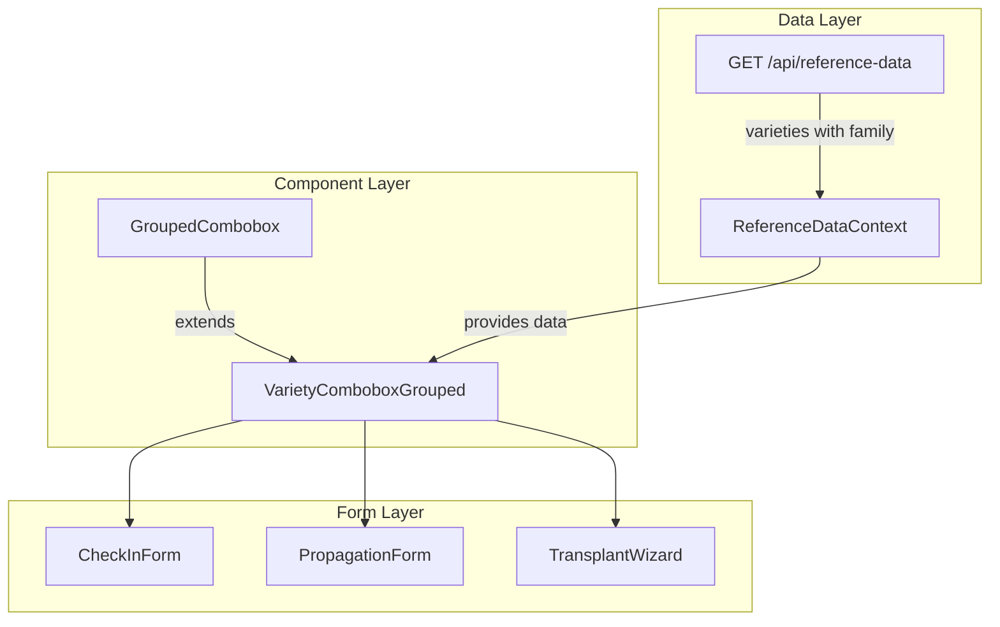
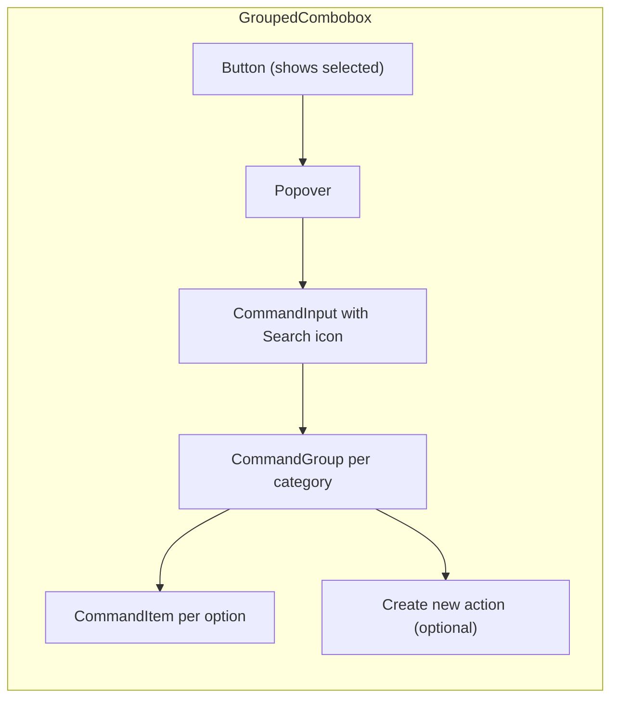
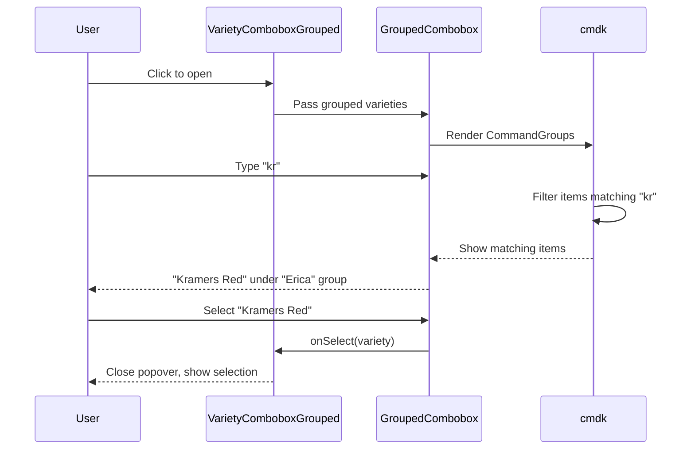

# Implementation Plan: Searchable Combobox with Grouping Support

**Status**: In Progress (Phases 1-3 Complete, Phase 4 Partial)
**Created**: 2026-02-03
**Author**: Planner
**Complexity**: M (Medium)
**Estimated Sessions**: 2-3

---

## Pre-Flight Check
- Existing PLAN.md: Found (dispatch module fix - unrelated)
- ROADMAP.md alignment: N/A (UX improvement)
- Related plans: None
- Backlog cross-ref: None

---

## 1. Overview

### Problem Statement
Users struggle to find items in dropdown menus, especially for varieties where there are 200+ options. The current UX issues:

1. **No search in most forms** - Many forms use basic `Select` components without type-ahead filtering
2. **No grouping** - Varieties should be grouped by family (e.g., "Heather", "Erica") to aid discovery
3. **Poor discoverability** - Users don't know they can type to search in components that do support it
4. **DOM query hack** - `VarietyCombobox` uses `document.querySelector("[cmdk-input]")` to get search text for create action
5. **Inconsistent patterns** - Multiple combobox implementations with different capabilities

**User Story**: "When I'm typing 'kr' I want to quickly find 'Kramers Red' without scrolling through 200 varieties. And ideally see it grouped under 'Erica' family."

### Proposed Solution
1. Create an enhanced `GroupedCombobox` component with family/category grouping
2. Create a specialized `VarietyComboboxGrouped` for variety selection with family grouping
3. Add visual search hint (search icon, placeholder text) to make search discoverable
4. Migrate high-impact forms from `SelectWithCreate` to the new grouped combobox
5. Fix the DOM query hack in `VarietyCombobox`

### Scope
**In Scope**:
- New `GroupedCombobox` base component
- New `VarietyComboboxGrouped` specialized component
- Migration of key variety selection forms
- Ensuring reference data includes family info (already present)

**Out of Scope**:
- Fuzzy search (cmdk already has basic filtering; fuzzy is P2)
- Migrating ALL Select usages (focus on high-impact variety selects)
- Server-side search/pagination (data is already loaded via ReferenceDataContext)
- Custom virtualization (cmdk handles lists well up to 500 items)

---

## 2. Requirements

### Functional Requirements
| ID | Requirement | Priority | Size |
|----|-------------|----------|------|
| FR-1 | Create GroupedCombobox component that renders items in collapsible groups | P0 | M |
| FR-2 | Create VarietyComboboxGrouped that groups varieties by family | P0 | M |
| FR-3 | Add visual search icon/hint so users know they can type to filter | P0 | S |
| FR-4 | Fix DOM query hack in VarietyCombobox create button | P1 | S |
| FR-5 | Migrate CheckInForm variety select to VarietyComboboxGrouped | P0 | S |
| FR-6 | Migrate PropagationForm variety select to VarietyComboboxGrouped | P0 | S |
| FR-7 | Migrate TransplantWizard variety select to VarietyComboboxGrouped | P1 | S |
| FR-8 | Add "Create new variety" action to grouped combobox | P1 | S |

### Non-Functional Requirements
| ID | Requirement | Target |
|----|-------------|--------|
| NFR-1 | Performance | < 100ms to filter 200 varieties |
| NFR-2 | Accessibility | Keyboard navigation preserved |
| NFR-3 | Mobile UX | Touch-friendly, adequate tap targets |

### Assumptions
- Variety data from `ReferenceDataContext` already includes `family` field (confirmed)
- cmdk library handles filtering efficiently for our data size (< 500 items)
- Users are familiar with combobox patterns from other modern apps

### Open Questions
- [x] Does variety data include family? **Yes - checked in reference data service**
- [ ] Should we collapse groups by default or show all expanded?

---

## 3. Technical Design

### Architecture Overview

The solution builds on existing components:
- `cmdk` library (already used via shadcn Command component)
- `CommandGroup` with `heading` prop for grouping (already available)
- `ReferenceDataContext` for variety data with family info

### System Diagram



### Component Design



### Database Changes
**Assessment**: None required
**data-engineer Required**: No

Variety data already includes `family` field:
```typescript
// From ReferenceData type
varieties: Array<{
  id: string;
  name: string;
  family: string | null;  // <-- Already available for grouping
  genus: string | null;
  species: string | null;
  category: string | null;
}>;
```

### API Changes
None required - data structure already supports grouping.

### Frontend Changes
| Component | Change | Size | Notes |
|-----------|--------|------|-------|
| `src/components/ui/grouped-combobox.tsx` | Add new | M | Generic grouped combobox |
| `src/components/ui/variety-combobox-grouped.tsx` | Add new | M | Variety-specific with family grouping |
| `src/components/ui/variety-combobox.tsx` | Fix DOM hack | S | Use controlled state for search |
| `src/components/batches/CheckInForm.tsx` | Update | S | Use VarietyComboboxGrouped |
| `src/components/worker/production/PropagationForm.tsx` | Update | S | Use VarietyComboboxGrouped |
| `src/components/worker/production/TransplantWizard.tsx` | Update | S | Use VarietyComboboxGrouped |

### Data Flow



---

## 4. Alternatives Considered

| Approach | Pros | Cons | Decision |
|----------|------|------|----------|
| **A: New GroupedCombobox component** | Clean separation, reusable, type-safe | New component to maintain | **Selected** |
| B: Enhance existing VarietyCombobox | Less code, single component | Already has issues, harder to extend | Rejected: Technical debt |
| C: Use react-select or similar library | Full-featured, battle-tested | Large bundle, different styling | Rejected: Bundle size, consistency |
| D: Virtual list with grouping | Handles 1000s of items | Overkill for our scale (<500 items) | Rejected: Over-engineering |

**Decision Rationale**: Creating a new `GroupedCombobox` allows us to:
1. Build on the solid cmdk foundation we already use
2. Keep the implementation simple and focused
3. Fix issues without breaking existing uses
4. Create a reusable pattern for other grouped selects (locations by site, products by category)

---

## 5. Implementation Plan

### Phase 1: Foundation Components (P0)

| # | Task | Agent | Size | Depends On | Acceptance Criteria |
|---|------|-------|------|------------|---------------------|
| 1.1 | Create `src/components/ui/grouped-combobox.tsx` | `feature-builder` | M | - | Component renders items grouped by category; search filters across all groups; keyboard navigation works |
| 1.2 | Create `src/components/ui/variety-combobox-grouped.tsx` | `feature-builder` | M | 1.1 | Groups varieties by family; shows "Unknown" group for null family; includes variety metadata in display |
| 1.3 | Add search icon visual hint to both comboboxes | `feature-builder` | S | 1.1, 1.2 | Search icon visible in input; placeholder says "Search varieties..." |

**Phase 1 Complete When**:
- [x] GroupedCombobox can render any grouped data
- [x] VarietyComboboxGrouped correctly groups varieties by family
- [x] Search filtering works within groups
- [x] Visual hint makes search obvious (search icon in input)
- [x] Keyboard navigation preserved (cmdk handles this)

---

### Phase 2: Form Migrations (P0)

| # | Task | Agent | Size | Depends On | Acceptance Criteria |
|---|------|-------|------|------------|---------------------|
| 2.1 | Migrate CheckInForm to use VarietyComboboxGrouped | `feature-builder` | S | Phase 1 | CheckInForm variety select shows grouped options; search works; selection works |
| 2.2 | Migrate PropagationForm to use VarietyComboboxGrouped | `feature-builder` | S | Phase 1 | PropagationForm variety select shows grouped options; mobile-friendly |
| 2.3 | Test migrations with manual testing | `verifier` | S | 2.1, 2.2 | Both forms work correctly end-to-end |

**Phase 2 Complete When**:
- [x] CheckInForm uses new component
- [x] PropagationForm uses new component
- [x] No regressions in form functionality
- [x] Selected variety ID correctly passed to form

---

### Phase 3: Enhancements & Cleanup (P1)

| # | Task | Agent | Size | Depends On | Acceptance Criteria |
|---|------|-------|------|------------|---------------------|
| 3.1 | Add "Create new variety" action to VarietyComboboxGrouped | `feature-builder` | S | Phase 1 | Create action appears at bottom; opens /varieties in new tab |
| 3.2 | Fix DOM query hack in original VarietyCombobox | `feature-builder` | S | - | Use controlled search state instead of DOM query |
| 3.3 | Migrate TransplantWizard variety select | `feature-builder` | S | Phase 1 | TransplantWizard uses grouped combobox |
| 3.4 | Update IncomingBatchDialog variety select | `feature-builder` | S | Phase 1 | Dialog uses grouped combobox |

**Phase 3 Complete When**:
- [x] Create action works in new component
- [x] Original VarietyCombobox has no DOM hacks
- [x] TransplantWizard migrated (skipped - no variety dropdown, uses ParentBatchSelector)
- [x] IncomingBatchDialog migrated

---

### Phase 4: Verification (P1)

| # | Task | Agent | Size | Depends On | Acceptance Criteria |
|---|------|-------|------|------------|---------------------|
| 4.1 | Run full test suite | `verifier` | S | Phase 3 | All tests pass |
| 4.2 | Manual testing of all migrated forms | `ui-comprehensive-tester` | M | Phase 3 | All variety selects work; grouping displays; search works |
| 4.3 | Code review | `reviewer` | S | 4.1, 4.2 | Code follows project conventions |

**Phase 4 Complete When**:
- [x] All tests pass (pre-existing failures in dispatch module unrelated to changes)
- [ ] Manual testing confirms functionality (PENDING)
- [ ] Code review approved (PENDING)

---

## 6. Detailed Implementation Guidance

### 6.1 GroupedCombobox Interface

```typescript
// src/components/ui/grouped-combobox.tsx

export interface GroupedOption<T = unknown> {
  value: string;
  label: string;
  group: string;
  data?: T;  // Original data for custom rendering
}

export interface GroupedComboboxProps<T = unknown> {
  options: GroupedOption<T>[];
  value?: string;
  onSelect: (option: GroupedOption<T>) => void;
  placeholder?: string;
  searchPlaceholder?: string;
  emptyMessage?: string;
  disabled?: boolean;
  /** Render custom content for each option */
  renderOption?: (option: GroupedOption<T>) => React.ReactNode;
  /** Render custom content for group headers */
  renderGroupHeader?: (group: string, count: number) => React.ReactNode;
  /** Action to show at bottom (e.g., "Create new") */
  createAction?: {
    label: string;
    onAction: (searchTerm: string) => void;
  };
  /** Sort groups by name (default: true) */
  sortGroups?: boolean;
  /** Group to show for items with null/undefined group */
  fallbackGroup?: string;
}
```

### 6.2 Grouping Logic

```typescript
// Group varieties by family
const groupedVarieties = useMemo(() => {
  const groups = new Map<string, VarietyOption[]>();

  for (const variety of varieties) {
    const group = variety.family || "Other";
    if (!groups.has(group)) {
      groups.set(group, []);
    }
    groups.get(group)!.push(variety);
  }

  // Sort groups alphabetically, but put "Other" last
  return Array.from(groups.entries())
    .sort(([a], [b]) => {
      if (a === "Other") return 1;
      if (b === "Other") return -1;
      return a.localeCompare(b);
    });
}, [varieties]);
```

### 6.3 Visual Search Hint

```tsx
<div className="flex items-center border-b px-3">
  <Search className="mr-2 h-4 w-4 shrink-0 opacity-50" />
  <CommandInput
    placeholder="Search varieties..."
    className="flex h-11 w-full rounded-md bg-transparent py-3 text-sm outline-none placeholder:text-muted-foreground"
  />
</div>
```

### 6.4 Form Migration Pattern

```tsx
// Before (SelectWithCreate)
<SelectWithCreate
  options={varieties.map((v) => ({
    value: v.id,
    label: v.name + (v.family ? ` - ${v.family}` : ""),
  }))}
  value={field.value}
  onValueChange={field.onChange}
  createHref="/varieties"
  placeholder="Select a variety"
/>

// After (VarietyComboboxGrouped)
<VarietyComboboxGrouped
  varieties={varieties}
  value={field.value}
  onSelect={(v) => field.onChange(v.id)}
  placeholder="Search varieties..."
  createHref="/varieties"
/>
```

---

## 7. Risks & Mitigations

| Risk | Likelihood | Impact | Mitigation |
|------|------------|--------|------------|
| Performance with many groups | Low | Medium | cmdk handles well; test with production data |
| Breaking form validation | Medium | High | Keep same value/onChange contract |
| Mobile touch issues | Low | Medium | Test on actual devices; preserve tap targets |
| Keyboard navigation breaks | Low | High | cmdk handles this; verify with testing |

---

## 8. Definition of Done

Feature is complete when:
- [ ] All P0 tasks complete
- [ ] All P1 tasks complete
- [ ] GroupedCombobox component exists and is generic
- [ ] VarietyComboboxGrouped groups by family
- [ ] CheckInForm uses new grouped combobox
- [ ] PropagationForm uses new grouped combobox
- [ ] Search is visually discoverable (search icon)
- [ ] Create action works
- [ ] No DOM query hacks
- [ ] All tests passing (`verifier`)
- [ ] Code reviewed (`reviewer`)

---

## 9. Handoff Notes

### Jimmy Command String
```bash
jimmy execute PLAN-searchable-combobox.md --mode standard
```

### For Jimmy (Routing)
- **Start with**: `feature-builder` for Phase 1 (foundation)
- **DB Work Required**: No
- **Recommended Mode**: standard
- **Critical Dependencies**: None
- **Estimated Sessions**: 2-3

### For feature-builder

**Key Context**:
- cmdk library is already available via shadcn `Command` components
- CommandGroup accepts a `heading` prop for group labels
- ReferenceDataContext provides varieties with family field
- Existing VarietyCombobox can serve as reference (but has issues to avoid)

**Files to reference**:
- `/Users/patrickdoran/Hortitrack/hortitrack/src/components/ui/command.tsx` - cmdk wrapper
- `/Users/patrickdoran/Hortitrack/hortitrack/src/components/ui/combobox.tsx` - Basic combobox pattern
- `/Users/patrickdoran/Hortitrack/hortitrack/src/components/ui/variety-combobox.tsx` - Current variety combobox (has DOM hack to fix)
- `/Users/patrickdoran/Hortitrack/hortitrack/src/lib/referenceData/service.ts` - Variety data structure
- `/Users/patrickdoran/Hortitrack/hortitrack/src/components/batches/CheckInForm.tsx` - Primary migration target

**Gotchas to avoid**:
- Don't use DOM queries for search state (the existing VarietyCombobox does this)
- Keep the value/onChange contract simple (just pass ID, not whole object)
- cmdk's filter is case-insensitive by default - good for UX
- Empty groups should be hidden, not shown
- "Other" or fallback group should appear last

### For verifier

**What to test**:
- Variety selection in CheckInForm
- Variety selection in PropagationForm
- Keyboard navigation (arrow keys, enter, escape)
- Search filtering works across groups
- Create action opens new tab

**Edge cases**:
- Varieties with no family (should appear in "Other" group)
- Searching for variety that matches multiple in different families
- Opening combobox when value is already selected
- Mobile tap behavior

### For ui-comprehensive-tester

**Test scenarios**:
1. Open CheckInForm, search for "Kramers", verify grouped display
2. Open PropagationForm on mobile, test touch selection
3. Verify keyboard-only navigation works
4. Test create action opens correct URL
5. Verify selected value displays correctly when reopening

---

## Appendix: Component Inventory

### Files to Create
| File | Purpose |
|------|---------|
| `src/components/ui/grouped-combobox.tsx` | Generic grouped combobox component |
| `src/components/ui/variety-combobox-grouped.tsx` | Variety-specific grouped combobox |

### Files to Modify
| File | Change |
|------|--------|
| `src/components/batches/CheckInForm.tsx` | Use VarietyComboboxGrouped |
| `src/components/worker/production/PropagationForm.tsx` | Use VarietyComboboxGrouped |
| `src/components/worker/production/TransplantWizard.tsx` | Use VarietyComboboxGrouped |
| `src/app/production/planning/components/IncomingBatchDialog.tsx` | Use VarietyComboboxGrouped |
| `src/components/ui/variety-combobox.tsx` | Fix DOM query hack |

### Forms Using SelectWithCreate for Varieties (Migration Candidates)

| Form | File | Priority |
|------|------|----------|
| CheckInForm | `src/components/batches/CheckInForm.tsx` | P0 |
| PropagationForm (worker) | `src/components/worker/production/PropagationForm.tsx` | P0 |
| TransplantWizard | `src/components/worker/production/TransplantWizard.tsx` | P1 |
| IncomingBatchDialog | `src/app/production/planning/components/IncomingBatchDialog.tsx` | P1 |
| ActualizeBatchDialog | `src/components/batches/ActualizeBatchDialog.tsx` | P2 |
| EditBatchForm | `src/components/batches/EditBatchForm.tsx` | P2 |

---

*Plan created by Planner. Execute with: `jimmy execute PLAN-searchable-combobox.md`*
