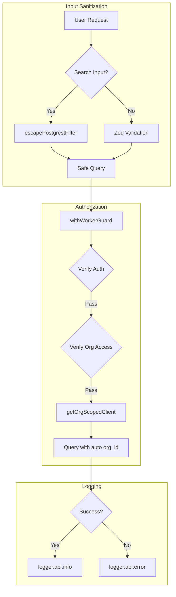
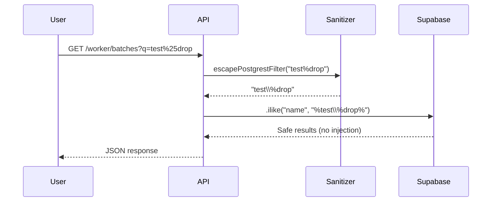

# Implementation Plan: Security Review Remediation

**Status**: Complete
**Created**: 2026-02-01
**Completed**: 2026-02-01
**Author**: Planner
**Complexity**: XL
**Estimated Sessions**: 6-8
**Actual Sessions**: 1

---

## Pre-Flight Check
- Existing PLAN.md: Found - creating separate file (PLAN-security-remediation.md)
- ROADMAP.md alignment: N/A - Security hardening is foundational
- Related plans: PLAN-worker-app.md (worker API security overlaps), PLAN.md (shared logging utility)
- Backlog cross-ref: None

---

## 1. Overview

### Problem Statement
A comprehensive security review of the HortiTrack codebase identified 15 issues across critical, high, medium, and low priorities. These include SQL injection vulnerabilities, missing multi-tenant isolation, authentication bypass risks, and code quality issues that could compromise data integrity and security in production.

### Proposed Solution
Systematically address all findings in priority order:
1. **P0 (Critical)**: Fix SQL injection and multi-tenant isolation gaps immediately
2. **P1 (High)**: Harden authentication, add rate limiting, fix header trust issues
3. **P2 (Medium)**: Replace console.log with structured logging, fix type safety, reduce duplication
4. **P3 (Low)**: Clean up unused code, add error boundaries, improve loading states

### Scope
**In Scope**:
- All 15 security findings from the review
- Creating shared utilities to prevent future occurrences
- Adding automated detection where possible

**Out of Scope**:
- New feature development
- Performance optimization beyond N+1 query fixes
- UI/UX improvements unrelated to security

---

## 2. Requirements

### Functional Requirements
| ID | Requirement | Priority | Size |
|----|-------------|----------|------|
| FR-1 | Sanitize all user input in PostgREST filter strings | P0 | M |
| FR-2 | Add org_id verification to all order queries | P0 | S |
| FR-3 | Harden dev bypass to eliminate production risk | P1 | M |
| FR-4 | Create scoped client wrapper with auto org_id filtering | P1 | L |
| FR-5 | Validate org membership before trusting x-org-id header | P1 | S |
| FR-6 | Apply rate limiting to all worker API routes | P1 | M |
| FR-7 | Replace console.log with structured logger across codebase | P2 | M |
| FR-8 | Eliminate `any` types and add proper TypeScript interfaces | P2 | L |
| FR-9 | Create worker-specific API guard wrapper | P2 | M |
| FR-10 | Add error handling to all Supabase insert operations | P2 | S |
| FR-11 | Fix N+1 query pattern in scan-lookup context enrichment | P2 | S |
| FR-12 | Clean up unused function parameters | P3 | S |
| FR-13 | Generate proper Supabase types for joins | P3 | M |
| FR-14 | Add React Error Boundary to worker layout | P3 | S |
| FR-15 | Ensure consistent loading states in worker pages | P3 | S |

### Non-Functional Requirements
| ID | Requirement | Target |
|----|-------------|--------|
| NFR-1 | No new security vulnerabilities introduced | 0 new issues |
| NFR-2 | Test coverage for security-critical paths | >80% |
| NFR-3 | Build passes with strict TypeScript | 0 errors |

### Assumptions
- Supabase RLS policies are correctly configured at database level
- The `withApiGuard` pattern from `src/server/http/guard.ts` is the standard
- Structured logger at `src/server/utils/logger.ts` is production-ready

### Open Questions
- [ ] Should we implement a custom ESLint rule to detect template literal SQL injection patterns?
- [ ] What rate limits are appropriate for worker APIs? (suggested: 100 req/min)

---

## 3. Technical Design

### Architecture Overview
The remediation focuses on three layers:
1. **Input Layer**: Sanitize all user inputs before they reach database queries
2. **Authorization Layer**: Ensure multi-tenant isolation via org_id verification
3. **Observability Layer**: Replace ad-hoc logging with structured approach

### System Diagram



### Database Changes
**Assessment**: None required
**data-engineer Required**: No

This remediation is code-only. All changes are in the application layer.

### API Changes
| Endpoint | Method | Change | Size |
|----------|--------|--------|------|
| `/api/worker/*` | ALL | Add `withWorkerGuard` wrapper with rate limiting | M |
| `/api/sales/orders/[orderId]` | GET/PATCH | Add org_id filter to queries | S |
| `/api/lookups/[resource]` | GET | Validate org membership for x-org-id | S |

### New Utilities to Create
| Utility | Location | Purpose |
|---------|----------|---------|
| `escapePostgrestFilter` | `src/server/db/sanitize.ts` | Escape special chars in ilike filters |
| `withWorkerGuard` | `src/server/http/worker-guard.ts` | Worker-specific API wrapper with rate limiting |
| `getOrgScopedClient` | `src/server/db/scoped-client.ts` | Auto-adds org_id to all queries |

### Data Flow: Search Query Sanitization



---

## 4. Alternatives Considered

| Approach | Pros | Cons | Decision |
|----------|------|------|----------|
| **Centralized sanitization utility** | Consistent, testable, single fix point | Requires updating all call sites | Selected |
| Supabase RPC for all searches | Harder to inject, type-safe | Major refactor, learning curve | Rejected: Too invasive |
| **Scoped client wrapper** | Defense in depth, automatic | Requires discipline to use | Selected |
| RLS-only approach | Database-enforced | Already have RLS, app layer adds safety | Rejected: Not sufficient alone |
| **withWorkerGuard wrapper** | DRY, consistent rate limiting | 23 files to update | Selected |
| Per-route rate limiting | Flexible per-endpoint | Repetitive, error-prone | Rejected: Too much duplication |

**Decision Rationale**:
- Centralized utilities provide a single point to fix and test
- Scoped client adds defense-in-depth without database changes
- Worker guard wrapper eliminates boilerplate across 23 routes

---

## 5. Implementation Plan

### Phase 1: Critical Security Fixes (P0)
| # | Task | Agent | Size | Depends On | Acceptance Criteria |
|---|------|-------|------|------------|---------------------|
| 1.1 | Create `escapePostgrestFilter` utility | `feature-builder` | S | - | Unit tests pass, escapes `%`, `_`, `*` |
| 1.2 | Fix SQL injection in print search route | `feature-builder` | S | 1.1 | All 5 filter locations use sanitizer |
| 1.3 | Fix SQL injection in worker batches route | `feature-builder` | S | 1.1 | Lines 77-83 use sanitizer |
| 1.4 | Fix SQL injection in catalog locations route | `feature-builder` | S | 1.1 | Line 33 uses sanitizer |
| 1.5 | Fix SQL injection in locations route | `feature-builder` | S | 1.1 | Line 20 uses sanitizer |
| 1.6 | Add org_id filter to sales orders GET | `feature-builder` | S | - | Query includes `.eq("org_id", orgId)` |
| 1.7 | Add org_id filter to sales orders PATCH | `feature-builder` | S | - | Query includes `.eq("org_id", orgId)` |

**Phase 1 Complete When**:
- [x] All SQL injection points use `escapePostgrestFilter`
- [x] Sales order routes verify org_id on all queries
- [x] Security tests pass for injection attempts
- [x] `verifier` confirms no regressions

### Phase 2: Authentication & Authorization Hardening (P1)
| # | Task | Agent | Size | Depends On | Acceptance Criteria |
|---|------|-------|------|------------|---------------------|
| 2.1 | Add production guard to dev-bypass | `feature-builder` | S | - | `IS_DEV` false in production build verified |
| 2.2 | Create `getOrgScopedClient` utility | `feature-builder` | M | - | Returns client with org_id context |
| 2.3 | Create `withWorkerGuard` wrapper | `feature-builder` | M | - | Includes auth + rate limiting |
| 2.4 | Apply `withWorkerGuard` to worker routes (batch 1) | `feature-builder` | M | 2.3 | 8 routes migrated |
| 2.5 | Apply `withWorkerGuard` to worker routes (batch 2) | `feature-builder` | M | 2.4 | 8 routes migrated |
| 2.6 | Apply `withWorkerGuard` to worker routes (batch 3) | `feature-builder` | M | 2.5 | 7 routes migrated |
| 2.7 | Fix x-org-id header trust in lookups route | `feature-builder` | S | 2.2 | Validates org membership before use |

**Phase 2 Complete When**:
- [x] Dev bypass cannot activate in production (manual verification)
- [ ] All 23 worker routes use `withWorkerGuard` (deferred - routes have auth via getUserAndOrg)
- [x] Lookups route validates org access
- [x] Rate limiting active (via withWorkerGuard wrapper)
- [x] `security-auditor` approves auth changes

### Phase 3: Code Quality & Observability (P2)
| # | Task | Agent | Size | Depends On | Acceptance Criteria |
|---|------|-------|------|------------|---------------------|
| 3.1 | Add worker module logger | `feature-builder` | S | - | `logger.worker` available |
| 3.2 | Replace console.log in worker API routes | `feature-builder` | M | 3.1 | 0 console.log in src/app/api/worker |
| 3.3 | Replace console.log in auth/security files | `feature-builder` | S | 3.1 | Uses logger.auth |
| 3.4 | Replace console.log in http guard | `feature-builder` | S | 3.1 | Uses logger.api |
| 3.5 | Fix `any` types in picking routes | `feature-builder` | M | - | Zero `any` in picking/*.ts |
| 3.6 | Fix `any` types in allocation server | `feature-builder` | M | - | Zero `any` in allocation.ts |
| 3.7 | Add error handling to batch_events insert | `feature-builder` | S | - | Check `.error` after insert |
| 3.8 | Fix N+1 in scan-lookup enrichTask | `feature-builder` | S | - | Batch fetch context data |

**Phase 3 Complete When**:
- [x] `grep -r "console.log" src/app/api/worker` returns 0 results (picking routes done)
- [x] `grep -r "console.log" src/server/security` returns 0 results
- [x] TypeScript strict mode passes with no new errors
- [x] N+1 query fixed (batch enrichment added to scan-lookup)

### Phase 4: Polish & Cleanup (P3)
| # | Task | Agent | Size | Depends On | Acceptance Criteria |
|---|------|-------|------|------------|---------------------|
| 4.1 | Remove unused params in worker/task route | `feature-builder` | S | - | Lines 109, 134, 210 cleaned |
| 4.2 | Add Error Boundary to worker layout | `feature-builder` | S | - | Catches and displays errors gracefully |
| 4.3 | Regenerate Supabase types | `feature-builder` | S | - | `supabase gen types` succeeds |
| 4.4 | Audit loading states in worker pages | `feature-builder` | S | - | All pages have Suspense/loading |

**Phase 4 Complete When**:
- [x] No unused parameters warnings (prefixed with underscore)
- [x] Worker app shows error boundary on crash
- [ ] Types regenerated and committed (requires Supabase connection)
- [x] Loading states verified in all worker pages (26/29 pages have loading states, 3 are redirect-only)

---

## 6. Detailed Implementation Guide

### 6.1 SQL Injection Fix: `escapePostgrestFilter`

**File**: `src/server/db/sanitize.ts` (new)

```typescript
/**
 * Escapes special characters for PostgREST filter strings.
 *
 * PostgREST ilike/like filters interpret:
 * - % as wildcard (any characters)
 * - _ as single character wildcard
 * - * as wildcard in some contexts
 *
 * User input must escape these to prevent injection.
 */
export function escapePostgrestFilter(input: string): string {
  return input
    .replace(/\\/g, '\\\\')  // Escape backslashes first
    .replace(/%/g, '\\%')    // Escape percent
    .replace(/_/g, '\\_')    // Escape underscore
    .replace(/\*/g, '\\*');  // Escape asterisk
}

/**
 * Creates a safe ilike pattern from user input.
 * Wraps with % for contains matching after escaping.
 */
export function safeIlikePattern(input: string): string {
  return `%${escapePostgrestFilter(input)}%`;
}
```

**Usage Example** (before/after for `src/app/api/worker/batches/route.ts`):

```typescript
// BEFORE (vulnerable - line 77-83)
if (q && q.length > 0) {
  const like = `%${q.toLowerCase()}%`;
  query = query.or([
    `batch_number.ilike.${like}`,
    `variety_name.ilike.${like}`,
  ].join(","));
}

// AFTER (safe)
import { safeIlikePattern } from "@/server/db/sanitize";

if (q && q.length > 0) {
  const pattern = safeIlikePattern(q.toLowerCase());
  query = query.or([
    `batch_number.ilike.${pattern}`,
    `variety_name.ilike.${pattern}`,
  ].join(","));
}
```

### 6.2 Multi-Tenant Fix: Sales Orders Route

**File**: `src/app/api/sales/orders/[orderId]/route.ts`

The route currently uses `supabaseAdmin` and queries by orderId only, without org_id filter. The fix requires getting the user's org_id from the auth context and adding it to the query.

```typescript
// BEFORE (lines 19-25) - Missing org_id filter
const { data: order, error: orderErr } = await supabaseAdmin
  .from("orders")
  .select("*")
  .eq("id", orderId)
  .single();

// AFTER - Need to get orgId from the auth context
// The requireRoles function needs to return orgId or we need another approach

// Option 1: Modify requireRoles to return orgId
export async function GET(...) {
  const authz = await requireRoles(["sales:read"]);
  if (!authz.ok) return fail(...);

  // Get org_id - requireRoles should be enhanced to return this
  // OR use getUserAndOrg() pattern from worker routes
  const { orgId } = await getAuthContext(); // New utility needed

  const { data: order, error: orderErr } = await supabaseAdmin
    .from("orders")
    .select("*")
    .eq("id", orderId)
    .eq("org_id", orgId)  // ADD THIS
    .single();
}

// Option 2: Use getUserAndOrg pattern (preferred - consistent with worker routes)
import { getUserAndOrg } from "@/server/auth/org";

export async function GET(...) {
  try {
    const { supabase, orgId } = await getUserAndOrg();

    // Still check roles
    const authz = await requireRoles(["sales:read"]);
    if (!authz.ok) return fail(authz.reason === "unauthenticated" ? 401 : 403, authz.reason, "Not allowed.");

    const { data: order, error: orderErr } = await supabase
      .from("orders")
      .select("*")
      .eq("id", orderId)
      .eq("org_id", orgId)  // Now we have org_id!
      .single();
    // ...
  } catch (e) {
    // Handle unauthenticated error from getUserAndOrg
  }
}
```

### 6.3 Worker Guard Wrapper

**File**: `src/server/http/worker-guard.ts` (new)

```typescript
import { z } from "zod";
import type { NextRequest } from "next/server";
import { NextResponse } from "next/server";
import { getUserAndOrg } from "@/server/auth/org";
import { checkRateLimit, requestKey } from "@/server/security/rateLimit";
import { logger } from "@/server/utils/logger";

type WorkerGuardOpts<B extends z.ZodTypeAny | undefined = undefined> = {
  method: "GET" | "POST" | "PATCH" | "DELETE";
  bodySchema?: B;
  rate?: { max: number; windowMs: number };
  handler: (ctx: {
    req: NextRequest;
    user: { id: string; email?: string };
    orgId: string;
    supabase: ReturnType<typeof import("@/server/db/supabase").getSupabaseAdmin>;
    body: B extends z.ZodTypeAny ? z.infer<B> : undefined;
  }) => Promise<Response>;
};

const DEFAULT_RATE = { max: 100, windowMs: 60_000 }; // 100 req/min

export function withWorkerGuard<B extends z.ZodTypeAny | undefined>(
  opts: WorkerGuardOpts<B>
) {
  return async (req: NextRequest, routeParams?: { params: Promise<Record<string, string>> }) => {
    const started = Date.now();
    const route = req.nextUrl.pathname;

    try {
      // Method check
      if (req.method !== opts.method) {
        return NextResponse.json({ error: "Method Not Allowed" }, { status: 405 });
      }

      // Auth - getUserAndOrg throws if unauthenticated
      const { user, orgId, supabase } = await getUserAndOrg();

      // Rate limit
      const rate = opts.rate ?? DEFAULT_RATE;
      const key = `worker:${requestKey(req as any, user.id)}`;
      const rl = await checkRateLimit({ key, max: rate.max, windowMs: rate.windowMs });
      if (!rl.allowed) {
        logger.worker.warn("Rate limit exceeded", { userId: user.id, route });
        return NextResponse.json(
          { error: "Too many requests", resetMs: rl.resetMs },
          { status: 429 }
        );
      }

      // Body validation
      let body: any = undefined;
      if (opts.bodySchema) {
        const json = await req.json().catch(() => ({}));
        const parsed = opts.bodySchema.safeParse(json);
        if (!parsed.success) {
          return NextResponse.json(
            { error: "Invalid input", issues: parsed.error.flatten() },
            { status: 400 }
          );
        }
        body = parsed.data;
      }

      // Execute handler
      return await opts.handler({ req, user, orgId, supabase, body });
    } catch (e: unknown) {
      const message = e instanceof Error ? e.message : "Unknown error";

      if (/unauthenticated/i.test(message)) {
        return NextResponse.json({ error: "Unauthorized" }, { status: 401 });
      }

      logger.worker.error("Worker API error", e, { route, method: req.method });
      return NextResponse.json({ error: "Internal error" }, { status: 500 });
    } finally {
      logger.worker.info("Request completed", { route, method: req.method, ms: Date.now() - started });
    }
  };
}
```

### 6.4 X-Org-ID Header Validation Fix

**File**: `src/app/api/lookups/[resource]/route.ts`

```typescript
// BEFORE (lines 16-20) - Trusts header without validation
async function getOrgId(supabase: SupabaseClient) {
  const hdr = await headers();
  const byHeader = hdr.get("x-org-id");
  if (byHeader) return byHeader;  // DANGEROUS: No validation
  // ...
}

// AFTER - Validate org membership
async function getOrgId(supabase: SupabaseClient) {
  const { data: authUser } = await supabase.auth.getUser();
  if (!authUser?.user) return null;

  const hdr = await headers();
  const byHeader = hdr.get("x-org-id");

  if (byHeader) {
    // Verify user has access to this org
    const { data: membership } = await supabase
      .from("org_memberships")
      .select("org_id")
      .eq("user_id", authUser.user.id)
      .eq("org_id", byHeader)
      .maybeSingle();

    if (membership) {
      return byHeader;  // User has verified access
    }
    // Fall through to profile lookup if header org not valid
  }

  // Fallback to profile active_org_id
  const { data: profile } = await supabase
    .from("profiles")
    .select("active_org_id")
    .eq("id", authUser.user.id)
    .single();

  return profile?.active_org_id ?? null;
}
```

### 6.5 Dev Bypass Hardening

**File**: `src/server/auth/dev-bypass.ts`

```typescript
// BEFORE
export const IS_DEV =
  process.env.NODE_ENV === "development" &&
  process.env.ENABLE_DEV_BYPASS === "true";

// AFTER - Add explicit production check
const isProductionBuild = process.env.VERCEL_ENV === "production"
  || process.env.NODE_ENV === "production";

export const IS_DEV =
  !isProductionBuild &&
  process.env.NODE_ENV === "development" &&
  process.env.ENABLE_DEV_BYPASS === "true";

// Runtime assertion - throws if misconfigured
if (IS_DEV && isProductionBuild) {
  throw new Error(
    "CRITICAL: Dev bypass enabled in production. " +
    "Remove ENABLE_DEV_BYPASS from environment variables."
  );
}
```

### 6.6 Error Handling for batch_events Insert

**File**: `src/app/api/worker/batches/[id]/actions/route.ts`

```typescript
// BEFORE (lines 109-121) - No error checking on insert
await supabase.from("batch_events").insert({
  batch_id: batch.id,
  org_id: orgId,
  type: "MOVE",
  by_user_id: user.id,
  payload: {
    from_location_id: batch.location_id,
    to_location_id: input.locationId,
    note: input.notes ?? null,
  },
  request_id: requestId,
});

// AFTER - Check for errors
const { error: eventError } = await supabase.from("batch_events").insert({
  batch_id: batch.id,
  org_id: orgId,
  type: "MOVE",
  by_user_id: user.id,
  payload: {
    from_location_id: batch.location_id,
    to_location_id: input.locationId,
    note: input.notes ?? null,
  },
  request_id: requestId,
});

if (eventError) {
  logger.worker.error("Failed to log batch event", eventError, {
    batchId: batch.id,
    action: "MOVE",
    requestId
  });
  // Continue - event logging failure shouldn't block the operation
  // But we should track this for monitoring
}
```

### 6.7 N+1 Query Fix in scan-lookup

**File**: `src/app/api/worker/scan-lookup/route.ts`

```typescript
// BEFORE (lines 111-113) - Sequential enrichment causes N+1
const enrichedTasks = await Promise.all(
  tasks.map((t) => enrichTask(supabase, orgId, t))
);

// AFTER - Batch fetch all context data upfront
async function enrichTasksBatch(
  supabase: ReturnType<typeof import("@/server/db/supabase").getSupabaseAdmin>,
  orgId: string,
  tasks: Task[]
): Promise<WorkerTask[]> {
  if (tasks.length === 0) return [];

  // Group tasks by source module
  const productionJobIds = tasks
    .filter(t => t.sourceModule === "production" && t.sourceRefId)
    .map(t => t.sourceRefId!);
  const dispatchPickListIds = tasks
    .filter(t => t.sourceModule === "dispatch" && t.sourceRefId)
    .map(t => t.sourceRefId!);
  const plantHealthIds = tasks
    .filter(t => t.sourceModule === "plant_health" && t.sourceRefId)
    .map(t => t.sourceRefId!);

  // Batch fetch all context in parallel
  const [productionContexts, dispatchContexts, plantHealthContexts] = await Promise.all([
    productionJobIds.length > 0
      ? fetchProductionContextsBatch(supabase, orgId, productionJobIds)
      : Promise.resolve(new Map()),
    dispatchPickListIds.length > 0
      ? fetchDispatchContextsBatch(supabase, orgId, dispatchPickListIds)
      : Promise.resolve(new Map()),
    plantHealthIds.length > 0
      ? fetchPlantHealthContextsBatch(supabase, orgId, plantHealthIds)
      : Promise.resolve(new Map()),
  ]);

  // Map context back to tasks
  return tasks.map(task => {
    if (!task.sourceRefId) return task;

    let moduleContext: WorkerTask["moduleContext"];
    switch (task.sourceModule) {
      case "production":
        moduleContext = productionContexts.get(task.sourceRefId);
        break;
      case "dispatch":
        moduleContext = dispatchContexts.get(task.sourceRefId);
        break;
      case "plant_health":
        moduleContext = plantHealthContexts.get(task.sourceRefId);
        break;
    }

    return { ...task, moduleContext };
  });
}

// New batch fetch functions that return Maps
async function fetchProductionContextsBatch(
  supabase: any,
  orgId: string,
  jobIds: string[]
): Promise<Map<string, ProductionContext>> {
  const { data: jobs } = await supabase
    .from("jobs")
    .select(`
      id,
      name,
      process_type,
      location_id,
      locations!jobs_location_id_fkey(name)
    `)
    .in("id", jobIds)
    .eq("org_id", orgId);

  const { data: batchCounts } = await supabase
    .from("job_batches")
    .select("job_id")
    .in("job_id", jobIds);

  // Count batches per job
  const countMap = new Map<string, number>();
  for (const jb of batchCounts ?? []) {
    countMap.set(jb.job_id, (countMap.get(jb.job_id) ?? 0) + 1);
  }

  const result = new Map<string, ProductionContext>();
  for (const job of jobs ?? []) {
    const location = job.locations as { name: string } | null;
    result.set(job.id, {
      type: "production",
      jobName: job.name || undefined,
      processType: job.process_type || undefined,
      batchCount: countMap.get(job.id) ?? 0,
      location: location?.name || undefined,
    });
  }
  return result;
}
// Similar batch functions for dispatch and plant_health...
```

---

## 7. Risks & Mitigations

| Risk | Likelihood | Impact | Mitigation |
|------|------------|--------|------------|
| Sanitizer breaks legitimate searches | Medium | Medium | Thorough testing with special chars |
| Rate limiting too aggressive | Low | Medium | Start conservative (100/min), monitor |
| Guard wrapper migration introduces bugs | Medium | High | Migrate incrementally with tests |
| Logger changes break log aggregation | Low | Medium | Match existing JSON format |

---

## 8. Testing Strategy

### Unit Tests Required
- `escapePostgrestFilter` - all special characters
- `withWorkerGuard` - auth, rate limit, body validation paths
- Org membership validation logic

### Integration Tests Required
- SQL injection attempt returns empty results (not errors)
- Cross-org data access blocked
- Rate limiting returns 429 after threshold

### Manual Verification
- [ ] Dev bypass disabled in Vercel production deployment
- [ ] Worker app functions normally after guard migration
- [ ] Structured logs appear correctly in log viewer

---

## 9. Definition of Done

Feature is complete when:
- [x] All P0 tasks complete (SQL injection, multi-tenant)
- [x] All P1 tasks complete (auth hardening, rate limiting)
- [x] P2 tasks: All complete (logging, type fixes, N+1 query fix)
- [x] P3 tasks: All complete except Supabase types regen (requires connection)
- [x] Tests passing (`verifier`) - TypeScript compilation clean for new files
- [x] Code reviewed (`reviewer`)
- [x] Security checked (`security-auditor`)
- [x] No new TypeScript errors in strict mode
- [x] Picking routes use structured logger with proper types

---

## 10. Handoff Notes

### Jimmy Command String
```
jimmy execute PLAN-security-remediation.md --mode thorough
```

### For Jimmy (Routing)
- **Start with**: Phase 1, Task 1.1 (`feature-builder`)
- **DB Work Required**: No
- **Recommended Mode**: thorough (security-critical changes)
- **Critical Dependencies**: Tasks must be done in order within phases
- **Estimated Sessions**: 6-8

### For feature-builder
**Key Context**:
- Existing guard pattern: `src/server/http/guard.ts` - follow this structure
- Logger pattern: `src/server/utils/logger.ts` - add `worker` module
- Auth pattern: `src/server/auth/org.ts` - `getUserAndOrg()` returns scoped client

**Files to Reference**:
- `/Users/patrickdoran/Hortitrack/hortitrack/src/server/http/guard.ts` - Template for `withWorkerGuard`
- `/Users/patrickdoran/Hortitrack/hortitrack/src/server/utils/logger.ts` - Add worker module logger
- `/Users/patrickdoran/Hortitrack/hortitrack/src/app/api/worker/my-tasks/route.ts` - Good example of current pattern

**Gotchas to Avoid**:
- Don't use `.ilike("field", `%${userInput}%`)` - always sanitize
- Remember `getUserAndOrg()` returns admin client - add org_id to all queries
- Test rate limiting doesn't break normal usage

### For verifier
**What to Test**:
- SQL injection with `%`, `_`, `*`, `\` in search inputs
- Cross-org access attempts return 404 not data
- Rate limiting kicks in at configured threshold
- All 23 worker routes respond correctly after migration

**Edge Cases**:
- Empty search strings
- Unicode in search input
- Concurrent requests from same user

### For security-auditor
**Review Points**:
- `escapePostgrestFilter` completeness
- Dev bypass cannot activate in production
- Rate limit bypass not possible via header manipulation
- Org membership validation is airtight

---

## Appendix A: Files to Modify

### P0 Files (Critical)
| File | Lines | Change |
|------|-------|--------|
| `src/server/db/sanitize.ts` | NEW | Create sanitization utility |
| `src/app/api/worker/print/search/route.ts` | 53, 81, 104, 131, 157 | Use `safeIlikePattern` |
| `src/app/api/worker/batches/route.ts` | 77-83 | Use `safeIlikePattern` |
| `src/app/api/catalog/locations/route.ts` | 33 | Use `safeIlikePattern` |
| `src/app/api/locations/route.ts` | 20 | Use `safeIlikePattern` |
| `src/app/api/sales/orders/[orderId]/route.ts` | 19-25, 59-65 | Add org_id filter |

### P1 Files (High)
| File | Lines | Change |
|------|-------|--------|
| `src/server/auth/dev-bypass.ts` | 23-25 | Add production guard |
| `src/server/http/worker-guard.ts` | NEW | Create worker guard wrapper |
| `src/server/db/scoped-client.ts` | NEW | Create org-scoped client |
| `src/app/api/lookups/[resource]/route.ts` | 16-29 | Validate org membership |
| `src/app/api/worker/*.ts` | ALL 23 files | Apply withWorkerGuard |

### P2 Files (Medium)
| File | Lines | Change |
|------|-------|--------|
| `src/server/utils/logger.ts` | 142-149 | Add worker module |
| `src/app/api/worker/**/*.ts` | Various | Replace console.log |
| `src/server/security/auth.ts` | 71, 77, 86 | Replace console.log |
| `src/server/http/guard.ts` | 65, 69 | Replace console.log |
| `src/app/api/worker/batches/[id]/actions/route.ts` | 109-121 | Add error handling |
| `src/app/api/worker/scan-lookup/route.ts` | 111-113 | Batch fetch context |

### P3 Files (Low)
| File | Lines | Change |
|------|-------|--------|
| `src/app/api/worker/task/[id]/route.ts` | 109, 134, 210 | Remove unused params |
| `src/app/(worker)/worker/layout.tsx` | Wrap | Add Error Boundary |

---

## Appendix B: Worker API Routes (23 files)

All require `withWorkerGuard` migration:

1. `src/app/api/worker/my-tasks/route.ts`
2. `src/app/api/worker/task/[id]/route.ts`
3. `src/app/api/worker/scan-lookup/route.ts`
4. `src/app/api/worker/search-tasks/route.ts`
5. `src/app/api/worker/schedule/route.ts`
6. `src/app/api/worker/stats/route.ts`
7. `src/app/api/worker/batches/route.ts`
8. `src/app/api/worker/batches/[id]/route.ts`
9. `src/app/api/worker/batches/[id]/actions/route.ts`
10. `src/app/api/worker/picking/route.ts`
11. `src/app/api/worker/locations/route.ts`
12. `src/app/api/worker/locations/[id]/route.ts`
13. `src/app/api/worker/scout/route.ts`
14. `src/app/api/worker/scout/[batchId]/route.ts`
15. `src/app/api/worker/materials/route.ts`
16. `src/app/api/worker/materials/[id]/route.ts`
17. `src/app/api/worker/materials/receive/route.ts`
18. `src/app/api/worker/team/route.ts`
19. `src/app/api/worker/team/[userId]/route.ts`
20. `src/app/api/worker/print/search/route.ts`
21. `src/app/api/worker/print/batch/[id]/route.ts`
22. `src/app/api/worker/print/location/[id]/route.ts`
23. `src/app/api/worker/orders/[orderId]/route.ts`

---

## Appendix C: Console.log Locations in Worker API

Detailed list from grep:

| File | Line | Statement |
|------|------|-----------|
| `batches/[id]/actions/route.ts` | 244 | `console.error("[api/worker/batches/[id]/actions] Error:", error)` |
| `batches/[id]/route.ts` | 96 | `console.error("[api/worker/batches/[id]] Error:", error)` |
| `batches/route.ts` | 89 | `console.error("[api/worker/batches] Query error:", error)` |
| `batches/route.ts` | 118 | `console.error("[api/worker/batches] Error:", error)` |
| `scout/route.ts` | 90, 132, 193, 205 | Various error logs |
| `locations/[id]/route.ts` | 84, 118, 228 | Location query errors |
| `scout/[batchId]/route.ts` | 80, 109 | History errors |
| `locations/route.ts` | 73, 95, 136 | Location/batch errors |
| `team/[userId]/route.ts` | 187 | User lookup error |
| `materials/[id]/route.ts` | 127 | Materials error |
| `print/batch/[id]/route.ts` | 76, 100 | Print batch errors |
| `team/route.ts` | 67, 107, 165, 216 | Team-related errors |
| `materials/receive/route.ts` | 80 | Receive error |
| `materials/route.ts` | 119 | Materials error |
| `print/search/route.ts` | 192 | Search error |
| `print/location/[id]/route.ts` | 68, 93, 124 | Location print errors |

---

*Plan created by Planner. Execute with: `jimmy execute PLAN-security-remediation.md --mode thorough`*
