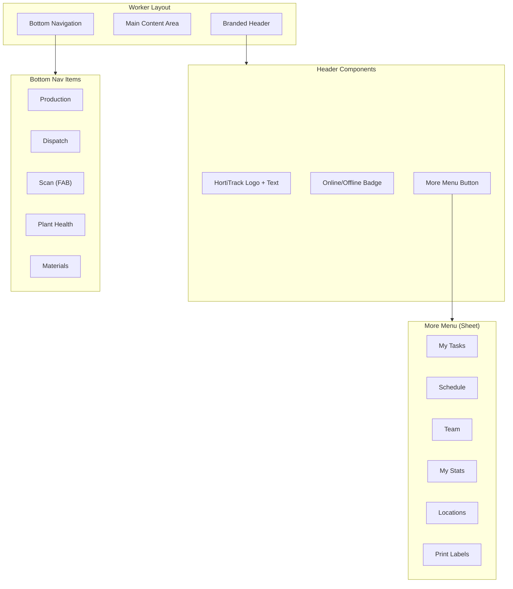
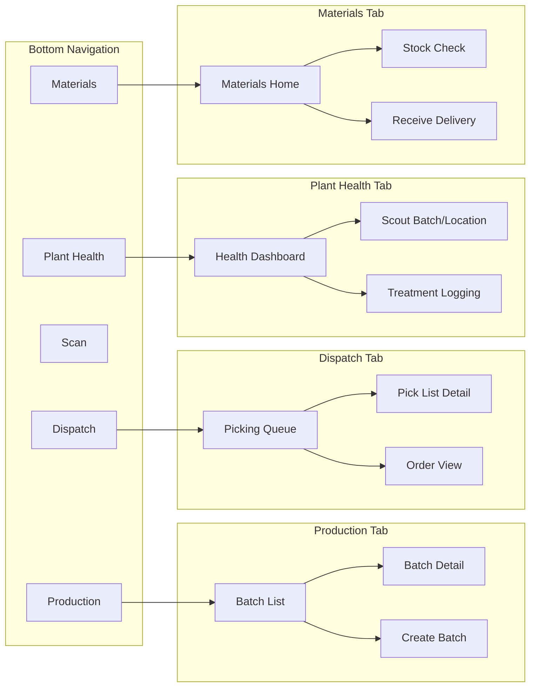

# Implementation Plan: Worker App Navigation Restructure

**Status**: Ready
**Created**: 2026-02-01
**Author**: Planner
**Complexity**: M (Medium - 2-3 sessions)
**Estimated Sessions**: 2-3

---

## Pre-Flight Check
- Existing PLAN.md: Separate file (PLAN-worker-app.md) - COMPLETE, no conflicts
- ROADMAP.md alignment: N/A - No ROADMAP.md found
- Related plans in progress: PLAN-plant-health-completion.md (no direct conflicts)
- Backlog cross-ref: None

---

## 1. Overview

### Problem Statement
The current Worker App navigation structure does not align with the functional workflows workers use daily. The current layout:
- **Home** - Shows tasks, but workers need quick access to production batches and jobs
- **Locations** - Rarely used as a primary navigation destination
- **Scout** - Too narrow; should encompass all plant health activities (IPM, scouting, treatments)
- **More** - Contains important items like Materials that deserve primary navigation status

Workers spend most of their time in these workflows:
1. **Production work** - Batches, jobs, potting, spacing
2. **Dispatch work** - Picking orders, packing, delivery
3. **Plant health** - IPM tasks, scouting, treatment logging
4. **Materials** - Stock checks, receiving deliveries

### Proposed Solution
Restructure the bottom navigation to match functional workflows, and move secondary features to a header menu.

**New Bottom Nav (5 items):**
1. **Production** (replaces Home) - Batches, jobs, batch creation
2. **Dispatch** (replaces Locations) - Picking queue, orders
3. **Scan** (center FAB) - Keep as-is
4. **Plant Health** (replaces Scout) - IPM tasks, scouting, treatments
5. **Materials** (replaces More) - Stock, receiving, material lookup

**New Header (Branded):**
- HortiTrack logo/branding on left
- Online/Offline indicator
- More menu button (hamburger) on right

**More Menu Contents:**
- My Tasks (original home tasks view)
- Schedule
- Team
- My Stats
- Locations (moved from bottom nav)
- Print Labels
- Settings (placeholder for future)

### Scope

**In Scope**:
- Restructure WorkerNav.tsx with new navigation items
- Update worker layout.tsx with header More menu
- Rename/restructure routes to match new navigation
- Create new landing pages for Production, Dispatch, Plant Health tabs
- Update existing pages to fit new structure

**Out of Scope**:
- New features or functionality (this is a navigation restructure only)
- Backend API changes
- Database changes
- New components beyond navigation/landing pages

---

## 2. Requirements

### Functional Requirements
| ID | Requirement | Priority | Size |
|----|-------------|----------|------|
| FR-1 | Bottom nav shows: Production, Dispatch, Scan, Plant Health, Materials | P0 | S |
| FR-2 | Header includes More menu button (hamburger or ...) | P0 | S |
| FR-3 | Production tab shows batch list with quick actions | P0 | M |
| FR-4 | Dispatch tab shows picking queue and order access | P0 | M |
| FR-5 | Plant Health tab combines IPM tasks + scouting | P0 | M |
| FR-6 | Materials tab maintains current functionality | P0 | S |
| FR-7 | More menu contains: Tasks, Schedule, Team, Stats, Locations, Print | P1 | S |
| FR-8 | Navigation state highlights correct tab based on current route | P0 | S |

### Non-Functional Requirements
| ID | Requirement | Target |
|----|-------------|--------|
| NFR-1 | Touch targets | Minimum 48x48px on all nav items |
| NFR-2 | Load time | Tab switch < 200ms perceived |
| NFR-3 | Accessibility | ARIA labels on all navigation items |

### Assumptions
- Workers are already familiar with the current app structure
- All existing page content remains functional (just reorganized)
- The Scan button behavior remains unchanged

### Open Questions
- [x] Production tab default view: **Batch list with quick action buttons** (most used)
- [x] Sub-navigation within tabs: **No sub-nav, use scroll sections** (simpler UX)
- [x] Icons: See design section below

---

## 3. Technical Design

### Architecture Overview

The restructure involves:
1. Updating `WorkerNav.tsx` - Change nav items and add route mappings
2. Updating `layout.tsx` - Add header More menu component
3. Creating/renaming route pages to match new structure
4. Ensuring all existing pages remain accessible

### Current vs New Route Structure

```
CURRENT ROUTES                    NEW ROUTES
/worker (Home - tasks)        ->  /worker/tasks (in More menu)
/worker/locations             ->  /worker/locations (in More menu)
/worker/scout                 ->  /worker/plant-health
/worker/batches              ->  /worker/production (default view)
/worker/picking              ->  /worker/dispatch (default view)
/worker/materials            ->  /worker/materials (stays)
/worker/schedule             ->  /worker/schedule (in More menu)
/worker/team                 ->  /worker/team (in More menu)
/worker/stats                ->  /worker/stats (in More menu)
/worker/print                ->  /worker/print (in More menu)

NEW LANDING PAGE
/worker (redirect to /worker/production)
/worker/production           ->  New production landing page
/worker/dispatch             ->  Picking queue (reuse picking/page.tsx)
/worker/plant-health         ->  Combine scout + IPM tasks
```

### Branded Header Design

The header should have HortiTrack branding:
- **Left**: HortiTrack logo (leaf icon + "HortiTrack" text) in brand green (#16a34a)
- **Center/Right**: Online indicator (green dot) or Offline banner
- **Right**: More menu button (hamburger icon)

```
+------------------------------------------+
|  🌿 HortiTrack          ● Online    ☰    |
+------------------------------------------+
```

If offline:
```
+------------------------------------------+
|  🌿 HortiTrack     ⚠️ Offline       ☰    |
+------------------------------------------+
```

### Component Diagram



### Navigation Flow



### Icon Selection

| Tab | Icon | Lucide Component | Rationale |
|-----|------|------------------|-----------|
| Production | Factory/Plant | `Sprout` or `Factory` | Represents growing/production |
| Dispatch | Truck/Package | `Truck` or `PackageCheck` | Delivery/shipping association |
| Scan | Barcode scanner | `ScanLine` | Keep existing |
| Plant Health | Heart/Leaf | `HeartPulse` or `Leaf` | Health monitoring |
| Materials | Box/Package | `Package` | Inventory/materials |
| More (header) | Menu | `MoreHorizontal` or `Menu` | Standard pattern |

**Recommended**:
- Production: `Sprout` (growing plants)
- Dispatch: `Truck` (delivery focus)
- Scan: `ScanLine` (keep as-is)
- Plant Health: `HeartPulse` (health monitoring)
- Materials: `Package` (keep existing)
- More: `Menu` (hamburger menu)

### Database Changes
**Assessment**: None
**data-engineer Required**: No

### API Changes
No API changes required. All existing endpoints remain valid.

### Frontend Changes

| Component | Change | Size | Notes |
|-----------|--------|------|-------|
| `WorkerNav.tsx` | Modify | M | Update nav items, icons, routes |
| `layout.tsx` | Modify | M | Add header More menu |
| `/worker/page.tsx` | Modify | S | Redirect to /worker/production |
| `/worker/production/page.tsx` | Create | M | New production landing page |
| `/worker/dispatch/page.tsx` | Create | S | Wrapper/redirect to picking |
| `/worker/plant-health/page.tsx` | Modify | M | Rename/enhance from scout |
| `/worker/tasks/page.tsx` | Create | S | Move original home content |

---

## 4. Alternatives Considered

| Approach | Pros | Cons | Decision |
|----------|------|------|----------|
| **A: Full restructure (Recommended)** | Clear functional separation, matches workflow | Requires more pages, learning curve | Selected |
| **B: Keep More in bottom, add sub-tabs** | Less change, keeps More prominent | Sub-tabs add complexity, touch issues | Rejected: UX complexity |
| **C: Swipeable tabs** | Modern gesture-based nav | iOS/Android differences, discoverability | Rejected: Implementation effort |

**Decision Rationale**: Option A provides the clearest mental model for workers. Each bottom nav item maps to a distinct job function. Moving secondary items to the header is a common mobile pattern (hamburger menu) that workers will recognize.

---

## 5. Implementation Plan

### Phase 1: Navigation Shell (P0)
| # | Task | Agent | Size | Depends On | Acceptance Criteria |
|---|------|-------|------|------------|---------------------|
| 1.1 | Update WorkerNav.tsx with new nav items | `feature-builder` | M | - | Nav shows 5 new items with correct icons |
| 1.2 | Add More menu to header in layout.tsx | `feature-builder` | M | - | Header has menu button, opens sheet with items |
| 1.3 | Update isActive logic for new routes | `feature-builder` | S | 1.1 | Correct tab highlights on each route |
| 1.4 | Create MoreMenuSheet component | `feature-builder` | S | 1.2 | Sheet with 6 menu items, proper styling |

**Phase 1 Complete When**:
- [ ] Bottom nav shows: Production, Dispatch, Scan, Plant Health, Materials
- [ ] Header has More button that opens sheet menu
- [ ] More menu contains: Tasks, Schedule, Team, Stats, Locations, Print
- [ ] Navigation state highlights correctly

### Phase 2: Route Restructure (P0)
| # | Task | Agent | Size | Depends On | Acceptance Criteria |
|---|------|-------|------|------------|---------------------|
| 2.1 | Create /worker/production/page.tsx | `feature-builder` | M | Phase 1 | Production landing with batch list + quick actions |
| 2.2 | Create /worker/dispatch/page.tsx | `feature-builder` | S | Phase 1 | Dispatch landing showing picking queue |
| 2.3 | Rename/update scout to plant-health | `feature-builder` | M | Phase 1 | Plant health page with IPM tasks + scouting combined |
| 2.4 | Create /worker/tasks/page.tsx | `feature-builder` | S | Phase 1 | Move original home content to tasks page |
| 2.5 | Update /worker/page.tsx to redirect | `feature-builder` | S | 2.1 | Worker root redirects to /worker/production |

**Phase 2 Complete When**:
- [ ] /worker redirects to /worker/production
- [ ] /worker/production shows batch list with Create Batch button
- [ ] /worker/dispatch shows picking queue
- [ ] /worker/plant-health shows IPM tasks + scouting
- [ ] /worker/tasks shows original home content (accessible via More menu)
- [ ] All existing deep links still work (/worker/batches/[id], etc.)

### Phase 3: Polish & Testing (P1)
| # | Task | Agent | Size | Depends On | Acceptance Criteria |
|---|------|-------|------|------------|---------------------|
| 3.1 | Verify all navigation paths | `verifier` | S | Phase 2 | All routes accessible, no 404s |
| 3.2 | Test touch targets and responsiveness | `ui-comprehensive-tester` | S | Phase 2 | All touch targets >= 48px |
| 3.3 | Add ARIA labels and accessibility | `feature-builder` | S | Phase 2 | Screen reader friendly nav |
| 3.4 | Production page quick actions | `feature-builder` | S | 2.1 | Buttons for: View Batches, Create Batch, View Jobs |

**Phase 3 Complete When**:
- [ ] All navigation works without errors
- [ ] Touch targets verified on mobile
- [ ] Accessibility audit passes
- [ ] Quick actions on Production page work

---

## 6. Detailed Component Specifications

### WorkerNav.tsx Changes

```typescript
// New navItems configuration
const navItems: NavItem[] = [
  {
    name: "Production",
    href: "/worker/production",
    icon: Sprout,
  },
  {
    name: "Dispatch",
    href: "/worker/dispatch",
    icon: Truck,
  },
  {
    name: "Scan",
    href: "/worker/scan",
    icon: ScanLine,
    isScanButton: true,
  },
  {
    name: "Plant Health",
    href: "/worker/plant-health",
    icon: HeartPulse,
  },
  {
    name: "Materials",
    href: "/worker/materials",
    icon: Package,
  },
];

// Route matching for isActive
const productionRoutes = ['/worker/production', '/worker/batches'];
const dispatchRoutes = ['/worker/dispatch', '/worker/picking', '/worker/orders'];
const plantHealthRoutes = ['/worker/plant-health', '/worker/scout'];
const materialsRoutes = ['/worker/materials'];
```

### Header More Menu Items

```typescript
const moreMenuItems: MoreMenuItem[] = [
  {
    name: "My Tasks",
    href: "/worker/tasks",
    icon: ClipboardList,
    description: "View assigned tasks",
  },
  {
    name: "Schedule",
    href: "/worker/schedule",
    icon: Calendar,
    description: "View your weekly schedule",
  },
  {
    name: "Team",
    href: "/worker/team",
    icon: Users,
    description: "See team activity",
  },
  {
    name: "My Stats",
    href: "/worker/stats",
    icon: BarChart3,
    description: "View your productivity",
  },
  {
    name: "Locations",
    href: "/worker/locations",
    icon: MapPin,
    description: "Browse nursery locations",
  },
  {
    name: "Print Labels",
    href: "/worker/print",
    icon: Printer,
    description: "Print batch, location labels",
  },
];
```

### Production Landing Page Structure

```
+------------------------------------------+
|  Production                    [Refresh]  |
+------------------------------------------+
|                                           |
|  +------+  +------+  +------+             |
|  | New  |  | Jobs |  | All  |  Quick     |
|  |Batch |  |      |  |Batch |  Actions   |
|  +------+  +------+  +------+             |
|                                           |
|  My Active Batches (In Progress)          |
|  +------------------------------------+   |
|  | B2024-0142 Lavender                |   |
|  | 500 plants | Tunnel 4 | Growing    |   |
|  +------------------------------------+   |
|  +------------------------------------+   |
|  | B2024-0138 Rosemary                |   |
|  | 300 plants | Tunnel 2 | Potted     |   |
|  +------------------------------------+   |
|                                           |
|  Recent Batches                           |
|  [List of recent batches...]              |
|                                           |
+------------------------------------------+
```

### Plant Health Landing Page Structure

```
+------------------------------------------+
|  Plant Health                  [Refresh]  |
+------------------------------------------+
|                                           |
|  +--------------------------------------+ |
|  |  [Scan]  Scan to Scout              | |  <- Prominent scan button
|  |          Batch or location QR       | |
|  +--------------------------------------+ |
|                                           |
|  Today's Stats                            |
|  +----------+  +----------+               |
|  | Scouted  |  | Issues   |               |
|  |    12    |  |    3     |               |
|  +----------+  +----------+               |
|                                           |
|  IPM Tasks Due                            |
|  +------------------------------------+   |
|  | Week 5 - Spray Program             |   |
|  | 8 batches need treatment           |   |
|  +------------------------------------+   |
|                                           |
|  Recent Scouts                            |
|  [List of recent scout logs...]           |
|                                           |
+------------------------------------------+
```

---

## 7. Risks & Mitigations

| Risk | Likelihood | Impact | Mitigation |
|------|------------|--------|------------|
| Workers confused by new layout | Medium | Medium | Keep existing deep links working, gradual rollout |
| Breaking existing bookmarks | Low | Low | All /worker/* routes still functional |
| More menu hard to discover | Low | Medium | Prominent hamburger icon, tooltip on first visit |
| Plant Health route collision with scout | Low | Low | Add redirect from /worker/scout to /worker/plant-health |

---

## 8. Definition of Done

Feature is complete when:
- [ ] All P0 tasks complete
- [ ] All P1 tasks complete
- [ ] Bottom nav shows correct 5 items
- [ ] Header More menu works with all 6 items
- [ ] All routes navigable without 404s
- [ ] Existing deep links (/worker/batches/[id], etc.) still work
- [ ] Scout routes redirect to plant-health
- [ ] Touch targets verified >= 48px
- [ ] No console errors in production

---

## 9. Handoff Notes

### Jimmy Command String
```
jimmy execute PLAN-worker-nav-restructure.md --mode standard
```

### For Jimmy (Routing)
- **Start with**: Phase 1, Task 1.1 - Update WorkerNav.tsx
- **DB Work Required**: No
- **Recommended Mode**: standard
- **Critical Dependencies**: None - purely frontend restructure
- **Estimated Sessions**: 2-3

### For feature-builder
**Key files to modify**:
1. `/Users/patrickdoran/Hortitrack/hortitrack/src/components/worker/WorkerNav.tsx` - Main navigation
2. `/Users/patrickdoran/Hortitrack/hortitrack/src/app/(worker)/worker/layout.tsx` - Add header More menu
3. `/Users/patrickdoran/Hortitrack/hortitrack/src/app/(worker)/worker/page.tsx` - Redirect to production

**Key files to create**:
1. `/Users/patrickdoran/Hortitrack/hortitrack/src/app/(worker)/worker/production/page.tsx` - Production landing
2. `/Users/patrickdoran/Hortitrack/hortitrack/src/app/(worker)/worker/dispatch/page.tsx` - Dispatch landing
3. `/Users/patrickdoran/Hortitrack/hortitrack/src/app/(worker)/worker/tasks/page.tsx` - Original home content
4. `/Users/patrickdoran/Hortitrack/hortitrack/src/components/worker/MoreMenuSheet.tsx` - Header menu

**Existing files to rename/repurpose**:
- `/worker/scout/*` content -> `/worker/plant-health/*`
- Keep batches pages at `/worker/batches/*` (accessible via Production tab)
- Keep picking pages at `/worker/picking/*` (accessible via Dispatch tab)

**Patterns to follow**:
- Use existing Sheet component for More menu (already used in WorkerNav)
- Match existing button styles (min-h-[44px], etc.)
- Use existing icon patterns from WorkerNav

### For verifier
- Test all navigation paths from each tab
- Verify no broken links
- Check that original URLs still work
- Test on mobile viewport (375px minimum)

---

## 10. File Changes Summary

### Files to Create
```
src/app/(worker)/worker/production/page.tsx      # Production landing
src/app/(worker)/worker/dispatch/page.tsx        # Dispatch landing
src/app/(worker)/worker/tasks/page.tsx           # Original home content
src/app/(worker)/worker/plant-health/page.tsx    # Rename of scout
src/components/worker/MoreMenuSheet.tsx          # Header menu component
```

### Files to Modify
```
src/components/worker/WorkerNav.tsx              # New nav items
src/app/(worker)/worker/layout.tsx               # Add header More menu
src/app/(worker)/worker/page.tsx                 # Redirect to production
```

### Optional: Files to Create for Backward Compatibility
```
src/app/(worker)/worker/scout/page.tsx           # Redirect to plant-health
```

---

*Plan created by Planner agent. Ready for execution via `jimmy execute PLAN-worker-nav-restructure.md`*
