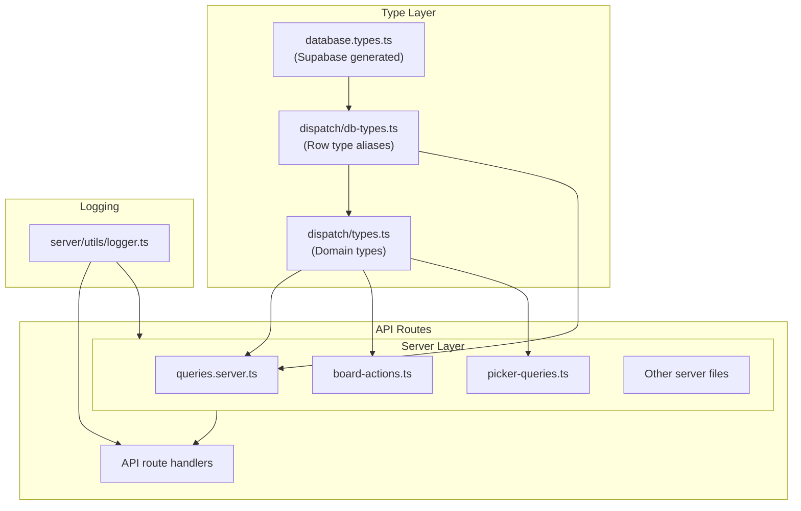
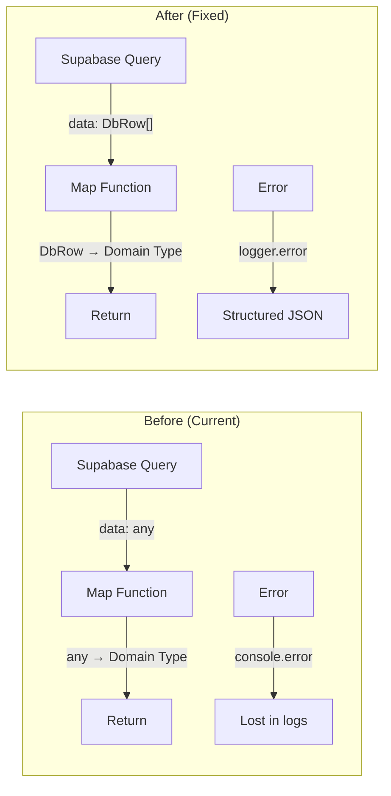

# Implementation Plan: Dispatch Module Type Safety & Code Quality Fix

**Status**: Ready
**Created**: 2025-01-29
**Author**: Planner
**Complexity**: L (Large)
**Estimated Sessions**: 3-4

---

## Pre-Flight Check
- Existing PLAN.md: None (creating new)
- ROADMAP.md alignment: N/A (code quality improvement)
- Related plans: None
- Backlog cross-ref: None

---

## 1. Overview

### Problem Statement
The Dispatch module has accumulated significant technical debt that violates HortiTrack's production standards:

1. **100+ `any` types** across server code - violates "Zero `any` types" rule
2. **12+ console.log statements** in production code - violates "No console.log in production"
3. **Inconsistent error handling** - functions throw, return empty arrays, or silently continue
4. **Deprecated function** still present in codebase

These issues increase maintenance burden, hide bugs at compile time, and make debugging production issues difficult.

### Proposed Solution
Systematic refactoring to:
1. Create proper TypeScript interfaces derived from Supabase generated types
2. Replace all `any` types with strict interfaces
3. Implement structured logging utility to replace console.log
4. Standardize error handling patterns across all functions
5. Remove deprecated code

### Scope
**In Scope**:
- All files in `/src/server/dispatch/`
- All files in `/src/app/api/dispatch/`
- Creating shared type definitions in `/src/lib/dispatch/db-types.ts`
- Creating a logging utility for server-side code

**Out of Scope**:
- UI components (separate review)
- Database schema changes
- New feature development
- Test file `any` types (acceptable in test mocks)

---

## 2. Requirements

### Functional Requirements
| ID | Requirement | Priority | Size |
|----|-------------|----------|------|
| FR-1 | Replace all `any` types with proper TypeScript interfaces | P0 | L |
| FR-2 | Remove all console.log/console.error from production code | P0 | M |
| FR-3 | Implement consistent error handling pattern | P1 | M |
| FR-4 | Remove deprecated `getHauliersWithVehiclesLegacy` function | P1 | S |
| FR-5 | Create shared db-types.ts for Supabase row types | P0 | M |

### Non-Functional Requirements
| ID | Requirement | Target |
|----|-------------|--------|
| NFR-1 | Type coverage | 100% (no `any` in production code) |
| NFR-2 | Build success | Zero TypeScript errors |
| NFR-3 | Runtime behavior | No functional changes |

### Assumptions
- Supabase generated types in `src/lib/database.types.ts` are up to date
- Existing tests provide adequate coverage to catch regressions
- Code functionality is correct; only types and logging need fixing

### Open Questions
- [x] Is there an existing logging utility? **No, needs to be created**
- [x] Are there other modules using similar patterns we should align with? **Will establish pattern here**

---

## 3. Technical Design

### Architecture Overview

The fix involves three main components:
1. **Type Foundation** - Create db-types.ts with Supabase row type aliases
2. **Logging Utility** - Create server-side logger to replace console.log
3. **Code Refactoring** - Update all files to use proper types and logger

### System Diagram



### File Changes Summary

| File | `any` Count | `console.*` Count | Change Type |
|------|-------------|-------------------|-------------|
| `queries.server.ts` | 40+ | 15 | Major refactor |
| `board-actions.ts` | 18 | 12 | Major refactor |
| `picker-queries.ts` | 8 | 3 | Moderate refactor |
| `trolley-balance.server.ts` | 2 | 0 | Minor refactor |
| `balance-transfers.server.ts` | 3 | 0 | Minor refactor |
| `trolley-capacity.server.ts` | 2 | 0 | Minor refactor |
| API routes (19 files) | 25 | 5 | Moderate refactor |

### Database Changes
**Assessment**: None required
**data-engineer Required**: No

### New Files to Create

| File | Purpose |
|------|---------|
| `src/lib/dispatch/db-types.ts` | Supabase row type aliases for dispatch tables |
| `src/server/utils/logger.ts` | Structured logging utility |

### Data Flow



---

## 4. Alternatives Considered

| Approach | Pros | Cons | Decision |
|----------|------|------|----------|
| **A: Incremental file-by-file** | Lower risk per change, easier review | Longer timeline, potential inconsistency | **Selected** |
| B: Big-bang refactor | Single PR, consistent patterns | High risk, hard to review, blocks other work | Rejected: Too risky |
| C: Type assertions only | Quick fix, minimal changes | Doesn't fix root cause, types still wrong | Rejected: Band-aid solution |

**Decision Rationale**: Incremental approach allows us to:
1. Verify each file works before moving to the next
2. Keep PRs reviewable
3. Roll back individual changes if issues arise
4. Continue other development in parallel

---

## 5. Implementation Plan

### Phase 1: Foundation (P0)

Create the type infrastructure and logging utility before touching existing code.

| # | Task | Agent | Size | Depends On | Acceptance Criteria |
|---|------|-------|------|------------|---------------------|
| 1.1 | Create `src/lib/dispatch/db-types.ts` with Supabase row type aliases | `feature-builder` | M | - | File exports typed aliases for: `DeliveryRunRow`, `DeliveryItemRow`, `OrderPackingRow`, `TrolleyRow`, `TrolleyTransactionRow`, `OrderStatusUpdateRow`, `HaulierRow`, `HaulierVehicleRow` |
| 1.2 | Create `src/server/utils/logger.ts` structured logging utility | `feature-builder` | M | - | Logger supports `info`, `warn`, `error` methods with context object; outputs JSON in production; is a no-op or console in development |
| 1.3 | Update `src/lib/dispatch/types.ts` to import from db-types where applicable | `feature-builder` | S | 1.1 | Domain types reference db-types for database fields |

**Phase 1 Complete When**:
- [ ] `db-types.ts` exports all dispatch table row types
- [ ] `logger.ts` is importable and functional
- [ ] `types.ts` updated without breaking existing imports
- [ ] Build passes with no new errors

---

### Phase 2: Server Code - queries.server.ts (P0)

The largest file with the most `any` types. Fix incrementally by function group.

| # | Task | Agent | Size | Depends On | Acceptance Criteria |
|---|------|-------|------|------------|---------------------|
| 2.1 | Type the mapper functions (`mapDeliveryRunFromDb`, `mapDeliveryItemFromDb`, etc.) | `feature-builder` | M | Phase 1 | All 6 mapper functions have typed input parameters (e.g., `d: DeliveryRunRow`) instead of `any` |
| 2.2 | Type delivery run functions (`listDeliveryRuns`, `getActiveDeliveryRuns`, `getDeliveryRunWithItems`, `createDeliveryRun`, `updateDeliveryRun`) | `feature-builder` | M | 2.1 | Zero `any` in these functions; `dbUpdates` objects properly typed |
| 2.3 | Type delivery item and packing functions (`addOrderToDeliveryRun`, `updateDeliveryItem`, `getOrdersReadyForDispatch`, `getOrCreateOrderPacking`, `updateOrderPacking`) | `feature-builder` | M | 2.1 | Zero `any` in these functions |
| 2.4 | Type trolley functions (`listTrolleys`, `getCustomerTrolleyBalances`, `createTrolley`, `recordTrolleyTransaction`) | `feature-builder` | S | 2.1 | Zero `any` in these functions |
| 2.5 | Type haulier and board functions (`getGrowerMembers`, `getHauliers`, `getHauliersWithVehicles`, `getDispatchBoardData`) | `feature-builder` | M | 2.1 | Zero `any` in these functions |
| 2.6 | Replace all `console.log/error` with logger in queries.server.ts | `feature-builder` | S | 1.2 | Zero console statements; all errors logged via logger |
| 2.7 | Remove deprecated `getHauliersWithVehiclesLegacy` function | `feature-builder` | S | 2.5 | Function removed; no references remain |

**Phase 2 Complete When**:
- [ ] `grep -c ": any" queries.server.ts` returns 0
- [ ] `grep -c "console\." queries.server.ts` returns 0
- [ ] All existing tests pass
- [ ] Build passes

---

### Phase 3: Server Code - Other Files (P0-P1)

| # | Task | Agent | Size | Depends On | Acceptance Criteria |
|---|------|-------|------|------------|---------------------|
| 3.1 | Fix `board-actions.ts` - replace `error: any` with proper error typing | `feature-builder` | M | Phase 1 | All catch blocks use `unknown` with type guards or proper error types |
| 3.2 | Fix `board-actions.ts` - replace console.log with logger | `feature-builder` | S | 1.2, 3.1 | Zero console statements |
| 3.3 | Fix `picker-queries.ts` - type `supabase: any` parameters | `feature-builder` | S | Phase 1 | Supabase client properly typed using `SupabaseClient` |
| 3.4 | Fix `picker-queries.ts` - type `pl: any` and remove console.log | `feature-builder` | S | 3.3 | Zero `any` types; zero console statements |
| 3.5 | Fix `trolley-balance.server.ts` - type row mappings | `feature-builder` | S | Phase 1 | Zero `any` types |
| 3.6 | Fix `balance-transfers.server.ts` - type row mappings | `feature-builder` | S | Phase 1 | Zero `any` types |
| 3.7 | Fix `trolley-capacity.server.ts` - type row mappings | `feature-builder` | S | Phase 1 | Zero `any` types |

**Phase 3 Complete When**:
- [ ] `grep -rc ": any" src/server/dispatch/` returns only test file matches
- [ ] `grep -rc "console\." src/server/dispatch/` returns 0
- [ ] All tests pass
- [ ] Build passes

---

### Phase 4: API Routes (P1)

| # | Task | Agent | Size | Depends On | Acceptance Criteria |
|---|------|-------|------|------------|---------------------|
| 4.1 | Fix `runs/route.ts` - type filters object | `feature-builder` | S | Phase 1 | `filters` has proper interface instead of `any` |
| 4.2 | Fix `trolleys/route.ts` and `trolleys/*/route.ts` - type row mappings | `feature-builder` | M | Phase 1 | Zero `any` in trolley API routes |
| 4.3 | Fix `qc/feedback/route.ts` and `qc/feedback/[feedbackId]/route.ts` - error typing | `feature-builder` | S | Phase 1 | Proper error handling with typed catches |
| 4.4 | Fix remaining API routes - error typing and row mappings | `feature-builder` | M | Phase 1 | Zero `any` in all dispatch API routes |
| 4.5 | Replace any remaining console statements in API routes | `feature-builder` | S | 1.2 | Zero console statements in API routes |

**Phase 4 Complete When**:
- [ ] `grep -rc ": any" src/app/api/dispatch/` returns 0
- [ ] `grep -rc "console\." src/app/api/dispatch/` returns 0
- [ ] All API routes return correct HTTP status codes
- [ ] Build passes

---

### Phase 5: Verification & Cleanup (P1)

| # | Task | Agent | Size | Depends On | Acceptance Criteria |
|---|------|-------|------|------------|---------------------|
| 5.1 | Run full test suite | `verifier` | S | Phase 4 | All tests pass |
| 5.2 | Run TypeScript strict mode check on dispatch module | `verifier` | S | Phase 4 | Zero type errors |
| 5.3 | Manual smoke test of dispatch board UI | `verifier` | M | 5.1, 5.2 | Board loads, orders display, drag-drop works |
| 5.4 | Security audit of error handling | `security-auditor` | S | Phase 4 | No sensitive data leaked in error responses |
| 5.5 | Code review | `reviewer` | M | 5.1-5.4 | Code follows project conventions |

**Phase 5 Complete When**:
- [ ] All automated tests pass
- [ ] Manual testing confirms no regressions
- [ ] Security review passed
- [ ] Code review approved

---

## 6. Detailed Implementation Guidance

### 6.1 db-types.ts Structure

```typescript
// src/lib/dispatch/db-types.ts
import type { Database } from "@/lib/database.types";

// Table row types (what Supabase returns)
export type DeliveryRunRow = Database["public"]["Tables"]["delivery_runs"]["Row"];
export type DeliveryRunInsert = Database["public"]["Tables"]["delivery_runs"]["Insert"];
export type DeliveryRunUpdate = Database["public"]["Tables"]["delivery_runs"]["Update"];

export type DeliveryItemRow = Database["public"]["Tables"]["delivery_items"]["Row"];
export type DeliveryItemInsert = Database["public"]["Tables"]["delivery_items"]["Insert"];
export type DeliveryItemUpdate = Database["public"]["Tables"]["delivery_items"]["Update"];

// ... similar for other tables

// Nested query result types (for JOINs)
export type DeliveryRunWithHaulier = DeliveryRunRow & {
  hauliers: HaulierRow | null;
  haulier_vehicles: HaulierVehicleRow | null;
  delivery_items: (DeliveryItemRow & {
    orders: { trolleys_estimated: number | null } | null;
  })[];
};
```

### 6.2 Logger Utility Structure

```typescript
// src/server/utils/logger.ts
type LogLevel = "info" | "warn" | "error";
type LogContext = Record<string, unknown>;

interface Logger {
  info(message: string, context?: LogContext): void;
  warn(message: string, context?: LogContext): void;
  error(message: string, error?: unknown, context?: LogContext): void;
}

function createLogger(module: string): Logger {
  const isProduction = process.env.NODE_ENV === "production";

  const log = (level: LogLevel, message: string, context?: LogContext) => {
    if (isProduction) {
      // JSON format for production log aggregation
      console.log(JSON.stringify({
        timestamp: new Date().toISOString(),
        level,
        module,
        message,
        ...context,
      }));
    } else {
      // Readable format for development
      console[level](`[${module}] ${message}`, context || "");
    }
  };

  return {
    info: (msg, ctx) => log("info", msg, ctx),
    warn: (msg, ctx) => log("warn", msg, ctx),
    error: (msg, err, ctx) => log("error", msg, {
      ...ctx,
      error: err instanceof Error ? { message: err.message, stack: err.stack } : err
    }),
  };
}

export const logger = {
  dispatch: createLogger("dispatch"),
  // Add other modules as needed
};
```

### 6.3 Error Handling Pattern

Replace:
```typescript
} catch (error: any) {
  console.log("Error:", error);
  return { error: error.message };
}
```

With:
```typescript
} catch (error) {
  const message = error instanceof Error ? error.message : "Unknown error";
  logger.dispatch.error("Failed to process request", error, { orderId });
  return { error: message };
}
```

### 6.4 dbUpdates Pattern

Replace:
```typescript
const dbUpdates: any = {};
if (updates.driverName !== undefined) dbUpdates.driver_name = updates.driverName;
```

With:
```typescript
const dbUpdates: DeliveryRunUpdate = {};
if (updates.driverName !== undefined) dbUpdates.driver_name = updates.driverName;
```

---

## 7. Risks & Mitigations

| Risk | Likelihood | Impact | Mitigation |
|------|------------|--------|------------|
| Type changes break runtime behavior | Low | High | Extensive test coverage; types are compile-time only |
| Logger changes affect debugging | Medium | Low | Keep readable output in development mode |
| Missed `any` types | Medium | Low | Use grep/lint to verify; add eslint rule |
| Breaking changes in nested query types | Medium | Medium | Test each function after typing; use type assertions sparingly as escape hatch |

---

## 8. Definition of Done

Feature is complete when:
- [ ] All P0 tasks complete
- [ ] All P1 tasks complete
- [ ] `grep -rc ": any" src/server/dispatch/` returns only test files
- [ ] `grep -rc ": any" src/app/api/dispatch/` returns 0
- [ ] `grep -rc "console\." src/server/dispatch/` returns 0
- [ ] `grep -rc "console\." src/app/api/dispatch/` returns 0
- [ ] Deprecated function removed
- [ ] All tests passing (`verifier`)
- [ ] Code reviewed (`reviewer`)
- [ ] Security checked (`security-auditor`)

---

## 9. Handoff Notes

### Jimmy Command String
```bash
jimmy execute PLAN.md --mode standard
```

### For Jimmy (Routing)
- **Start with**: `feature-builder` for Phase 1 (foundation)
- **DB Work Required**: No
- **Recommended Mode**: standard
- **Critical Dependencies**: None - this is independent refactoring
- **Estimated Sessions**: 3-4

### For feature-builder

**Key Context**:
- Supabase types are in `src/lib/database.types.ts`
- Existing domain types are in `src/lib/dispatch/types.ts`
- The mapper functions at the bottom of `queries.server.ts` are the key - type those first
- Use `Database["public"]["Tables"]["table_name"]["Row"]` pattern for row types

**Files to reference**:
- `/Users/patrickdoran/Hortitrack/hortitrack/src/lib/database.types.ts` - Supabase generated types
- `/Users/patrickdoran/Hortitrack/hortitrack/src/lib/dispatch/types.ts` - Existing domain types
- `/Users/patrickdoran/Hortitrack/hortitrack/src/server/dispatch/queries.server.ts` - Main file to fix

**Gotchas to avoid**:
- Don't change function signatures (input/output types) unless necessary
- Nested Supabase queries return complex types - may need to define intermediate types
- Some `any` types in mapper functions are intentional escape hatches for Supabase's nested selects
- Test files can keep `any` types for mock flexibility

### For verifier

**What to test**:
- All dispatch module tests should pass
- TypeScript compilation should succeed
- No runtime errors in dispatch board loading
- Drag-drop functionality still works

**Edge cases**:
- Empty delivery runs list
- Orders with no packing records
- Hauliers with no vehicles

### For security-auditor

**Review points**:
- Error messages don't leak database structure
- Logger doesn't log sensitive data (customer PII, auth tokens)
- API error responses are sanitized

---

## Appendix: File Inventory

### Server Files (`src/server/dispatch/`)

| File | Lines | `any` Count | `console` Count | Priority |
|------|-------|-------------|-----------------|----------|
| `queries.server.ts` | 1295 | 40 | 15 | P0 |
| `board-actions.ts` | ~600 | 18 | 12 | P0 |
| `picker-queries.ts` | ~250 | 8 | 3 | P0 |
| `trolley-balance.server.ts` | ~300 | 2 | 0 | P1 |
| `balance-transfers.server.ts` | ~400 | 3 | 0 | P1 |
| `trolley-capacity.server.ts` | ~100 | 2 | 0 | P1 |

### API Routes (`src/app/api/dispatch/`)

| Route | `any` Count | `console` Count | Priority |
|-------|-------------|-----------------|----------|
| `runs/route.ts` | 1 | 0 | P1 |
| `trolleys/route.ts` | 1 | 0 | P1 |
| `trolleys/transactions/route.ts` | 1 | 0 | P1 |
| `trolleys/balances/route.ts` | 1 | 0 | P1 |
| `trolleys/haulier-balances/route.ts` | 1 | 0 | P1 |
| `trolleys/transfers/route.ts` | 2 | 0 | P1 |
| `trolleys/transfers/[transferId]/route.ts` | 1 | 0 | P1 |
| `trolleys/signed-docket/route.ts` | 1 | 0 | P1 |
| `qc/feedback/route.ts` | 2 | 0 | P1 |
| `qc/feedback/[feedbackId]/route.ts` | 2 | 0 | P1 |
| `assign-load/route.ts` | 1 | 0 | P1 |
| `assign-picker/route.ts` | 1 | 0 | P1 |
| `complete-delivery/route.ts` | 1 | 0 | P1 |
| `delivery-photo/route.ts` | 1 | 0 | P1 |
| `debug/route.ts` | 2 | 1 | P2 (debug only) |

### console.log Locations (Specific Lines)

**picker-queries.ts**:
- Line 247: `console.log('[getPickerTasks] Sample pick lists:', ...)`

**board-actions.ts** (in catch blocks):
- Lines 251, 266, 278, 462, 476, 480, 502, 516, 520 (approx)

**queries.server.ts**:
- Line 66: `console.error("Error listing delivery runs:", error)`
- Line 110: `console.error("Error fetching delivery runs:", runsError)`
- Line 214: `console.error("Error fetching delivery run:", ...)`
- Line 243: `console.error("Error fetching delivery items:", itemsError)`
- Line 321: `console.error("Error creating delivery run:", error)`
- And ~10 more similar patterns

---

*Plan created by Planner. Execute with: `jimmy execute PLAN.md`*
